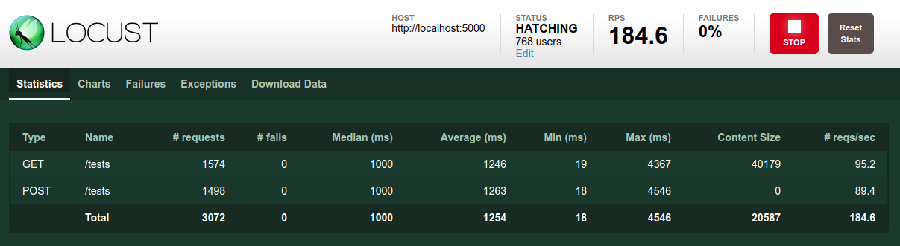

# Introduction


There are several types of test types in software engineering and load testing is one of the most common tests.

The purpose of this test is checking if a software can handle what it was designed to handle and identifying the blottleneck and any performance degradation. 

This is performed by putting demand on a application under normal and peak load conditions. Load testing could help you determine some metrics like the Mean Time Between Failure (MTBF) and Mean Time To Failure (MTTF).

According to [Microsoft guide Performance Testing Guidance for Web Applications](https://msdn.microsoft.com/en-us/library/bb924357.aspx), a load test enables you to measure response times, throughput rates, and resource-utilization levels, and to identify your application’s breaking point, assuming that the breaking point occurs below the peak load condition. 

As a conclusion, load testing helps you to:

- Determine the throughput required to support the anticipated peak production load.
- Determine the adequacy of a hardware environment.
- Evaluate the adequacy of a load balancer.
- Detect concurrency issues.
- Detect functionality errors under load.
- Collect data for scalability and capacity-planning purposes.
- Help to determine how many users the application can handle before performance is compromised.
- Help to determine how much load the hardware can handle before resource utilization limits are exceeded. 

Gatling, JMeter, Locust are some of the load testing tools.

In this practice lab, we are going to create a simple REST API and write some load test scenarios.

# Preparing Our Application


In this practice lab, we are going to create a minimal RESTful API using the Flask framework. Our application will let the user get a list of software testing types or add a new type.

The purpose of this lab is to load test our RESTful API using Locust.

We are going to use:

- Python 3.5
- Python Virtualenv to create an isolated environment for our application
- Locust: A load testing framework

This is the structure of our project folder:

```
app/
├── app.py
└── __init__.py
__init__.py
.gitignore
```

You can also download the .gitignore file from [this repository](https://github.com/github/gitignore/blob/master/Python.gitignore).

Let's start by creating the virtual environment for our Flask application. 

```
python3 -m venv /path/to/new/virtual/environment
```

If you are using Linux.

```
c:\>c:\Python35\python -m venv c:\path\to\myenv
```

If you are using Windows.

If everything is fine, let's activate it:

```
. /path/to/new/virtual/environment/bin/activate
```

In order to use Flask, you need to install it from the Python Package Index using PIP:

```
pip install flask
```

Let's create our application files:

```
mkdir project
wget -O .gitignore "https://github.com/github/gitignore/blob/master/Python.gitignore" 2> templog
touch __init__.py
mkdir app
touch app/app.py
touch app/__init__.py
```

Paste this code inside the app.py file:

```
from flask import Flask, jsonify, request

app = Flask(__name__)

testing_types = [
  { 'name': 'unit testing', 'description': 'testing individual units of source code' }
]


@app.route('/tests')
def get_tests():
  return jsonify(testing_types)


@app.route('/tests', methods=['POST'])
def add_test():
  testing_types.append(request.get_json())
  return '', 204
  
  
  
if __name__ == '__main__':
    app.run(debug=True)  
    
```

The above code has two functions:
- get_tests : Used to get the list of tests from the testing\_types dictionary 
- add_tests : Used to add a test to the testing\_types dictionary
    
Our initial dictionary contains one test type:

```
testing_types = [
  { 'name': 'unit testing', 'description': 'testing individual units of source code' }
]
```

In order to run our API, type:

```
python app/app.py
```

You should see something similar to the following output:

```
python app/app.py 
 * Running on http://127.0.0.1:5000/ (Press CTRL+C to quit)
 * Restarting with stat
 * Debugger is active!
 * Debugger PIN: 179-596-761
```

Our web server runs on: http://127.0.0.1:5000/ and in order to test it we can use a curl request. You can use your terminal or a graphical tool like Postman, Swagger or any other alternative.

This is our curl request to get the testing types list:

```
curl -X GET  http://127.0.0.1:5000/tests
```

At this stage, it should return:

```
[
  {
    "description": "testing individual units of source code", 
    "name": "unit testing"
  }
]
```

Let's try adding another type of test:

```
curl -X POST -H "Content-Type: application/json" -d '{
  "name": "load testing",
  "description": "checking if a software can handle the expected load"
}' http://localhost:5000/tests
```

After executing the last POST request, we can verify using another GET:

```
curl -X GET  http://127.0.0.1:5000/tests
```

We should see the two types of tests:

```
[
  {
    "description": "testing individual units of source code", 
    "name": "unit testing"
  }, 
  {
    "description": "checking if a software can handle the expected load", 
    "name": "load testing"
  }
]
```

# Load Testing Our RESTful API Using Locust

Locust is described as an easy-to-use, distributed, user load testing tool. It is intended for load-testing web sites (or other systems) and figuring out how many concurrent users a system can handle.

A swarm of locusts will attack your website. The behavior of each locust (or test user if you will) is defined by you and the swarming process is monitored from a web UI in real-time. This will help you battle test and identify bottlenecks in your code before letting real users in.

Since Locust is event-based, it is possible to support concurrent users on a single machine. 

Start by installing Locust:

```
pip install locustio
```

Now in the project root directory, create the locustfile.py file that will describe our testing scenarios:

```
from locust import HttpLocust, TaskSet, task

class UserBehavior(TaskSet):

    @task
    def get_tests(self):
        self.client.get("/tests")
        
    @task
    def put_tests(self):
        self.client.post("/tests", {
						  "name": "load testing",
						  "description": "checking if a software can handle the expected load"
						})
        

class WebsiteUser(HttpLocust):
    task_set = UserBehavior
    
```

In this file we told Locust to create two test tasks:

- The first one will execute a GET request to list the test types we stored in our dictionary
- The second one will execute a POST request to add a new testing type

Now start our Flask API using ``` python app/app.py ``` and Locust using ``` locust --host=http://localhost:5000 ```.

Make sure to change ``` http://localhost:5000 ``` by the real address of your application.

The web interface of Locust is available by default at ``` http://localhost:8089 ```


Say our API should support a number of 10000 user. We can start a test by giving this value to Locust, using the web interface, as well as the the hatch rate which is the number of users spawned by second.

After clicking on "Start spawning", you can see different live statistics about your tasks like the number of requests, fails, and other statistics about the response time.



Using the Charts view, we can determine some fact-based conclusions. For instance, if we don't accept a response time greater than 450ms, we know that our application cannot handle more than 117 request per second and that the max number of simultaneous users should be less than 350.


# Conclusion

In this practice lab, we created a RESTful API and tested its performance using Locust. Using the results from our tests, we determined how our API can behave with a certain number of users and requests.

Load testing is an important practice since it prevents organizations from downtimes and failures due to errors like the timeout or memory overflows. Load testing gives meaningful results when tests are done against a similar environment to production (configurations, code, physical resources like disks and memory ..etc).
