Elements of this lab we're originally sourced from **Jose Moreno**, from his github page at <a href="https://github.com/erjosito/ansible-azure-lab" target="_blank"><span style="color: #0066cc;" color="#0066cc">https://github.com/erjosito/ansible-azure-lab</span></a>. We would like to thank Jose for his help and allowing us to re-use portions the lab as part of this DevOps lab series! 

In this lab we will deploy two Linux web servers into Azure and then query the resourced in Azure by using a dynamic inventory approach with Ansible, to list our Azure resources. We will then use tags to filter our inventory. We will then create and configure an Ansible control VM on an Ubuntu Server form which we will then deploy and manage web servers using Ansible playbooks. We will then ensure desired state of our web servers using ansible integration with Linux cron jobs. We will then deploy an Azure virtual machine using and ansible playbook and Azure resource templates and again ensure ensure desired state, and demonstrate idempotency using the integration of playbooks and Azure resource Manager templates. Finally we will delete our Azure resource using Ansible playbooks.


<h3><span style="color: #0000CD;">DevOps Course Source </span></h3>

This lab is used in the following courses:
- <a href="https://www.edx.org/course/infrastructure-code-microsoft-devops200-2x-0" target="_blank"><span style="color: #0066cc;" color="#0066cc">DevOps200.2x: Infrastructure as Code</span></a> - Module 4.
- AZ-400T05: Implementing Application Infrastructure - Module 4-Third Party and Open Source Tool integration with Azure. The lab compliments the AZ-400 series of courses to help you prepare for the <a href="https://www.microsoft.com/en-us/learning/exam-AZ-400.aspx" target="_blank"><span style="color: #0066cc;">AZ-400 Microsoft Azure DevOps Solutions</span></a> certification exam.


<a href="https://docs.microsoft.com/en-us/cli/azure/install-azure-cli" target="_blank"><span style="color: #0066cc;">Install the Azure CLI</span></a>

<h3><span style="color: #0000CD;"> Pre-requisites:</span></h3>

To complete this lab you will require the following:
- A valid Azure subscription account. If you don't have one, you can create one on the <a href="https://azure.microsoft.com/en-us/free/" target="_blank"><span style="color: #0066cc;">Create your Azure free account today</span></a> page.
- Azure CLI. To Install Azure CLI, please see the <a href="https://docs.microsoft.com/en-us/cli/azure/install-azure-cli" target="_blank"><span style="color: #0066cc;">Install the Azure CLI</span></a> page.


<h3><span style="color: #0000CD;"> Lab Tasks:</span></h3>


- Task 1: Create two Web Server virtual machines in Azure using Azure Cloud Shell
- Task 2: Generate a Dynamic Inventory
- Task 3: Create an Ansible Control VM in Azure using Azure CLI
- Task 4: Install and Configure Ansible on Azure VM
- Task 5: Obtain Ansible configuration and sample playbook files
- Task 6: Create Service Principal in Azure
- Task 7: Configure Azure Credentials and SSH for use with Ansible
- Task 8: Creating a Web server VM using an Ansible Playbook 
- Task 9: Configure a newly deployed Web Server VM with an Ansible playbook
- Task 10: Run Ansible playbooks periodically for configuration management and desired state in Azure 
- Task 11: Using Ansible with ARM templates for Azure configuration management and desired state
- Task 12: Deleting Azure resources using Ansible - Optional


<h3><span style="color: #0000CD;">Estimated Lab Time:</span></h3>

- approx. 120 minutes  


### Overview

Ansible is a software that falls into the category of **Configuration Management Tools**. These tools are mainly used in order to describe in a declarative language the configuration that should possess a certain machine (or a group of them) in so called playbooks, and then make sure that those machines are configured accordingly.

Playbooks are structured using YAML (Yet Another Markup Language) and support the use of variables, as we will see along the labs.

As opposed to other Configuration Management Tools like Puppet or Chef, Ansible is **agent-less**, which means that it does not require the installation of any software in the managed machines. Ansible uses **SSH** to manage Linux machines, and **remote Powershell** to manage Windows systems.

In order to interact with machines other than Linux servers (for example, with the Azure portal in order to create VMs), Ansible supports extensions called **modules**. Ansible is completely written in Python, and these modules are equally Python libraries. In order to support Azure, Ansible needs the Azure Python SDK.

Additionally, Ansible requires that the managed hosts are documented in a **host inventory**. Alternatively, Ansible supports **dynamic inventories** for some systems, including Azure, so that the host inventory is dynamically generated at runtime.

<p style="text-align:center;"></p>


**Figure**: Ansible architecture example to configure web servers and databases

**Important**: Be aware that Azure Cloud Shell by default comes with python 3.5 and the Ubuntu Server 18.04 LTS image that is available in Azure comes with Azure 2.7 installed by default (at time of writing Feb 2019). This can cause some problems when running python 2 or python 3 based scripts with legacy dependencies or older versions of packages or modules. We will use both environments and you will see some issues and warning messages related to this. In production environments it would be best practice to ensure you clean down machines, delete older versions and install the versions you wish to use, and are clear on the versioning approach you wish to take.

### Task 1: Create two Web Server virtual machines in Azure using Azure Cloud Shell
If you are short on time you can just complete Tasks 1 and 2 to get a feel for it. Tasks 3, 4, 5 and 6 are primarily configuring a standalone ansible control VM, and will take approx 30 mins to complete. 

1. Open the Azure Cloud Shell either logging into the Azure Portal and clicking on the  Azure Cloud Shell icon in the task bar at the top of the page, or by going to the site  <a href="https://shell.azure.com/" target="_blank"><span style="color: #0066cc;">https://shell.azure.com/</span></a>. Open the **Bash** terminal.

2. Once in the Azure Cloud Shell create a resource group, in which to create your web servers, by running the following command

    ```
    az group create --resource-group ansible-webservers-rg --location westeurope
    ```

    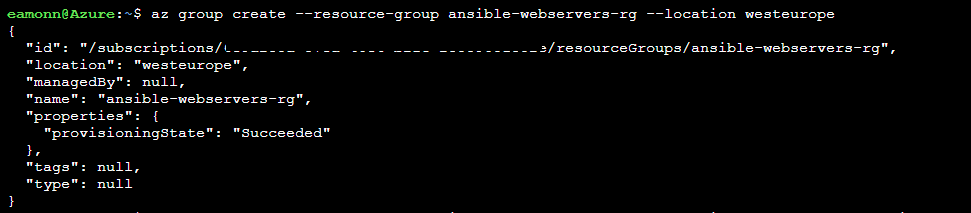

3. Create a web server virtual machine by running the following command

    **Note**: Although we do so in this lab, you should generally avoid dashes and hyphens and excessively long strings in virtual machine names, to avoid encountering any naming convention violations when creating some azure resources.

    ```
    az vm create --resource-group ansible-webservers-rg --name ansible-webserver-vm1 --image UbuntuLTS --generate-ssh-keys
    ```

    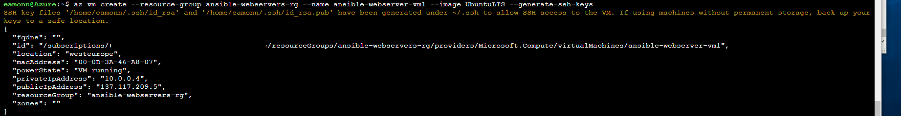    

4. Create another web server virtual machine by running the command

    ```
    az vm create --resource-group ansible-webservers-rg --name ansible-webserver-vm2 --image UbuntuLTS --generate-ssh-keys
    ```

    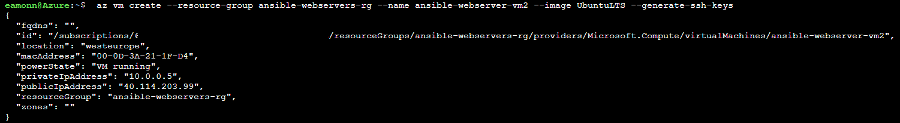    

5. Tag the first virtual machine, *ansible-webserver-vm1*,  with the tag `Nginx` to identify it as an **Nginx** web server by running the following command. Don't forget to paste your subscription ID into the command where indicated below. You can obtain the subscription ID by running the Azure CLI command **az account show**


    ```
    az resource tag --tags nginx --id /subscriptions/< YourAzureSubscriptionID >/resourceGroups/ansible-webservers-rg/providers/Microsoft.Compute/virtualMachines/ansible-webserver-vm1
    ```

6. Go to the Azure Portal and verify the `ansible-webserver-vm1` virtual machine has a tag applied now of Nginx and the other virtual machine, `ansible-webserver-vm2`, does not have the tag assigned.

    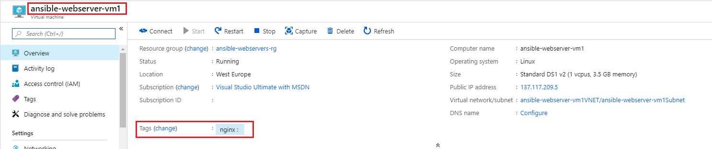    
    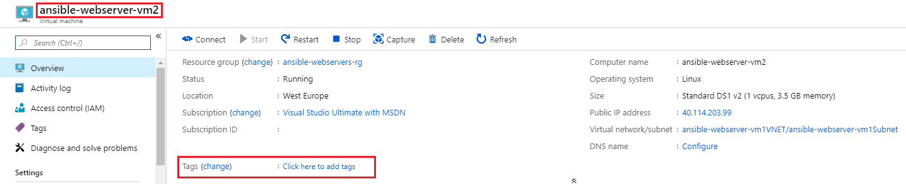    


### Task 2: Generate a Dynamic Inventory
Ansible provides a Python script called `azure_rm.py` that generates a dynamic inventory of your Azure resources by making API requests to the Azure Resource Manager at runtime.

1. Clone the ansible source code from **GitHub** into your Azure Cloud Shell by running the below command. These source files includes the dynamic inventory files such as `azure_rm.py`, that we will use for this dynamic inventory task in the lab. Git is already pre-installed with the Azure Cloud Shell, so does not need to be installed now, and also be aware that if you have already cloned the git repo into your Azure Cloud Shell instance, it will persist even if the Azure Cloud Shell is closed and re-opened, so does not need to be imported again.

    ```
    git clone git://github.com/ansible/ansible.git --recursive
    ```

    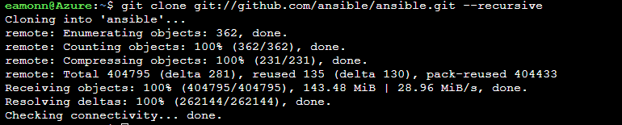 

2. Use the `chmod` command to change the access permissions to the `azure_rm.py` script. The following command uses the `+x` parameter to allow for execution, or running, of the file `azure_rm.py`


    ```
    chmod +x ./ansible/contrib/inventory/azure_rm.py
    ```
     

3. Install a JSON filter, **jq** that we will use shortly, by running the following command

    ```
    pip install jq
    ```
    
    Note: If you receive an error related to permissions, run the below command. As the command is run in the Azure Cloud Shell, there is no root access and packages, but packages can be installed in the user context instead of root.
    
    ```
    pip install jq --user
    ```

    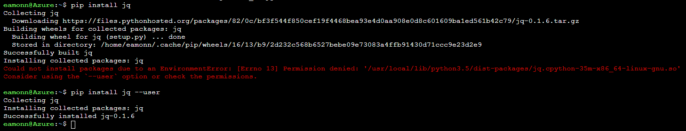 


4. Perform a ping test and generate a dynamic inventory of all the virtual machines running in Azure in the *ansible-webservers-rg* resource group by running the following command

    ```
    ansible -i ./ansible/contrib/inventory/azure_rm.py ansible-webservers-rg -m ping
    ```

    **Note**:The first time you run the command you will have to acknowledge the host's authenticity, by typing **yes** and pressing **Enter**. You may have to do this for each VM running the command again each time. Once the authenticity is verified subsequent runs of the command should return successfully with any interaction being required. The confirmation to continue connecting is related to how the public/private keys are configured in Azure Cloud Shell and the virtual machines when we set them up. You may also see an error related to logging, this is related to an ansible azure module and is fine to ignore in our lab. Run the command a few times to generate the successful output if needed.

    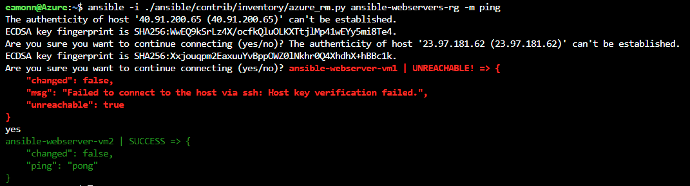 


    ```
        ansible-webserver-vm1 | SUCCESS => {
        "changed": false,
          "ping": "pong"
    }
    ansible-webserver-vm2 | SUCCESS => {
        "changed": false,
        "ping": "pong"
    }
    ```

     


5. To allow us run python against the `azure_rm.py` script we need to install the **Azure Python SDK for Ansible**. We can do that by running the following command
    
    ```
    pip install ansible[azure] --user
    ```

    **Note**: We use the `--user` switch to install in the user context, as we are not able to install packages as root, using `sudo`. If we try to install without the user switch we will receive an error related to permissions, with Permission denied.
    

6. Test that the dynamic inventory script is running, executing the below command. This should show JSON text containing information about all the VMs in your subscription.


    ```
    python ./ansible/contrib/inventory/azure_rm.py --list | jq
    ```
    
    Scroll through the output and note the various headings and sections that the data is grouped into. Perhaps also try run the command without the **jq** json package, and note how the formatting output is poor and difficult to interpret. 
    
    Also, you could run the command with **Python3**, rather than **Python** i.e. `python3 ./ansible/contrib/inventory/azure_rm.py --list | jq`, this will provide output in a slightly different format. **Python3** is installed by default in Azure Cloud Shell.


7. You could further refine the inventory script in order to return only the VMs using some other criteria, such as a location, resource group or *tags*. To achieve this filtering modify the *.ini* file that controls some aspects of `azure_rm.py` file. This *.ini* file is located in the same directory as the Python script, `azure_rm.py` which we downloaded from the ansible git repo earlier,  `~/ansible/contrib/inventory/azure_rm.ini`. You need to find the line that specifies which resource groups are to be inspected, un-comment it and change it as required. In our case we wish to filter by the tag `nginx` and as such as modify *line 10* in the `azure_rm.ini` file as below. You can modify the file in an editor such as **vi**, or **nano**, or using the editor that comes with **Azure Cloud Shell**, accessible by clicking the curly brackets in the task bar. **Save** the file when finished.


    ```
    tags=nginx
    ```

    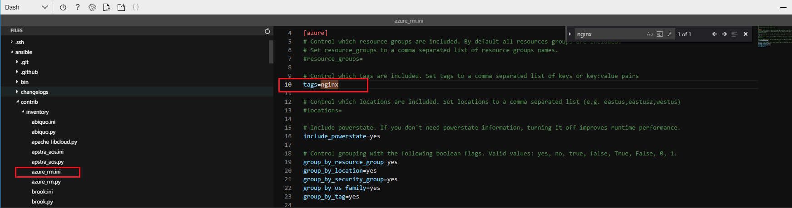 


8. Once the ini file has been modified to filter by the tag, run the Ansible dynamic inventory command again, listed below, against the resource group and verify only the virtual machine that has the `nginx` tag assigned is returned i.e. ansible-webserver-vm1


    ```
    ansible -i ./ansible/contrib/inventory/azure_rm.py ansible-webservers-rg -m ping
    ```

    ```
    ansible-webserver-vm1 | SUCCESS => {
        "changed": false,
        "ping": "pong"
    }
    ```
    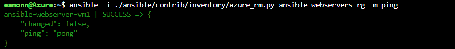


9. One final item to be aware of if that you can also run commands on the VMs identified by the dynamic inventory script. Run the command below and verify that data is returned. This command wil only run on the `nginx` tagged vm, as we modified our `azure_rm.ini` file earlier. To run it on all VMs, you could comment out the tag header in the .ini file.

    ```
    ansible -i ~/ansible/contrib/inventory/azure_rm.py all -m shell -a "/bin/uname -a"
    ```

    

    The command `uname -a` returns some information about the machine where it is executed, such as the Kernel version, the date and time and the CPU architecture.

    Dynamic Inventory is an Ansible feature that allows for a certain operation to be executed on a list of VMs which is not defined statically, rather is evaluated at execution time. For example, on all VMs in Azure in a certain resource group, certain location or with a certain tag.


### Task 3: Create an Ansible Control VM in Azure using Azure CLI
Host inventory is controlled and managed using the `/etc/ansible/hosts` file. However in the Azure Cloud Shell, we do not have root access and can only save files in the user context, i.e. `$Home`. As such to perform Ansible management with non dynamic inventory, we need root level access. We can achieve this by running ansible from a full Linux OS. In our case we'll provision a Linux virtual machine to Azure and configure it to allow us manage ansible and Azure virtual machines.

1. Some variables will be used in this task, these may look different in your environment. You should decide on these variables before starting with the lab. Notice that the VM names are prefixed by a (not so) random number, as we could use these to create DNS entries as well, and DNS names need to be unique.

    | **Description** | **Value used in this lab guide** |
    | --- | --- |
    | Azure resource group | ansiblemaster |
    | Name for provisioning VM | 19761013myvm |
    | Username for provisioning VM | azureuser |
    | Password for provisioning VM | Password0134! |
    | Name for created VM | ansiblemaster|
    | Azure region | westeurope |
    

2. In your local environment, not the Azure Cloud Shell, open the Azure CLI window. If Azure CLI is not installed on your machine, install it now using directions from the <a href="https://docs.microsoft.com/en-us/cli/azure/install-azure-cli" target="_blank"><span style="color: #0066cc;">Install the Azure CLI</span></a> page for your particular platform

3.  Login to Azure by running the below command and entering your credentials as prompted

    ```cli
    az login
    ```

4. If you have more than one subscription ensure you are set to use the correct subscription by running the below commands

    get a list of subscriptions available to your account by running the following command
    
    ```
    az account list
    ```
    set the subscription to the one you wish to use
    
    ```
    az account set --subscription < your subscription ID >
    ```
    
    Ensure the correct subscription is now set
    
    ```
    az account show
    ```

5. Create an Azure resource group and then define it as the *default* group for further commands by running the below commands in succession.

    ```
    az group create --name ansiblemaster-rg --location westeurope
    ```

    ```
    az configure --defaults group=ansiblemaster-rg
    ```
    - **Note**: The second command above set the default resource group to **ansiblemaster-rg**, so that in the next commands, the resource group does not need to be explicitly identified with the option `-g`.

    
   

6. Create a **VNet** and a **subnet** by running the below commands in succession

    ```
    az network vnet create -n ansibleVnet --address-prefixes 192.168.0.0/16 --subnet-name ansibleSubnet --subnet-prefix 192.168.1.0/24
    ```

    ```
    az network public-ip create --name masterPip
    ```

7. Create a Linux virtual machine in that subnet with a public IP address.

    ```
    az vm create -n ansibleMaster --image UbuntuLTS --vnet-name ansibleVnet --subnet ansibleSubnet --public-ip-address masterPip --authentication-type password --admin-username azureuser --admin-password Password0134!
    ```
    
    When it is complete, you should receive output similar to the below. Note the public IP Address for later use. It can take up to 5 minutes for the command to complete.

    ```
      "fqdns": "",
      "id": "/subscriptions/3e78e84b-6750-44b9-9d57-d9bba935237a/resourceGroups/ansiblemaster-rg/providers/Microsoft.Compute/virtualMachines/ansibleMaster",
      "location": "westeurope",
      "macAddress": "00-0D-3A-24-E2-C0",
      "powerState": "VM running",
      "privateIpAddress": "192.168.1.4",
      "publicIpAddress": "1.2.3.4",
      "resourceGroup": "ansiblemaster-rg"
    ```

    

8. At the Azure CLI the command prompt, connect over SSH to the new VM, using the public IP address displayed in the output of the previous command, and username and password provided in the previous command (azureuser / Password0134!). 

    **Note**: Please **replace 1.2.3.4** listed in the command below with the actual public IP address retrieved out of the last command.

    ```
    ssh azureuser@1.2.3.4
    ```

    
    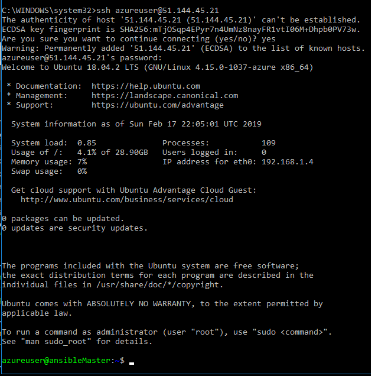


### Task 4: Install and Configure Ansible on Azure VM
Now inside the deployed virtual machine, this section will install the required packages into the **Ansible** master VM to allow **Ansible** interact with Azure, one of which is the **Azure Python SDK**.

1. Update the *Advanced Packaging Tool* (apt) package list so it has the latest version and package details
    
    ```
    sudo apt update
    ```
    
    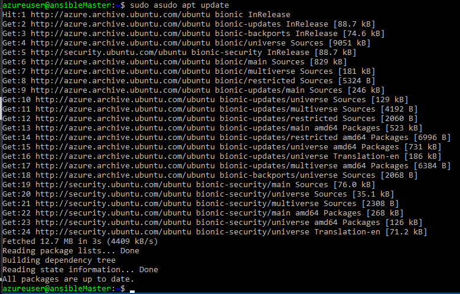


2. Install the pre-requisites required for ansible on Azure into the master VM by running the below command

    Install the four listed packages together in one command
    ```
    sudo apt-get install -y libssl-dev libffi-dev python-dev python-pip
    ```

    Install the Azure Python SDK for Ansible, (is also be referred to as the Ansible and Azure SDKs)
    ```
    sudo pip install ansible[azure]
    ```

    Install the dnspython package, this allows the ansible playbook to verify a DNS name of the before deploying the playbook
    ```
    sudo pip install dnspython 
    ```

    install the `jq` json formatting tool, by running the following command
    ```
    sudo apt install jq
    ```

### Task 5: Obtain Ansible configuration and sample playbook files

In this task we will obtain some ansible configuration file from github, which we will use in this lab. Again, this is carried out in our control VM, the *ansibleMaster*

1. Ensure git is installed in the ansible control vm by running the command

    ```
    sudo apt install git
    ```

2. Clone the ansible source code from **GitHub** into your control virtual machine by running the below command. These source files include the dynamic inventory files such as `azure\_rm.py`.

    ```
    git clone git://github.com/ansible/ansible.git --recursive
    ```

    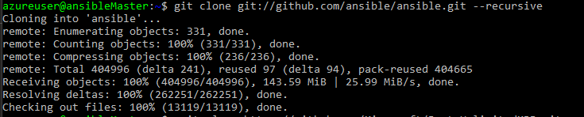

3. Clone the *PartsUnlimitedMRP* repo from **GitHub** which contains some sample yml files by running the below command. This repository contains yml for for creating new vms, web servers and more, some of which we will use in the lab.

    ```
    git clone https://github.com/Microsoft/PartsUnlimitedMRP.git
    ```

    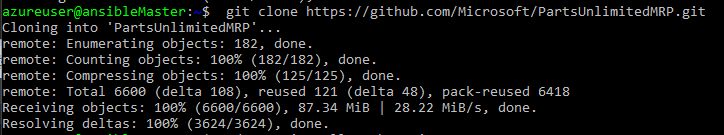


### Task 6: Create Service Principal in Azure

In general username and password is not a good authentication method for automation solutions, since it requires interaction. A solution for non-interactive authentication in Azure is called **Service Principal** where an application can authenticate with a pre-defined password, and it gets specific permissions within a certain scope.

This step is required so that Ansible can log in to Azure with non-interactive authentication. We will define a service principal and an application ID, and we will give permissions to the service principal to operate on the resource group that we created earlier.

As best practice, you should give the minimum permissions required to your service principals. 

For more information see the following URL page detail: <a href="https://docs.microsoft.com/en-us/azure/azure-resource-manager/resource-group-authenticate-service-principal-cli" target="_blank"><span style="color: #0066cc;">https://docs.microsoft.com/en-us/azure/azure-resource-manager/resource-group-authenticate-service-principal-cli</span></a>

**Note**: You can run the following commands in this task in the virtual machine you just deployed, which you are currently logged into after Task 3. However, you will need to login in again with the **az login** command. You should also verify you are in the same subscription that you deployed the virtual machine into earlier using the **az account show**, **az account list** and **az account set** commands if need be.

1. Create Active Directory application for Ansible by running the below command:

    ```
    az ad app create --password ThisIsTheAppPassword --display-name ansibleApp --homepage ansible.mydomain.com --identifier-uris ansible.mydomain.com
    ```

    You should receive output similar pt the below

    ```
      "appId": "11111111-1111-1111-1111-111111111111",
      "appPermissions": null,
      "availableToOtherTenants": false,
      "displayName": "ansibleApp",
      "homepage": "ansible.mydomain.com",
      "identifierUris": [
        "ansible.mydomain.com"
      ],
      "objectId": "55555555-5555-5555-5555-555555555555",
      "objectType": "Application",
      "replyUrls": []
    ```

2. Create Service Principal associated to that application, use the `appId` returned in the previous command for the `--id` value below.

    ```
    az ad sp create --id 11111111-1111-1111-1111-111111111111
    ```

    You should receive output similar to the below

    ```
      "appId": "11111111-1111-1111-1111-111111111111",
      "displayName": "ansibleApp",
      "objectId": "44444444-4444-4444-4444-444444444444",
      "objectType": "ServicePrincipal",
      "servicePrincipalNames": [
        "11111111-1111-1111-1111-111111111111",
        "ansible.mydomain.com"
      ]
    ```

3. Find out your **subscription** and **tenant** IDs:


    ```
    az account show
    ```

    You should receive output similar to the below

    ```
    {
      "environmentName": "AzureCloud",
      "id": "22222222-2222-2222-2222-222222222222",
      "isDefault": true,
      "name": "Your Subscription Name",
      "state": "Enabled",
      "tenantId": "33333333-3333-3333-3333-333333333333",
      "user": {
        "name": "your.name@microsoft.com",
        "type": "user"
      }
    }
    ```


4. Assign the **Contributor** role to the principal for our resource group (remember we have specified the default resource group earlier, so we do not need to specify it again), using the object ID for the service principal: Use the **appId** that you obtained earlier alongside the **--assignee** parameter

    ```
    az role assignment create --assignee 44444444-4444-4444-4444-444444444444 --role contributor
    ```

    You should receive output similar to the below

    ```
    {
      "id": "/subscriptions/22222222-2222-2222-2222-222222222222/resourceGroups/ansiblemaster-rg/providers/Microsoft.Authorization/roleAssignments/66666666-6666-6666-6666-666666666666",
      "name": "66666666-6666-6666-6666-666666666666",
      "properties": {
        "principalId": "44444444-4444-4444-4444-444444444444",
        "roleDefinitionId": "/subscriptions/22222222-2222-2222-2222-222222222222/providers/Microsoft.Authorization/roleDefinitions/77777777-7777-7777-7777-777777777777",
        "scope": "/subscriptions/22222222-2222-2222-2222-222222222222/resourceGroups/ansiblemaster-rg"
      },
      "resourceGroup": "ansiblemaster-rg",
      "type": "Microsoft.Authorization/roleAssignments"
    }
    ```

    Note the following values of your output, since we will need them later. 

    - Subscription ID: **22222222-2222-2222-2222-222222222222**
    - Tenant ID: **33333333-3333-3333-3333-333333333333**
    - Application ID (also known as Client ID): **11111111-1111-1111-1111-111111111111**
    - Password: **ThisIsTheAppPassword**


    

    An alternative to password authentication for the application, certificates can also be used, but that is out of the scope of this lab.


### Task 7: Configure Azure Credentials and SSH for use with Ansible
Ansible communicates and configures using `SSH`. As such we need to configure our control virtual machine and hosts, which are being managed, to allow communication between them and with Azure. You can do that by creating a credentials file, or by exporting the service principal details as Ansible environment variables. We will create a credentials file, and we will do that in these steps.

For more information about how to define Ansible credentials, see the <a href="https://docs.ansible.com/ansible/latest/scenario_guides/guide_azure.html#providing-credentials-to-azure-modules" target="_blank"><span style="color: #0066cc;" color="#0066cc"> Providing Credentials to Azure Modules</span></a> page.


1. You will also need to create a new file in the directory `~/.azure` (create it if it does not exist), using the credentials generated in the previous sections. The filename is `~/.azure/credentials` an this is file Ansible uses for credentials with Azure, to connect and perform operations in Azure. Start by running the below commands in sequence.

    ```
    mkdir ~/.azure
    ```

    ```
    touch ~/.azure/credentials
    ```

    Run the first line below for the `cat` command, and then one line at time, enter each line and press **Enter**, replacing the numbers listed below with the actual values you obtained for **AppID**, **SubscriptionID** and **tenant ID** when creating the **service principal** earlier. When you paste in the `EOF` value at the end it will save the file changes and exit.

    ```
    cat <<EOF > ~/.azure/credentials
    [default]
    subscription_id=22222222-2222-2222-2222-222222222222
    client_id=11111111-1111-1111-1111-111111111111
    secret=ThisIsTheAppPassword
    tenant=33333333-3333-3333-3333-333333333333
    EOF
    ```

   **Note:** Don’t forget to replace the numbers with the actual information you retrieved when you created the service principal

    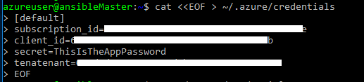

2. When finished run the below command to view the file contents and just double check it displays as intended.

    ```
    cat  ~/.azure/credentials
    ```
    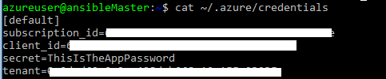

3.  Next we will create a public/private key pair, and install the public key in the local machine, to test the correct operation of Ansible. Press **Enter** when prompted, to accept the default values for the file in which to save the key, and to leave the passphrase (password) empty.

    ```
    ssh-keygen -t rsa
    ```

    You should receive output similar to the below

    ```
    Generating public/private rsa key pair.
    Enter file in which to save the key (/home/azureuser/.ssh/id_rsa):
    Created directory '/home/azureuser/.ssh'.
    Enter passphrase (empty for no passphrase):
    Enter same passphrase again:
    Your identification has been saved in /home/azureuser/.ssh/id_rsa.
    Your public key has been saved in /home/azureuser/.ssh/id_rsa.pub.
    The key fingerprint is:
    81:86:f7:9c:6b:34:3a:5a:b2:d9:49:c4:8b:36:19:3b azureuser@ansibleMaster
    The key's randomart image is:
    +--[ RSA 2048]----+
    |                 |
    |     . .         |
    |    . + .        |
    |     + o o       |
    |    . o S        |
    |     * + o       |
    |    E * o        |
    |   . @ +         |
    |    + o          |
    +-----------------+
    ```
    
4. When completed, then run the below commands to set the file and folder permissions.

    specify read, write and execute permissions on the .ssh folder.
    ```
    chmod 755 ~/.ssh
    ```

    create the `authorized_keys` file. Keys present in this file are allowed access, without requiring a password to be input
    ```
    touch ~/.ssh/authorized_keys 
    ```
    specify read and write permissions on the authorized_keys file
    ```
    chmod 644 ~/.ssh/authorized_keys
    ```
    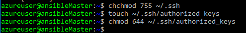


5. Next, run the below command and when prompted, type **yes** and enter the password for the **azureuser** which you defined earlier i.e. Password0134! or whatever you set it as.

    install the ssh key as an authorized key on the machine to the `authorized_keys` file
    ```
    ssh-copy-id azureuser@127.0.0.1
    ```
    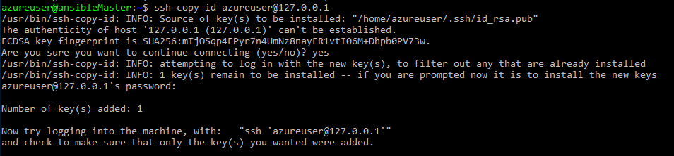

6. You can now verify that when trying to `ssh` to the local machine, no password will be requested when running the below command:

    ```
    ssh 127.0.0.1
    ```

    You should receive output similar to the below

    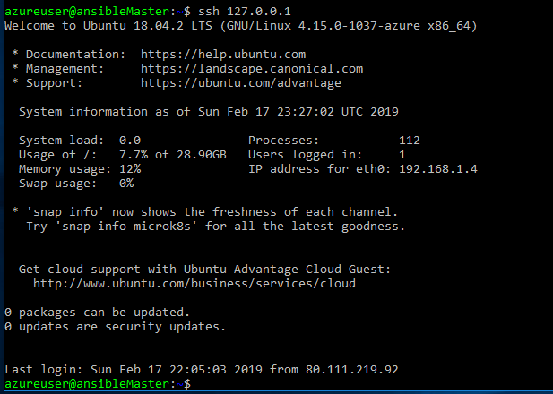
    ```
7. Type exit once only, to exit from the `127.0.0.1` connection


    

    As with any Ansible deployment, getting password-less SSH authentication right is a critical step. For that purpose, the creation of the VM in Azure needs to make sure that the right users with the right SSH public keys are deployed. 


### Task 8: Creating a Web server VM using an Ansible Playbook 

Now that we have Ansible up and running in our master virtual machine, we can deploy our first playbook in order to create a VM. This playbook will not be executed using the dynamic inventory function, but on the localhost. This will trigger the necessary calls to Azure so that all required objects are created. We will be using the playbook example that was cloned from the Github repository for this lab in previous sections, which you should have stored in `~/PartsUnlimitedMRP/Labfiles/AZ-400T05-ImplemntgAppInfra/Labfiles/ansible/new_vm_web.yml`.

1. You need to change the public SSH key that you will find inside the file `~/PartsUnlimitedMRP/Labfiles/AZ-400T05-ImplemntgAppInfra/Labfiles/ansible/new_vm_web.yml` with your own key, which you can find using the below command. Copy the key output that is returned after running the command, including the username at the end into a txt file for use later.

    ```
    cat ~/.ssh/id_rsa.pub
    ```

    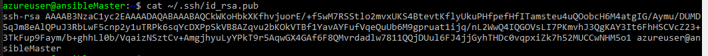

2. Edit the file `/new_vm_web.yml` with a text editor such as **nano** or **vi** from the command line by running the command

    ```
    nano ~/PartsUnlimitedMRP/Labfiles/AZ-400T05-ImplemntgAppInfra/Labfiles/ansible/new_vm_web.yml
    ```

3. In the nano editor, locate the SSH string towards the end of the file, in the` key_data` value, and delete the key that is present in the file.


    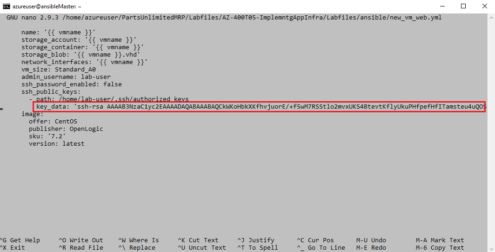

4. Paste in the key value that you copied earlier in Step 1. It is important that the username matches the user name in your ansibleMaster VM, i.e.`azureuser`, if you followed the lab guide. **Save** the file when finished and exit the editor

    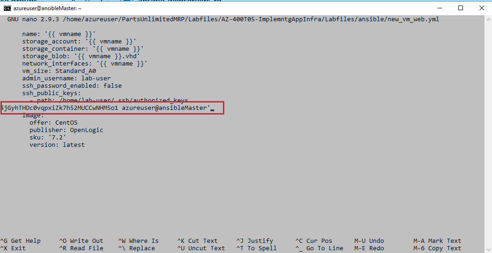


    **Note**: If you used a different username than what was called out earlier in the lab, i.e. *azureuser*, you will need to modify the `admin_username:` and `ssh_public_keys - path` values to match your username. Otherwise the public key will not be copied over to the virtual machine and you will be unable to ping or log on to it.

5. We will deploy the virtual machine into the resource group we created earlier for our ansible-webserver-vms, not the master resource group. Obtain the below values values from that resource group, as they will be needed in the playbook command. A VM name will also be required that adheres to the required dnsname standards ie.. no up

    - **Resource group name**=ansible-webservers-rg
    - **VNet** = ansible-webserver-vm1VNET
    - **Subnet** = ansible-webserver-vm1Subnet
    

    

    **Note**: The variables can be defined inside of playbooks, or can be entered at runtime along the ansible-playbook command with the `--extra-vars` option. As VM name please use **only lower case letters and numbers** (no hyphens, underscore signs or upper case letters), and a unique name, for example, using your birthday as suffix), since the creation of the DNS for the public IP requires that the VM name is unique (region-wide).

6. Run the ansible playbook to deploy the virtual machine by running the below command:


    ```
    ansible-playbook ~/PartsUnlimitedMRP/Labfiles/AZ-400T05-ImplemntgAppInfra/Labfiles/ansible/new_vm_web.yml --extra-vars "vmname=your-vm-name resgrp=ansible-webservers-rg vnet=ansible-webserver-vm1VNET subnet=ansible-webserver-vm1Subnet"
    ```


    **Note:** some errors you might get at this step, if you enter a "wrong" VM name:
    - `fatal: [localhost]: FAILED! => {"changed": false, "failed": true, "msg": "The storage account named storageaccountname is already taken. - Reason.already_exists"}`
    Resolution: use another name for your VM, that one seems to be already taken
    - `fatal: [localhost]: FAILED! => {"changed": false, "failed": true, "msg": "Error creating or updating your-vm-name - Azure Error: InvalidDomainNameLabel\nMessage`: The domain name label for your VM is invalid. It must conform to the following regular expression: ^[a-z][a-z0-9-]{1,61}[a-z0-9]$."}
    Resolution: use another name for your VM following the naming syntax. The problem could be that VM names should not start with a number or an upper case letter, but with a lower case letter 


    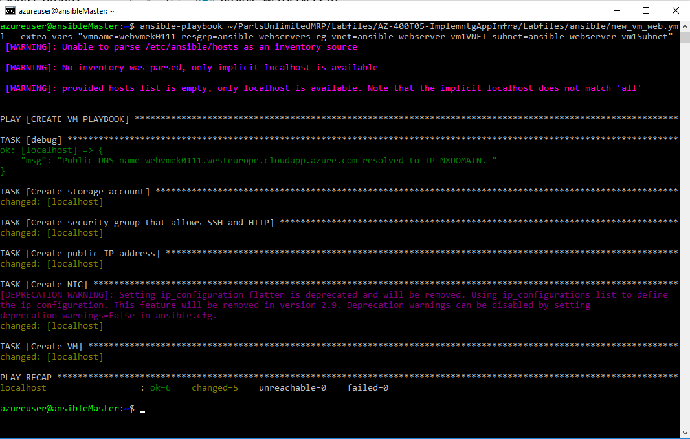

8. While the playbook is running, have a look in another console inside of the file `/new_vm_web.yml` , and try to identify its various componets.

9. After it is deployed, you can run the dynamic inventory, to verify that the new VM is now detected by Ansible by running the command

    ```
    python ./ansible/contrib/inventory/azure_rm.py --list | jq
    ```

    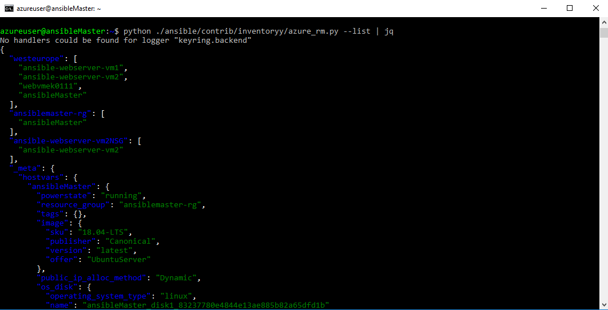

10. Using the dynamic inventory, run the ping test again, to verify that the dynamic inventory file can see the new machine. The first time you run the test you will have to verify the SSH host key, but successive attempts should run without any interaction being required:

    ```
    ansible -i ~/ansible/contrib/inventory/azure_rm.py all -m ping
    ```
    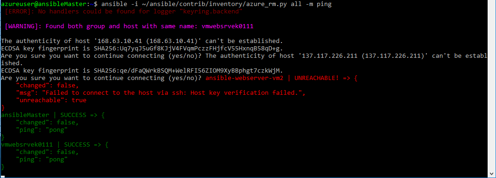

    Again, the first time you connect to the new VM you need to manually accept the SSH fingerprint, further attempts will work without manual intervention. Also, the two vms deployed earlier via the Azure Cloud Shell do not have the public key imported into the authorized keys file as we specified when deploying the web server in this step, as such we will not be able to ping them until that is done. the Ansible master shoudl also be responding in the ping responses. Once you can successfully get a ping response from the web server thatis the objective to be able to contineu to the next task. If thats not the case you should spend some time troubleshooting.


    Ansible playbooks can be used not only to interact with Linux VMs running on Azure, but with Azure itself. In this task we used an Ansible playbook (which was executed against the local host) to create a new Linux VM in Azure.


### Task 9: Configure a newly deployed Web Server VM with an Ansible playbook

In this section we will run another Ansible playbook, this time to configure the newly created machine. We will run a playbook that installs a software package **httpd** and downloads an HTML page from a Github repository. If everything works, after running the playbook you will have a fully functional Web server.

We will be using the example playbook that was downloaded from Github under `~/PartsUnlimitedMRP/Labfiles/AZ-400T05-ImplemntgAppInfra/Labfiles/ansible/httpd.yml`. Additionally, we will be using the variable `vmname` in order to modify the `hosts` parameter of the playbook, that defines on which host (out of the ones returned by the dynamic inventory script) the playbook will be run. First, we verify that there is no Web server running on the machine. Please replace `your-vm-name` with the real name of your VM (with your birthday as suffix, if you followed the recommendation in lab 5 step 3):

1. Run the following command to verify if there is the web server is running.


    ```
    curl http://your-vm-name.westeurope.cloudapp.azure.com
    ```

    You should receive a message saying **curl: (7) Failed connect to your-vm-name.westeurope.cloudapp.azure.com:80; Connection refused**


    **Note:** if you provisioned your VM to a different region, the URL will be different too.

    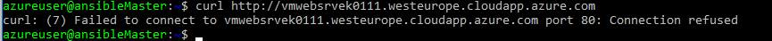

2. Now we will install the HTTP server with our Ansible playbook by running the following command. Run the command and open the yml file to get a feel for what it is doing.

    ```
    ansible-playbook -i ~/ansible/contrib/inventory/azure_rm.py ~/PartsUnlimitedMRP/Labfiles/AZ-400T05-ImplemntgAppInfra/Labfiles/ansible/httpd.yml --extra-vars  "vmname=your-vm-name"
    ```	


    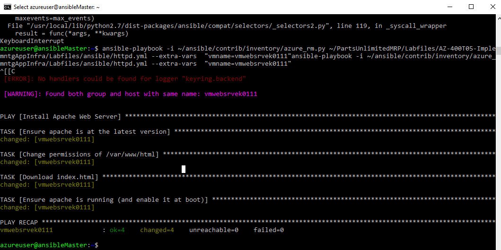

3. Once completed you can test that there is a Web page on our VM using your Internet browser and trying to access the location http://your-vm-name.westeurope.cloudapp.azure.com, or using curl from the master VM:


    ```
    curl http://your-vm-name.westeurope.cloudapp.azure.com
    ```

    If it is successful you should see output as per the below

    ```html
    <!DOCTYPE html>
    <html lang="en">
        <head>
            <meta charset="utf-8">
            <title>Hello World</title>
        </head>
        <body>
            <h1>Hello World</h1>
            <p>
                <br>This is a test page
                <br>This is a test page
                <br>This is a test page
            </p>
        </body>
    </html>
    ```

    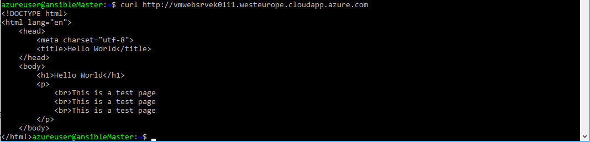

    You can also open a web browser and go to the url i.e. `http://your-vm-name.westeurope.cloudapp.azure.com`

    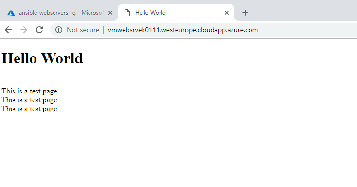

### Task 10: Run Ansible playbooks periodically for configuration management and desired state in Azure 

We could run the previous command periodically, to make sure that the configuration is what we want it to be, or more
precisely, what is defined in the VM's playbook. In order to do this we will use the cron functionality of Linux, that allows running
commands at certain schedules. 

In this task we will run the command every minute, in a production environment you would probably want a lower frequency. 


1. We have an ansible playbook yml file to set up our cron job. Run the below command to open the `cron.yml` file to configure iut for your environment and to get a feel for what it is doing. 


    ```
    nano ~/PartsUnlimitedMRP/Labfiles/AZ-400T05-ImplemntgAppInfra/Labfiles/ansible/cron.yml
    ```
2. Change the `vmname` value to match that of your VM in line where **job** is defined. It should be something like the below, then save the file and exit the editor.

    ```yml
    job: 'ansible-playbook -i /home/azureuser/ansible/contrib/inventory/azure_rm.py /home/azureuser/PartsUnlimitedMRP/Labfiles/AZ-400T05-ImplemntgAppInfra/Labfiles/ansible/httpd.yml --extra-vars "vmname=webvmsrvek01111"'
    ```

3. Run the `cron.yml` playbook file to create the cron job, by running the below command. As we are running the command directly on the ansible control


    ```
    ansible-playbook  ~/PartsUnlimitedMRP/Labfiles/AZ-400T05-ImplemntgAppInfra/Labfiles/ansible/cron.yml
    ```


4. Verify the command is running successfully. You can check the times that the command was executed with this line. Note that you need root privilege, since all cron jobs for all users are logged in that file. Also, the location below is for Ubuntu, if you have a different linux environment it may be a different location where the logs are stored.

    ```
    sudo tail /var/log/syslog
    ```


5. Check the cron entry by running the command below to launch the cron editor and view its contents. the first time you run it you need ot select an editor, select **1**, for nano, and press **Enter**


    ```
    crontab -e
    ```


Note the presence of the entry listed below, the 5 wild characters, indicate to run every minute.

    ```
    * * * * * ansible-playbook -i ~/ansible/contrib/inventory/azure_rm.py ~/ansible-azure-lab/httpd.yml --extra-vars  "vmname=your-vm-name"
    ```


6. Now let us verify that our setup works. Run the below command to connect to your VM over SSH and you can use the VM name from your Ansible master, since Azure DNS service will resolve it to the right IP address. 


    ```
    ssh azureuser@your-vm-name
    ```

    If you are unable to connect with this command and receive a message saying temporary failure in name resolution, you can connect directly to the IP address without the user name, once you are running the command from within the ansible master VM, as we have earlier installed its public keys in the authorized_keys file in the web server VM during its creation. As such, obtain the IP address of the web server, you cause the Azure Portal to do so, and run the below command to connect

        ```
    ssh < your web server IP address >
    ```
   
    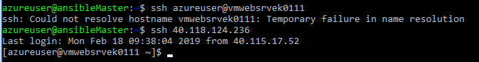

7. Run the below command again to view the web site content, you should see the Hello World, This is a test page content returned

    ```
    curl http://webvmsrvek01111.westeurope.cloudapp.azure.com
    ```


8.  Delete the Web page by running the command, and then exit the VM by running the command by running the below commands in sequence
    ```
    rm /var/www/html/index.html
    ```
    
    ```
    exit
    ```

6. Now the run curl command again against your web server and web site address by running the below command
    ```
    curl http://your-vm-name.westeurope.cloudapp.azure.com
    ```

    If you did the previous steps quick enough, the first time you run the curl command you will see that a different page is coming back. If you reissue the previous curl command again after a minute or so, **cron** will have run the playbook again and fixed any issue (such as the absence of index.html), so that you should see our custom page coming back now. 

    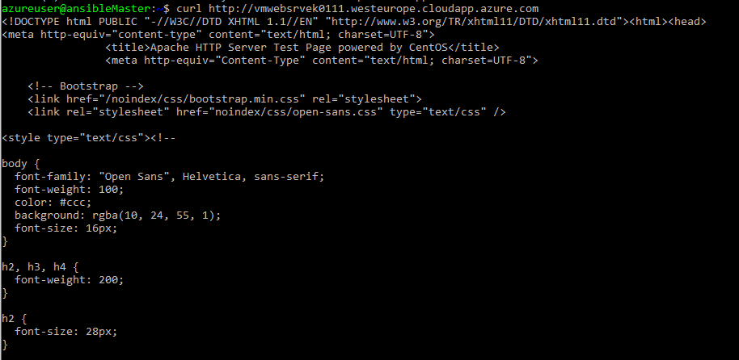


    By periodically running ansible playbooks you can correct changes that deviate VMs from their desired configuration (as defined in the playbooks). Using this approach we can prevent configuration drift and ensure our desired state.


    We could also follow the same approach and run Ansible playbooks periodically against Azure itself. The same way that a playbook can correct configuration deviations in a VM, they can equally correct configuration deviation in Azure resources such as virtual networks, subnets, storage and any Azure resources we can write ansible playbooks against. This way you can be sure that your infrastructure is deployed exactly as it should. See more information about Azure modules in Ansible here: http://docs.ansible.com/ansible/latest/list_of_cloud_modules.html#azure.


### Task 11: Using Ansible with ARM templates for Azure configuration management and desired state

As we saw in the previous lab, Azure modules for Ansible can be used to fix configuration deviations of existing resources supported by Ansible. However, you can also use Ansible to deploy a playbook that will refer to an Azure Resource Manager template, and you can offload logic from the playbook to the ARM template. Thus giving you access to the full set of functionality and resources available natively in Azure Resource Manager templates

An additional benefit is that the Azure admin does not need to learn the playbook syntax, but can work with the known constructs of Azure templates.

1. We will deploy another VM, this time we will run an ansible playbook that calls an Azure Resource Manager template. For simplicity reasons we will use a predefined VM name with no public IP address. However, we will create a slightly more complex setup, with an additional vnet, subnet, availability group and load balancer. The file os available at /PartsUnlimitedMRP/Labfiles/AZ-400T05-ImplemntgAppInfra/Labfiles/ansible/new_ARM_deployment.yml, and you can lok through it to understand it structure, then ru the below command to deploy the virtual machine, changing any values for resource group and location as you need.

    ```
    ansible-playbook ~/PartsUnlimitedMRP/Labfiles/AZ-400T05-ImplemntgAppInfra/Labfiles/ansible/new_ARM_deployment.yml --extra-vars "resgrp=ansible-webservers-rg location=westeurope"
    ```


2. It is important to realize that applying an ARM template to Azure is *idempotent*. That is to say, deploying an ARM template once, has the same effect as deploying that very same template one hundred times. In other words, you can safely redeploy ARM templates to the same resource group without the concern that duplicate resources will be created. As such, you can schedule the ARM template to be deployed periodically with the Linux **cron** facility as we have seen earlier. Run the same command again to demonstrate this idempotency and to note how quickly it runs second time round. 

    ```
    ansible-playbook ~/PartsUnlimitedMRP/Labfiles/AZ-400T05-ImplemntgAppInfra/Labfiles/ansible/new_ARM_deployment.yml --extra-vars "resgrp=ansible-webservers-rg location=westeurope"
    ```


    Note how the template took a shorter time to be deployed (no new resources were configured).

3.  Now we will introduce a change in one of the objects deployed by the template, for example in the Load Balancer probe. These changes are very difficult to detect, but could completely break your application. Therefore, it is extremely useful having a mechanism to automatically fix these deviations from the desired state. In this case, we will change the TCP port that the *healthcheck* probe of the load balancer uses to verify the state of the servers:

    In the Azure Cloud Shell, run the below command (we do not have Azure CLI installed in our ansible control VM so it needs to be run form the Azure Cloud Shell)

    ```
    az network lb probe update --lb-name mySlb -n myProbe --set port=80 --resource-group=ansible-webservers-rg
    ```

4.  Now re-run the template issuing the same command as in step 1 one more time. It should be run in the Ansible control VM, not the Azure Cloud Shell, (this time it will take a bit longer to run than in Step 2, since the load balancer needs to be re-provisioned), and verify after the run that the probe is now back to port 22:

    ```
    ansible-playbook ~/PartsUnlimitedMRP/Labfiles/AZ-400T05-ImplemntgAppInfra/Labfiles/ansible/new_ARM_deployment.yml --extra-vars "resgrp=ansible-webservers-rg location=westeurope"
    ```

5. Then switch back to the Azure Cloud Shell and run the below command to verify the port number has returned ot the value defined in the Resource Manager template
    
    ```
    az network lb probe show --lb-name mySlb -n myProbe --resource-group=ansible-webservers-rg
    ```

    In this task we have demonstrated how to use Ansible playbooks to define desired state configuration for certain Azure objects (those supported by the Ansible modules for Azure), and in this lab we have seen how to use Ansible functionality together with ARM templates in order to define desired state via templates for anything in Azure that can be defined with an ARM template.

    Idempotency is a critical property of ARM templates that enables this use case.

    **Note**: A valid question is why should you bother with Ansible, since you could just schedule Azure CLI deployments with **cron** without having to rely in Ansible. While you could certainly do that, there are certain scenarios where you want to use the same mechanism for describing and deploying desired state configuration for all your resources (including the state of the guest OS or deployments in other clouds), and Ansible offers a way to do that. In other words, it is a question of standardization.

    In any case, Azure Resource Manager templates offer a way to enhance Ansible support for new Azure services, and allows administrators to describe Azure desired state via templates that will be deployed using Ansible.  

### Task 12: Deleting Azure resources using Ansible - Optional 

Finally, similarly to the process to create a VM we can use Ansible to delete it, making sure that associated objects such storage account, NICs and Network Security Groups are deleted as well. For that we will use the playbook in this labs' repository `delete_vm.yml`.

1. We need to disable the automatic execution of Ansible playbooks, otherwise you will not see the effect of removing a VM, since the next Ansible cron pass could recreate it. Edit the crontab file by opening the editor with the below command, and comment all lines with a hash symbol, `#` at the beginning of the line.

    ```
    crontab -e
    ```

2. Save and close the file then verify the changes by running the below command to view the contents.

    ```bash
    crontab -l
    ```

    Your crontab file should look like this:
    ```yml
    #* * * * * /usr/bin/ansible-playbook -i ~/ansible/contrib/inventory/azure_rm.py ~/PartsUnlimitedMRP/Labfiles/AZ-400T05-ImplemntgAppInfra/Labfiles/ansible/httpd.yml --extra-vars  "vmname=webvmsrvek01111"
    ```
3.  You can now remove the VM created at the beginning of this lab using the provided playbook. Do not forget to replace "your-vm-name" with the actual name of your Virtual Machine:

    ```
    ansible-playbook ~/PartsUnlimitedMRP/Labfiles/AZ-400T05-ImplemntgAppInfra/Labfiles/ansible/delete_vm.yml --extra-vars "vmname=your-vm-name resgrp=ansible-webservers-rg"
    ```


3. Verify that the virtual machines in the specified resource group do not exist any more, using Ansible's dynamic inventory functionality, i.e. run the below command.

    ```
    ansible -i ~/ansible/contrib/inventory/azure_rm.py all -m ping
    ```

<h3><span style="color: #0000CD;"> Summary</span></h3> 

In this lab we have seen how to use Ansible for two purposes:

On one side, Ansible can be used in order to create VMs, in a similar manner than Azure quickstart templates. If you already know Ansible and prefer using Ansible playbooks instead of native Azure JSON templates, you can certainly do so.

On the other side, and probably more importantly, you can use Ansible in order to manage the configuration of all your virtual machines in Azure. Whether you have one VM or one thousand, Ansible will discover all of them (with its dynamic inventory functionality) and apply any playbooks that you have defined, making server management at scale much easier.

Lastly, by automating periodic execution of Ansible playbooks you can make sure that the configuration of Azure resources (including guest OS configuration) matches the desired state defined in Ansible playbooks, and optionally in Azure ARM templates. And all that without installing any agent, due to the agentless nature of Ansible.

We have completed the following tasks in this lab
- Created two Web Server virtual machines in Azure using Azure Cloud Shell
- Generated a Dynamic Inventory
- Created an Ansible Control VM in Azure using Azure CLI
- Installed and Configure Ansible on Azure VM
- Obtained Ansible configuration and sample playbook files
- Created Service Principal in Azure
- Configured Azure Credentials and SSH for use with Ansible
- Created a Web server VM using an Ansible Playbook 
- Configured a newly deployed Web Server VM with an Ansible playbook
- Ran Ansible playbooks periodically for configuration management and desired state in Azure 
- Ued Ansible with ARM templates for Azure configuration management and desired state
- Deleted Azure resources using Ansible - Optional


#### References 

Useful links:


- Ansible web page: <a href="https://www.ansible.com" target="_blank"><span style="color: #0066cc;">https://www.ansible.com</span></a>
- Ansible documentation - Getting started with Azure: <a href="https://docs.ansible.com/ansible/guide_azure.html" target="_blank"><span style="color: #0066cc;">https://docs.ansible.com/ansible/guide_azure.html</span></a>
