In this lab, we will deploy the *PartsUnlimted MRP Application* (PU MRP App) via *Chef Server* to Azure. The lab is designed to point out some of the key features and capabilities of using Chef with Azure, and to discuss and describe them. Completing this lab will enable you to understand and explain these features and capabilities to customers, as part of the DevOps Lifecycle.

<h3><span style="color: #0000CD;">DevOps MPP Course Source:</span></h3>

This lab is used in the following courses.

- <a href="https://www.edx.org/course/infrastructure-code-microsoft-devops200-2x-0" target="_blank"><span style="color: #0066cc;">DevOps200.2x: Infrastructure as Code</span></a> - Module 4 Azure IaaS and PaaS, Environment Configuration and Deployment, and Optimization.
- AZ-400T05: Implementing Application Infrastructure - Module 4 Third Party and Open Source Tool integration with Azure. The lab compliments the AZ-400 series of courses to help you prepare for the <a href="https://www.microsoft.com/en-us/learning/exam-AZ-400.aspx" target="_blank"><span style="color: #0066cc;">AZ-400 Microsoft Azure DevOps Solutions</span></a> certification exam.

<h3><span style="color: #0000CD;">Lab Video:</span></h3>

<div class="image">
<div onclick="thevid=document.getElementById('thevideo'); thevid.style.display='block'; this.style.display='none'">

</div>
<div id="thevideo" style="display: none;">
<iframe width="960" height="640" src="https://www.youtube.com/embed/1gIeeyuvzQs" frameborder="0" allowfullscreen></iframe>
</div>
</div>

<h3><span style="color: #0000CD;">Pre-requisites:</span></h3>

- An active Azure subscription.

<h3><span style="color: #0000CD;">Lab Tasks:</span></h3>

- Set up a Chef Automate machine and client with an Azure Resource Manager (ARM) template.
- Configure the Chef Workstation.
- Create a Cookbook and Recipe, and upload them to the Chef Automate server.
- Create a Role.
- Bootstrap the PU MRP App Server and Deploy the PU MRP App.

<h3><span style="color: #0000CD;">Estimated Lab Time:</span></h3>

- Approx. 80 minutes.

### Chef deployment options in Azure

The following deployment options are available for using Chef in Azure.

- *Install a clean Linux VM*. We can install an Ubuntu image SKU in a VM on Azure, and then install and configure *Chef Server* in that VM.
- *Install Chef Automate*. This image SKU is available on Azure. The Chef Automate image includes a number of Chef services, such as Chef Server.
- *Hosted Chef Server*. You can sign up for a hosted Chef Server account at <a href="https://manage.chef.io" target="_blank"><span style="color: #0066cc;">https://manage.chef.io</span></a>, and use the server to host your Chef configurations.

In this lab, we will install Chef Automate on Azure. Chef Automate contains Chef Server. It also replaces *Chef Analytics*, so deploying Chef Automate to Azure will provide us with the components we need.

  > **Note**: If you have time, look through the <a href="https://docs.chef.io/install_chef_automate.html" target="_blank"><span style="color: #0066cc;">Chef Automate documentation</span></a> to familiarize yourself with how it operates and how it is structured.
  >
  > Also, note that there is a free 30-day trial license for use with Chef Automate in Azure. In this lab, we will leave the license fields blank to avail of this free 30-day trial license.

### Lab environment

This lab uses two Virtual Machines (VMs) on Azure, and your local environment, set up as follows:

- *Chef Automate* houses the Chef Server, and will be installed on a Linux VM in Azure.
- *PU MRP App client* will also be a Linux VM in Azure. This is the Chef node machine which we will configure. We will deploy the PU MRP application to this node machine using Chef.
- *Chef Workstation* will connect to and manage your Chef Server. It can be Linux, Windows, or Mac.

For this lab, your local machine will act as the Chef Workstation. We will use ARM templates to create the two Linux VMs in Azure for Chef Automate and for the PU MRP App, instead of creating the VMs manually.

> **Note**: If you prefer, you can create a VM in Azure of any Operating System (OS) platform, and use it as your Chef Workstation instead of using your local environment. The steps set out in this lab assume you are using a Windows OS.

### Task 1: Set up a Chef Automate machine and client with an ARM template

1. Select the **Deploy to Azure button** below, and follow the wizard to deploy Chef Automate to a new VM in Azure. When prompted, log in to the Azure Portal.

	<a href="https://portal.azure.com/#create/Microsoft.Template/uri/https%3A%2F%2Fraw.githubusercontent.com%2FMicrosoft%2FPartsUnlimitedMRP%2Fmaster%2FLabfiles%2FAZ-400T05-ImplemntgAppInfra%2FLabfiles%2FM04%2FDeployusingChef%2Fenv%2Fdeploychef.json" target="_blank"></a>
	<a href="http://armviz.io/#/?load=https%3A%2F%2Fraw.githubusercontent.com%2FMicrosoft%2FPartsUnlimitedMRP%2Fmaster%2FLabfiles%2FAZ-400T05-ImplemntgAppInfra%2FLabfiles%2FM04%2FDeployusingChef%2Fenv%2Fdeploychef.json" target="_blank"></a>

    The VM will be deployed to a Resource Group along with a Virtual Network (VNET), and some other required resources.

	> **Note**: You can create a new Resource Group during the deployment process, to demarcate the resources that you set up in this lab. By assigning this lab's resources to a separate Resource Group, you can delete the Resource Group any time you want to remove the resources created at this point in the lab.

2. Fill out the required fields with the following details. Add your initials or other unique identifier as a suffix to create a unique name, where required.

    - **Subscription**. `< your Azure subscription >`.
    - **Resource group**.  Choose **Create new** and enter a `< a unique resource group name >`. For example `chefrgek017`.
    - **Location**: Select a region to deploy the Resource Group to. For example `West Europe` or `East US`.
    - **Admin Username**. `azureuser`.
    - **Admin Password**. `Passw0rd0134`.
    - **Diagnostic Storage Account Name**. `< a unique diagnostic storage account name >`. For example, `diagstrek017`.
    - **Location**. Select a region to deploy the VM to. Use the same region that you used previously. For example `West Europe` or `East US`.
    - **Public IP Dns Name**: `< a unique dns name >`. For example `chefautomateek017`.
    - **Storage Account Name**: `< a unique storage account name >`. For example `strek017`.

    <br>

    > **Note**: *Only edit the configuration fields cited above*. All other configuration fields are already populated correctly, and you do not need to change them. Make a note of the *region*, *username* and *password* that you set for the Chef Automate machine, as you will be required to recall these details later in this lab.

    When you have entered the required details, **check the tick box** to agree to the Azure Marketplace terms and conditions. Select the **Purchase** button.

    Allow about 10 minutes for the deployment to complete.

    

3. When the deployment completes, select the **Resource Groups** blade from the Azure Portal menu. Choose the name of Resource Group that you created, **chefrgek017** for example.

    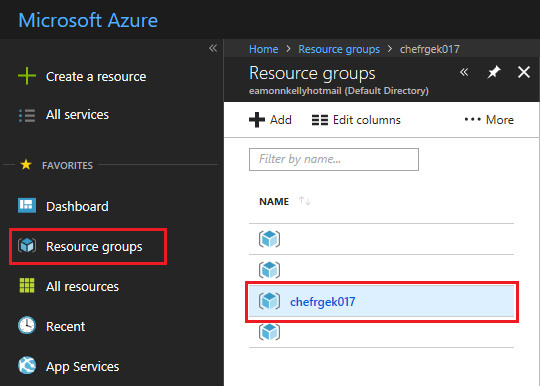

    You should see a list of resources similar to the following. Beside **Deployments**, select the **5 succeeded** message.

    

4. Verify that the **Status** for each deployment operation is **Succeeded**.

    

5. You need to obtain the public DNS name for your Chef Automate instance. Select the **Resource Groups blade** in Azure Portal. Choose the Resource Group you created previously (for example, **chefrgek017**). Select the **chefautomateip** resource (or whatever you called it) from the resources list.

    ![Screenshot of the chefautomateip resource, listed under the chefrgek017 Resource Group, in Azure Portal. The Resource Groups blade on the Azure menu is highlighted to illustrate how to access a list of Resource Groups from the Azure menu. The chefrgek017 Resource Group is highlighted inside the Resource Groups blade to illustrate how to access a list of resources within a particular Resource Group. The chefautomateip resource is highlighted inside the chefrgek017 Resource Group to illustrate how to access a particular resource from within a Resource Group list.](../assets/pumrpdeploywithchef-feb2019/chefautomateip.png)

   Copy the **DNS name** value from the **Public IP address pane**. The **DNS name** value will be a URL, in the following format `machinename`.`region`.`cloudapp.azure.com`

   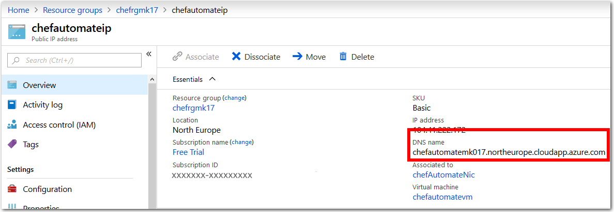

6. Open a web browser, paste the DNS name value into the address bar field, and go to the URL. Use the prefix `https` (not `http`).

    If you are prompted about a certificate error, it is safe to override this warning for the purposes of this lab and visit the page. The prompts that you see, and steps required to access the URL, may be different depending on your web browser.

    The following screenshot is from inside the Microsoft *Edge* web browser. To go to the page, choose **Details**, then select **Go on to the webpage**.

    

7. If the deployment of the Chef Automate image has succeeded, you should see the **Chef Automate login** prompt.

    > **Note**: You *cannot* sign into Chef Automate at this stage. You will need to complete Task 2 before you can sign into Chef Automate successfully.

    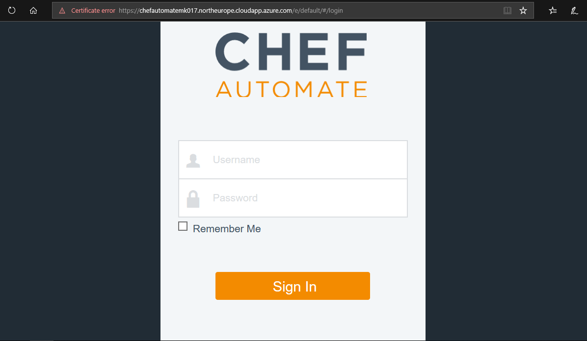

### Task 2: Configure the Chef Workstation

In this task, you will configure your Chef Workstation by setting up the Chef Starter Kit on your local workstation. You will connect to, and manage, your Chef Server from the Chef Workstation.

1. Download and install the **Chef Development Kit** (Chef DK) from <a href="https://downloads.chef.io/chefdk" target="_blank"><span style="color: #0066cc;">https://downloads.chef.io/chefdk</span></a>. Choose the version of the Chef Development Kit appropriate to your particular environment, i.e. Mac OSX/macOS, Debian, Red Hat Enterprise Linux, SUSE Linux Enterprise Server, Ubuntu, Windows, etc.

    > **Note**: As of September 2019 the latest version of the Chef Development Kit is 4.3.13. Chef Development Kit `chefdk-4.3.13-1-x64` for Windows 10 is the version used in this lab.

2. Once installed, you should have a shortcut for **Chef Development Kit** on your desktop. Use the shortcut to launch the Chef Development Kit, and run the following command in the **Chef Development Kit PowerShell window**.

    ```powershell
    chef verify
    ```

    If prompted, type **yes** to accept the Chef License terms.
    Keep the PowerShell window open, you will use it again later in this lab.

    **Running `Chef Verify`**

    The results of running the `Chef verify` command may depend on your configuration.

    - If `Chef verify` runs successfully, and lists **succeeded** at each component, proceed to Step 4.
    - If `Chef verify` fails or gives a warning at one or more components, as per the following screenshot, but continues to the end without further errors, proceed to Step 4.

      

    - If `Chef verify` returns errors because Git is not configured with your identity information, proceed to Step 3 to configure your Git identity information.

      

3. In the **Chef DK PowerShell** window, configure your global Git variables with your name and email address if you have not already done so. We will use Git to store our Chef configuration details.

    Enter the following commands and values into the **Chef DK PowerShell window**.

    ```powershell
    git config --global user.name “azureuser”
    git config --global user.email “azureuser@partsunlimitedmrp.local”
    ```

    Run `chef verify` again to ensure no further Git-related errors exist.

4. You need the *Chef Starter Kit* for accessing your Chef Automate VM instance on Azure. To get the Chef Starter Kit, append `/biscotti/setup` to the public DNS name value for the Chef Automate VM that you installed in Task 1.

    The result will be a URL in the following format

    `https:`//`DNS label`.`region`.`cloudapp.azure.com`/`biscotti`/`setup`

    For example, `https://chefautomateek017.westeurope.cloudapp.azure.com/biscotti/setup`

    Visit the URL in a web browser, and override the certificate error if required.

    

    In your web browser window, on the **Chef Automate Setup Authorization** page you will be prompted to enter a *Virtual Machine ID* (VMID). This is the VMID for the Chef Automate VM that we deployed in Task 1.

5. The VMID is a unique value that is assigned to each VM in Azure. You can obtain the VMID in a number of ways, such as using PowerShell, or with Azure CLI. This lab uses the Windows OS, so we will obtain the VMID by connecting to the Chef Automate VM via SSH using PuTTy.

    In a Linux environment, you can obtain the VMID in a similar way by connecting to the Chef Automate VM via SSH.

    **Obtain VMID using PuTTy**

    - Download PuTTy from <a href="https://putty.org/" target="_blank"><span style="color: #0066cc;">https://putty.org/</span></a> and install it.
    - In PuTTy, open a new SSH connection to your Chef Automate VM. Enter the public DNS name for your Chef Automate VM as the destination **Host Name (or IP address)**. Select **Open** to connect to your Chef Automate VM.

      

	  > **Note**: If prompted, choose **Yes** to add the new SSH key to your local registry cache.

		

    - A new bash terminal window will open. When prompted, inside the bash terminal, login into the Chef Automate VM using the username and password credentials you specified in Task 1, i.e.
      - **username**. `azureuser`
      - **password**. `Passw0rd0134`

    - Once the PuTTy terminal has logged into the Chef Automate VM, run the following bash command and note the VMID that is returned.

      ```bash
      sudo chef-marketplace-ctl show-instance-id
      ```

        

        Exit the PuTTy terminal with the following command.

      ```bash
      exit
      ```

    - Go back to your web browser and enter the VMID into the **Chef Automate Authorization Setup** page. Select the **Authorize** button, as in the following screenshot.

    	

6. You will be asked to provide details of your **Chef Automate Setup**. Enter the same details on the Chef Automate Setup web page that you provided for the Chef Automate VM deployment. You should note the details that you specify, as you will need to reuse them later in this lab.

    We recommend using the following details, which are consistent with the details used throughout this lab for the Chef Automate VM, Git, second Linux VM deployment, etc.

	- **First Name**. `Azure`
	- **Last Name**. `User`
	- **Username**. `azureuser`
	- **Email address**. `azureuser@partsunlimitedmrp.local`
	- **Password**. `Passw0rd0134`

	

7. Agree to the EULA terms and select the **Set Up Chef Automate** button.

	If you get a warning message about a certificate error, override the error and continue to the web page.

	> **Note**: An organization name of **default** will be applied. We do not specify an organization name as part of the Chef Automate configuration setup. You can specify an organization name within the Chef Automate server, but we will use the default value. This organization value will be used in the `knife.rb` file in Task 3.

8. Your web browser should be redirected to the **download Chef Starter Kit** web page. The Chef Starter Kit is a file named `starter-kit.zip`, which contains pre-configured files to set up Chef quickly. Select the **Download Starter Kit** button and download the zip file to your local environment.

	> **Note**: The Chef Start Kit contains user credentials and certificate details. Different credentials and details are generated each time you register, which are specific to the user and organizational details that you provide each time. Do not re-use the Chef Start Kit files across multiple users or registrations, as you may encounter errors.

	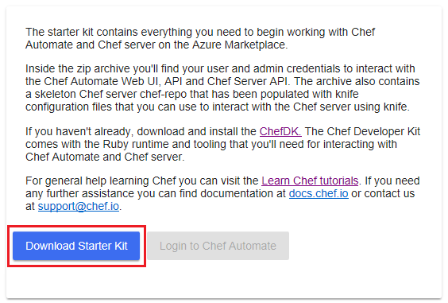

9. After you have downloaded the **Chef Starter Kit**, the **Login to Chef Automate** button will be enabled. Select the button, and sign into Chef Automate by entering the username and password you provided on the **Chef Automate Setup** web page. The **Chef Automate dashboard** should now be visible in your web browser.

	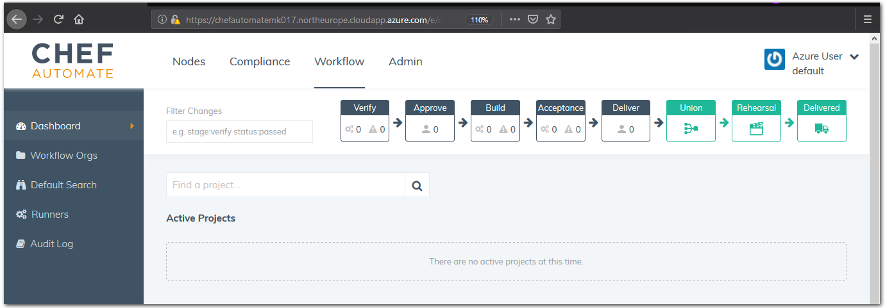

10. **Extract** the contents of the Chef Starter Kit zip archive to a directory, such as `C:\Users\<username>\chef\`.

11. Go to the location where you extracted the Chef Starter Kit files. **Open** the file `~\chef-repo\.chef\knife.rb` in an editor. Check that the value assigned to `chef_server_url`, for the external FQDN (Fully Qualified Domain Name), corresponds to the following.

	`https:`//`<chef-server-dns-name>`.`<region>`.`cloudapp.azure.com/organizations/default`

	Then, **save** and **close** the file.

	> **Note**: If you have a different organization name present in the `knife.rb` file, change the name to the `default` organization.

	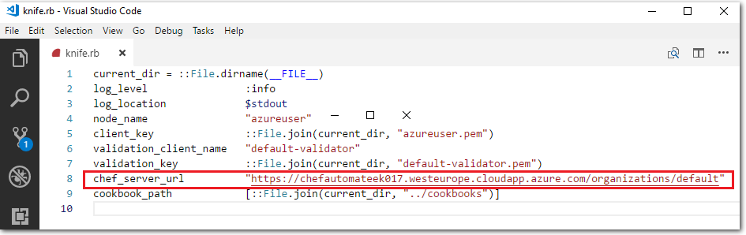

12. Return to the **Chef DK PowerShell** window that you used earlier to run the `chef verify`. Change directories into the `chef-repo` directory (e.g. `cd C:\Users\<username>\chef\chef-repo`).

	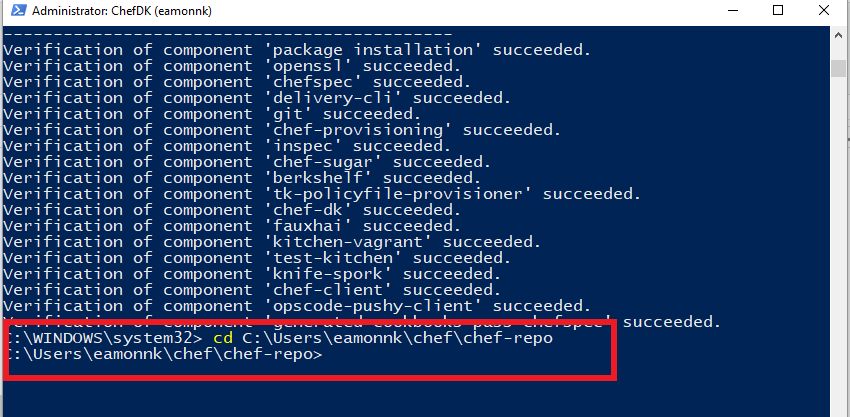

	Run the following Git commands inside the Chef repo directory.

	```powershell
	git init
	git add -A
	git commit -m "starter kit commit"
	```

	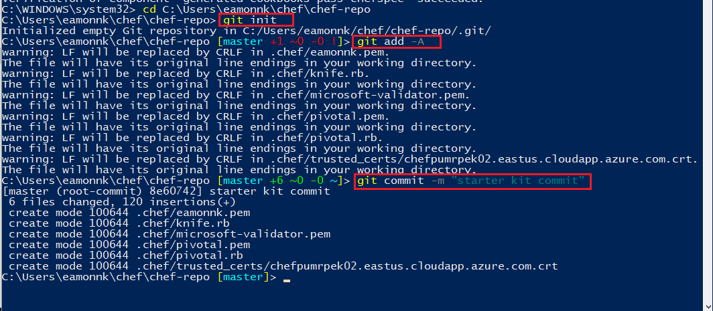

13. Our Chef Server has an SSL certificate that is not trusted. As a result, we have to manually trust the SSL certificate for our Chef Workstation to communicate with the Chef Server. To change this, we can import a valid SSL certificate for Chef to use with the following command:

	```powershell
	knife ssl fetch
	```
	
	

14. List the current contents of the chef-repo, by running the `ls` or the `dir` command. Inspect the current files in the chef-repo, so that you can compare the existing files to the new files that you will add to the chef-repo soon.

	```powershell
	dir
	```
	
	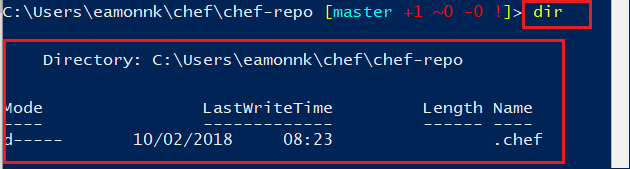

15. Synchronize the contents of the Chef Workstation repo, with the contents of your Chef Automate VM server's repo, by running the following command. The command downloads the entire Chef repo from your Chef Automate server.

	```powershell
	knife download /
	```

	> **Note**: For more information see the Chef Documentation page <a href="https://docs.chef.io/knife_download.html" target="_blank"><span style="color: #0066cc;">Knife Download</span></a>.

	

	You may see errors in relation to `acls`, depending on your user account details, but you can ignore these errors for the purposes of this lab.

16. Run the `dir` command again. Observe the additional files and folders that have been created in the `chef-repo` directory.

	

17. Commit the newly added files into the Git repository with the following commands.

	```powershell
	git add -A
	git commit -m "knife download commit"
	```
	
	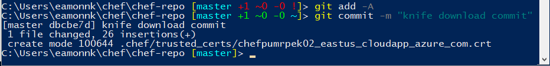

### Task 3: Create a Cookbook and Recipe, and upload them to the Chef Automate server

In this exercise, you will create a cookbook and recipe for the PU MRP app's dependencies to automate the installation of the PU MRP application, and upload those cookbooks and recipes to the Chef server.

1. Open the **Chef Development Kit** PowerShell window. Change into the directory **cookbooks**, within the **chef-repo**. For example, `cd C:\Users\eamonnk\chef\chef-repo\cookbooks` or wherever you placed your Chef Git repo in Task 2. Use the Chef **knife** tool to generate a *cookbook* template by running the following command

	```powershell
	chef generate cookbook mrpapp
	```

	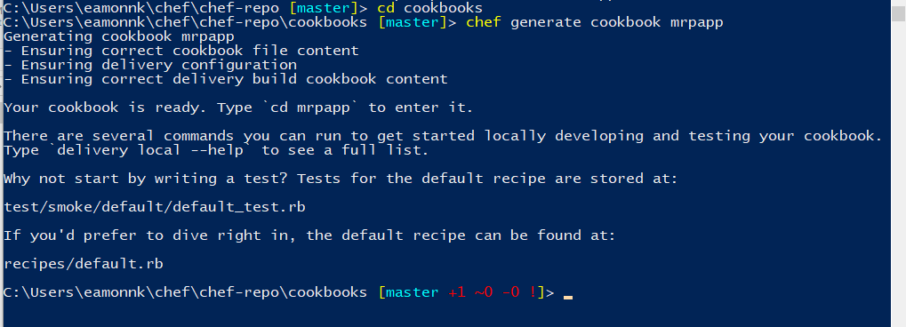

	A cookbook is a set of tasks for configuring an application or feature. It defines a scenario and everything required to support that scenario. Within a cookbook, there are a series of *recipes* that define a set of actions for the cookbook to perform. Cookbooks and recipes are written in the *Ruby* language. 

	The `chef generate cookbook` command we ran here creates an `mrpapp` directory in the `~/chef-repo/cookbooks/` directory. The `mrpapp` directory contains all of the boilerplate code that defines a cookbook and a default recipe.

	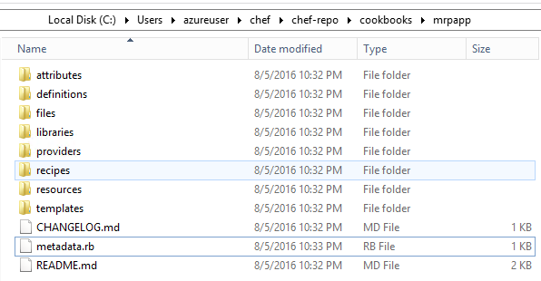

2. With a text editor, open the file `metadata.rb`, within your `~/cookbook/mrpapp` directory, for editing. For example, use the *Visual Studio Code* editor to open the file `~/chef-repo/cookbooks/mrpapp/metadata.rb` for editing. You may need to open the file with administrator privileges.

	Cookbooks and recipes can leverage other cookbooks and recipes. Our cookbook will use a pre-existing recipe for managing APT repositories. Add the following line at the end of the `metadata.rb` file, then save and close the file.

	```ruby
	depends 'apt'
	```

	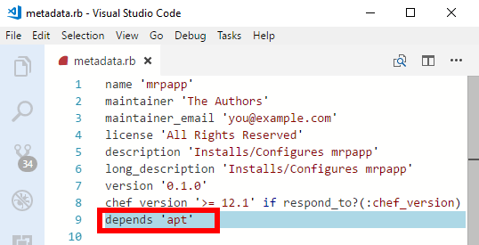

3. We need to install three dependencies for our recipe: the `apt` cookbook, the `windows` cookbook, and the `chef-client` cookbook. We can download the three cookbooks from the official Chef cookbook repository, [https://supermarket.chef.io/cookbooks](https://supermarket.chef.io/cookbooks), using the `knife cookbook site` command.

	In the **Chef Development Kit** (Chef DK) PowerShell window, from inside the directory `~\chef\chef-repo\cookbooks`, download the cookbooks using the `knife cookbook site` command as follows.

	Install the apt cookbook:

	```ruby
	knife cookbook site install apt
	```

	Install the windows cookbook:

	```ruby
	knife cookbook site install windows
	```

	Install the chef-client cookbook

	```ruby
	knife cookbook site install chef-client
	```

4. After each `knife cookbook site install` command, the focus of the **Chef DK** window should return to the `master` branch of your Chef repo automatically. However, the last command may change the focus to the `chef-vendor-windows` branch. Switch focus back to the `master` branch, by issuing the following command in the **Chef DK** window.

	```powershell
	git checkout master
	```
	
	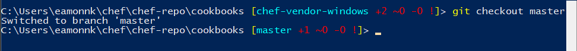

5.  Copy the full contents of the `default.rb` recipe from the Microsoft <a href="https://raw.githubusercontent.com/Microsoft/PartsUnlimitedMRP/master/Labfiles/AZ-400T05-ImplemntgAppInfra/Labfiles/M04/DeployusingChef/final/default.rb" target="_blank"><span style="color: #0066cc;">Parts Unlimited MRP GitHub repository</span></a>.

	Open the URL in a web browser to access the `default.rb` recipe file in RAW format. The recipe file is hosted on Microsoft's Parts Unlimited GitHub repo. Providing the recipe file in RAW format allows you to copy the file content easily. **Copy the contents** of the online recipe file.

	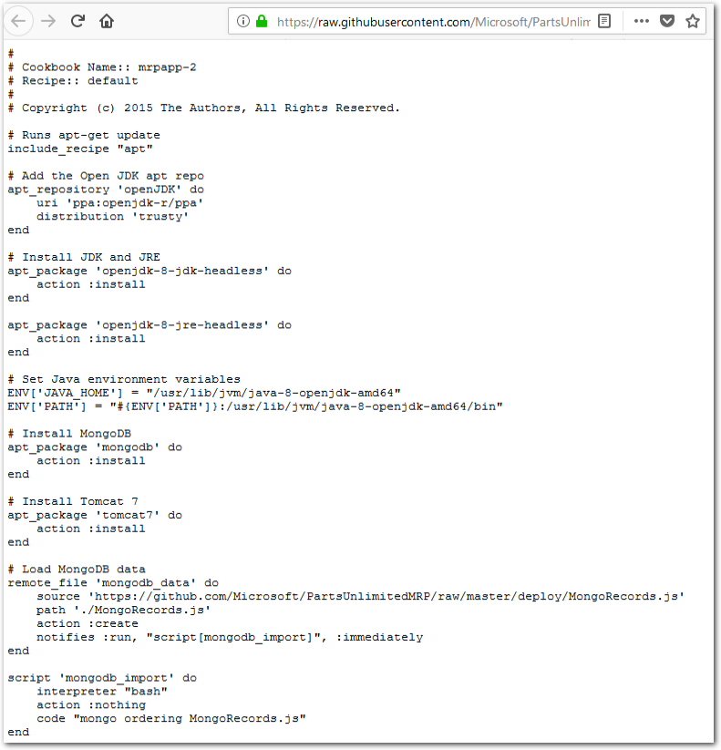

6. **Open** local file `~/chef-repo/cookbooks/mrpapp/recipes/default.rb` for editing.

	The file should look similar to the following, to start:

	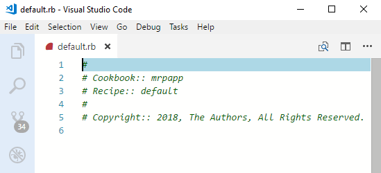

7. **Paste the contents** copied from the online recipe into the default recipe file `default.rb`.

	

	**Save** and **close** the file.

8. The following explains how the recipe we copied will provision our application, by going through `default.rb` line-by-line.

	The recipe will run the `apt` resource – this will cause our recipe to execute `apt-get update` command prior to running. This command makes sure the package sources on the machine are up-to-date.

	```ruby
		↪	# Runs apt-get update
		↪	include_recipe "apt"
	```

	Now we add an `apt_repository` resource to make sure that the **OpenJDK** repository is part of our apt repository list and up-to-date.

	```ruby
    	↪	# Add the Open JDK apt repo
    	↪	apt_repository 'openJDK' do
    	↪		uri 'ppa:openjdk-r/ppa'
    	↪		distribution 'trusty'
    	↪	end
	```

	Next, we will use the `apt-package` recipe to ensure that **OpenJDK** and **OpenJRE** are installed. We use the **headless** versions as the full versions depend on a legacy package that we do not want to use.

	```ruby
    	↪	# Install JDK and JRE
    	↪	apt_package 'openjdk-8-jdk-headless' do
    	↪		action :install
    	↪	end
    	↪
    	↪	apt_package 'openjdk-8-jre-headless' do
    	↪		action :install
		↪	end
	```

	Next, we set the `JAVA_HOME` and `PATH` environment variables to reference **OpenJDK**.

	```ruby
    	↪	# Set Java environment variables
    	↪	ENV['JAVA_HOME'] = "/usr/lib/jvm/java-8-openjdk-amd64"
		↪	ENV['PATH'] = "#{ENV['PATH']}:/usr/lib/jvm/java-8-openjdk-amd64/bin"

	```

	Then, we will install the **MongoDB** database engine and **Tomcat** web server.

	```ruby
    	↪	# Install MongoDB
    	↪	apt_package 'mongodb' do
    	↪		action :install
    	↪	end
    	↪
    	↪	# Install Tomcat 7
    	↪	apt_package 'tomcat7' do
    	↪		action :install
		↪	end
	```

	At this point, all of our dependencies will be installed. We can then can start configuring our applications. First, we need to ensure that our MongoDB database has some baseline data in it. The `remote_file` resource will download a file to a specified location.
	
	It is *idempotent* which means, in this context, if the file on the server has the same checksum as the local file, no action will be taken.
	
	We also use the `notifies` command. For example, if a new version of the file is present when the resource runs, a notification is sent to the specified resource, telling it to run the new file.

	```ruby
    	↪	# Load MongoDB data
    	↪	remote_file 'mongodb_data' do
    	↪		source 'https://github.com/Microsoft/PartsUnlimitedMRP/tree/master/deploy/MongoRecords.js'
    	↪		path './MongoRecords.js'
    	↪		action :create
    	↪		notifies :run, "script[mongodb_import]", :immediately
		↪	end
	```

	Next we use a `script` resource to set the command line script that runs to load the MongoDB data we downloaded in the previous step.
	
	The `script` resource has its `action` parameter set to `nothing`, which means the script will only run when it receives a notification to run. The only time this resource will run is when it is notified by the `remote_file resource` we specified in the previous step. So every time a new version of the `MongoRecord.js` file is uploaded, the recipe will download and import it. If the `MongoRecords.js` file does not change, nothing is downloaded or imported!

	```ruby
    	↪	script 'mongodb_import' do
    	↪		interpreter "bash"
    	↪		action :nothing
    	↪		code "mongo ordering MongoRecords.js"
		↪	end
	```

	Next, we need to set the port that **Tomcat** will run our **PU MRP application** on. This uses a script resource to invoke a regular expression to update the `/etc/tomcat7/server.xml` file.

	The `not_if` action is a guard statement – if the code in the `not_if` action returns `true`, the resource will not execute. This ensures that the script will only run if it needs to run.

	Another thing to note: We are referencing an attribute called `#{node['tomcat']['mrp_port']}`. We have not defined this value yet, but we will in the next task. With attributes, you can set variables, so the PU MRP application can run on one port, on one server, or on a different port on a different server. If the port changes, you see that it uses `notifies` to invoke a service restart.

	```ruby
    	↪	# Set tomcat port
    	↪	script 'tomcat_port' do
    	↪		interpreter "bash"
    	↪		code "sed -i 's/Connector port=\".*\" protocol=\"HTTP\\/1.1\"$/Connector port=\"#{node['tomcat']['mrp_port']}\" protocol=\"HTTP\\/1.1\"/g' /etc/tomcat7/server.xml"
    	↪		not_if "grep 'Connector port=\"#{node['tomcat']['mrp_port']}\" protocol=\"HTTP/1.1\"$' /etc/tomcat7/server.xml"
    	↪		notifies :restart, "service[tomcat7]", :immediately
		↪	end
	```

	Now we can download the **PU MRP application** and start running it in **Tomcat**. If we get a new version, it signals the Tomcat service to restart.

	```ruby
    	↪	# Install the PU MRP app, restart the Tomcat service if necessary
    	↪	remote_file 'mrp_app' do
    	↪		source 'https://github.com/Microsoft/PartsUnlimitedMRP/tree/master/builds/mrp.war'
    	↪		action :create
    	↪		notifies :restart, "service[tomcat7]", :immediately
		↪	end
	```

	We can define the Tomcat service's desired state, which is `running`. This will cause the script to check the state of the Tomcat service, and start it, if it is not running. We can also signal this resource to `restart` with `notifies` (see above).

	```ruby
    	↪	# Ensure Tomcat is running
    	↪	service 'tomcat7' do
    	↪		action :start
    	↪	end
	```

	Finally, we can make sure the `ordering_service` is running. This uses a combination of `remote_file` and `script` resources to check if the `ordering_service` needs to be killed and restarted. These checks ensure that the `ordering_service` will always be up and running.

	```ruby
    	↪	remote_file 'ordering_service' do
    	↪		source 'https://github.com/Microsoft/PartsUnlimitedMRP/tree/master/builds/ordering-service-0.1.0.jar'
    	↪		path './ordering-service-0.1.0.jar'
    	↪		action :create
    	↪		notifies :run, "script[stop_ordering_service]", :immediately
    	↪	end
    	↪
    	↪	# Kill the ordering service
    	↪	script 'stop_ordering_service' do
    	↪		interpreter "bash"
    	↪	# Only run when notified
    	↪		action :nothing
    	↪		code "pkill -f ordering-service"
    	↪		only_if "pgrep -f ordering-service"
    	↪	end
    	↪
    	↪	# Start the ordering service.
    	↪	script 'start_ordering_service' do
    	↪		interpreter "bash"
    	↪		code "/usr/lib/jvm/java-8-openjdk-amd64/bin/java -jar ordering-service-0.1.0.jar &"
    	↪		not_if "pgrep -f ordering-service"
    	↪	end
	```

9. In the **Chef DK** PowerShell window, commit the files we added to the Git repository with the following commands.

	```powershell
	git add .
	git commit -m "mrp cookbook commit"
	```

	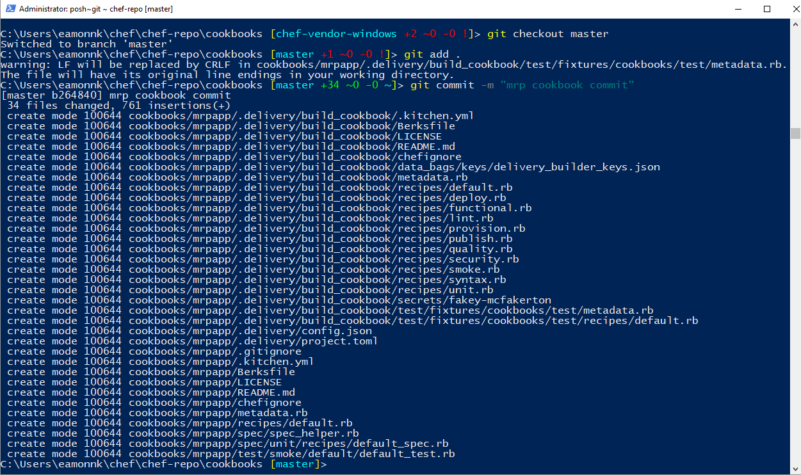

10. Now that we have created a recipe, and installed the dependencies, we can upload our cookbooks and recipes to the **Chef Automate server**.  Use the `knife cookbook upload` command in the **Chef DK** PowerShell window, as follows.

	```powershell
	knife cookbook upload mrpapp --include-dependencies
	knife cookbook upload chef-client --include-dependencies
	```

	

### Task 4: Create a Role

In this exercise, you will use the `knife` command to create a *Role*. The role will define a baseline set of cookbooks and attributes that can be applied to multiple servers.

> **Note**: For more information see the Chef Documentation page <a href="https://docs.chef.io/knife_role.html" target="_blank"><span style="color: #0066cc;">Knife Role</span></a>.

1. In a text editor, **open** the file `C:\Users\<username>\chef\chef-repo\.chef\knife.rb` or wherever you placed your `knife.rb` file.

2. **Add** the following line to the end of the `knife.rb` file. **Save** and **close** the file.

	```ruby
	knife[:editor] = "notepad"
	```

	![Screenshot of the local knife.rb, open inside the Visual Studio Code editor, with the added line knife[:editor] = "notepad" highlighted. The image illustrates how to edit the local knife.rb and how the file appears after editing.](../assets/pumrpdeploywithchef-feb2019/chef_notepadedit2-1.png)

	Adding this line specifies Windows *Notepad* as the editor to open the `knife.rb` when we create a role, in the next step. If you do not specify an editor in the `knife.rb`, when you run the command in step 3 you will receive an error. The error message will state something such as *"Runtime ERROR: please set editor environment variable..."*

3. In the **Chef DK** PowerShell window run the following command to create the role, which we will name `partsrole`.

	```powershell
	knife role create partsrole
	```

4. Running the command will open the Windows **Notepad** editor. Edit the JSON content by making the following changes. Change the `default_attributes` to:

	```json
	"default_attributes": {
		"tomcat": {
			"mrp_port": 9080
		}
	},
	```

5. Update the `override_attributes` to:

	```json
	"override_attributes": {
		"chef_client": {
			"interval": "60",
			"splay": "1"
		}
	},
	```

6. Update the `run_list` to:

	```json
	"run_list": [
		"recipe[mrpapp]",
		"recipe[chef-client::service]"
	],
	```

	The completed file should be similar to the file in the following screenshot.

	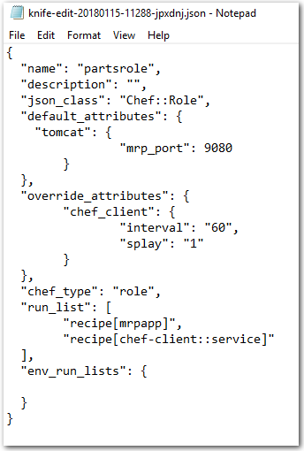

7. When you finish editing the JSON file, **save** the file and **exit** Notepad.

8. In the **Chef DK** PowerShell window, the `knife role create partsrole` command that you ran in step 3 should be completed.  The message `Created role[partsrole]` shown in the **Chef DK** PowerShell window indicates that the command ran successfully.

	![Screenshot of a PowerShell window. The knife role create partsrole command has been run successfully. The message Created role[partsrole] is shown which indicates that the command ran successfully. The knife commands and their outputs are shown to illustrate how to run the commands in PowerShell.](../assets/pumrpdeploywithchef-feb2019/chef_createroleparts1.png)

### Task 5: Bootstrap the PU MRP App Server and Deploy the PU MRP Application

In this exercise, you will use knife to bootstrap the PU MRP Application Server and assign the PU MRP application role.

1. The PU MRP application will run on Azure in a Linux VM. Create the Linux VM by selecting the **Deploy to Azure** button. This will add a VM image template directly into Azure. You will need to sign in to Azure Portal to deploy the image.

	<a href="https://portal.azure.com/#create/Microsoft.Template/uri/https%3A%2F%2Fraw.githubusercontent.com%2FMicrosoft%2FPartsUnlimitedMRP%2Fmaster%2FLabfiles%2FAZ-400T05-ImplemntgAppInfra%2FLabfiles%2FM04%2FDeployusingChef%2Fenv%2Fdeploylinux.json" target="_blank">
	</a>
	<a href="http://armviz.io/#/?load=https%3A%2F%2Fraw.githubusercontent.com%2FMicrosoft%2FPartsUnlimitedMRP%2Fmaster%2FLabfiles%2FAZ-400T05-ImplemntgAppInfra%2FLabfiles%2FM04%2FDeployusingChef%2Fenv%2Fdeploylinux.json" target="_blank"></a>

	The template will take approximately 5 minutes to deploy.

2. When prompted, enter the following details for the PU MRP app VM into the **Deploy from a custom template** pane in Azure Portal.

	- **Resource group**: `< specify a new resource group >`. Choose **Create new** and enter a new Resource Group name. For example, `chefmrplinuxvmrg`.
	- **Location**: `< whatever region location you selected for the Chef Automate >`. For example, `West Europe`.
	- **Admin Username**: `< your admin username >`. For example, `azureuser`.
	- **Admin Password**: `< your admin password >`. For example, `Passw0rd0134`.
	- **Dns Label Prefix**: `appmrppartsek017`
	- **Ubuntu OS Version**: `< Leave the default value >`

	Check the box to **Agree to the terms**, and select the **Purchase** button.

3. Once the template has deployed, return to the **Chef DK** PowerShell window. From inside your Chef repo directory, e.g. `C:/Users/<username>/chef/chef-repo`, use knife to bootstrap the PU MRP app VM by running the following command.

	> **Note**: You need to obtain the Public DNS name for your MRP App VM. To obtain the DNS name, select the **Resource Groups** blade in Azure Portal. Choose the Resource Group that you created in the previous step (for example, `chefmrplinuxvmrg`). Select the `mmrpPublicIP` resource (or whatever you called it) from the resources list. Copy the `DNS name` value. For example, `ppmrppartsek017.westeurope.cloudapp.azure.com`.
    >
    > In the following `knife bootstrap` command, enter the DNS name you obtained as the value for `<FQDN-for-MRP-App-VM>`. You should also substitute the username and password that you set in the previous step for `<mrp-app-admin-username>` and `<mrp-app-admin-password>`. For example, `azureuser` and `Passw0rd0134`.

	```powershell
	knife bootstrap <FQDN-for-MRP-App-VM> --ssh-user <mrp-app-admin-username> --ssh-password <mrp-app-admin-password> --node-name mrp-app --run-list role[partsrole] --sudo --verbose
	```

    If prompted to continue connecting, type **"Y"** and press **Return**.

	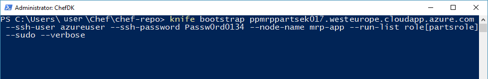

	The script should take between 5 to 10 minutes to run. You will see the script perform the following operations:

	- Install Chef on the VM.
	- Assign the `mrp` Chef role to the VM.
	- Run the `mrpapp` recipe.

	

	**Potential Errors and Issues**

	- The installation may not do anything for the first minute, while it connects and prepares to run. However, if it hangs for more than 5 to 10 minutes, cancel the run and note any error messages that are returned.
	- If error messages relate to disconnecting from the remote host, it may be a username or password issue. You should recheck the user account details on the Chef Automate server, and on the Linux VM. Use PuTTy to sign in to the VMs.
	- You can also set up the connection to use certificates instead of a username and password.
	- If there is an error related to resolving the run list, you will need to run the following command in the Chef DK PowerShell window and try again. This command will make sure the missing role is in the node.

		```ruby
		knife node run_list add mrp-app 'role[partsrole]'
		```

4. Open a web browser and, in the address bar, enter the Public DNS name of your MRP App VM with the suffix `:9080/mrp/`. The URL should be in the following format `http:`//`<mrp-dns-name>`.`<region>`.`cloudapp.azure.com`:`9080/mrp/`. For example, `http://ppmrppartsek017.westeurope.cloudapp.azure.com:9080/mrp/`. If the installation was successful, you should see the PU MRP application landing web page.

	

5. Explore the web site and check that it functions normally.

6. Visit the URL for your **Chef Automate server** in your web browser, for example `https://chefautomateek017.westeurope.cloudapp.azure.com`. Log in to your Chef Automate server. From the **Chef Automate Dashboard**, go to the **Nodes** area. Verify the PU MRP Application VM is listed as node `mrp-app`. Select the `mrp-app` from the bottom of the dashboard.

	

	From the **Run History** panel, choose **Last 24 hours** from the dropdown list and select the **Apply** button. Examine the details listed under the **Resources**, **Run List** and **Attributes** tabs, and verify that the details are as expected.

	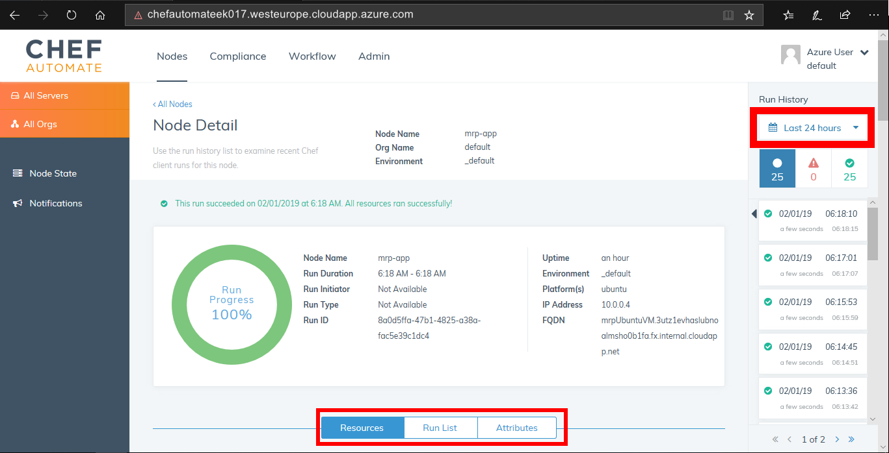

	> **Note**: You can manage your Chef server configuration and node deployments via a web browser by installing the *Chef Management Console*. Go to your Chef Automate server deployment organization page by appending `/organizations/default` to the URL you use to access your Chef Automate server. The resulting URL should be similar to `https:`//`< your chef automate server dns name >`.`< region >`.`cloudapp.azure.com`/`organizations/default`. Visit the URL, and follow the instructions on the web page to install the Chef Management Console.

	

<h3><span style="color: #0000CD;">Summary:</span></h3>

In this lab you deployed the PU MRP app, via a Chef Automate server in Azure, to an application server. You completed the following tasks:

- Deployed a Chef Automate server in Azure.
- Configured a workstation to connect and interact with the Chef Automate server.
- Created a cookbook and recipe for the PU MRP application and its dependencies, to automate the installation of the PU MRP application.
- Uploaded a cookbook to the Chef Automate server.
- Created a Role to define a baseline set of cookbooks and attributes that can be applied to multiple servers.
- Created a Node to deploy the configuration to, i.e. a Linux VM.
- Bootstrapped the Linux VM to add the Role to the Node, i.e. deployed the PU MRP application to it using Chef.

This hands-on lab was designed to show you one option for integrating Chef with Azure. This lab also demonstrates how run lists, nodes, cookbooks, roles and recipes can be created and deployed on Azure.
