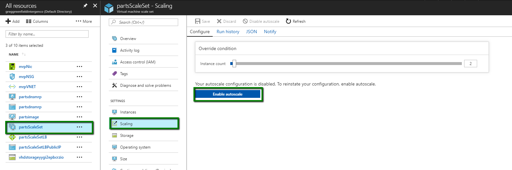
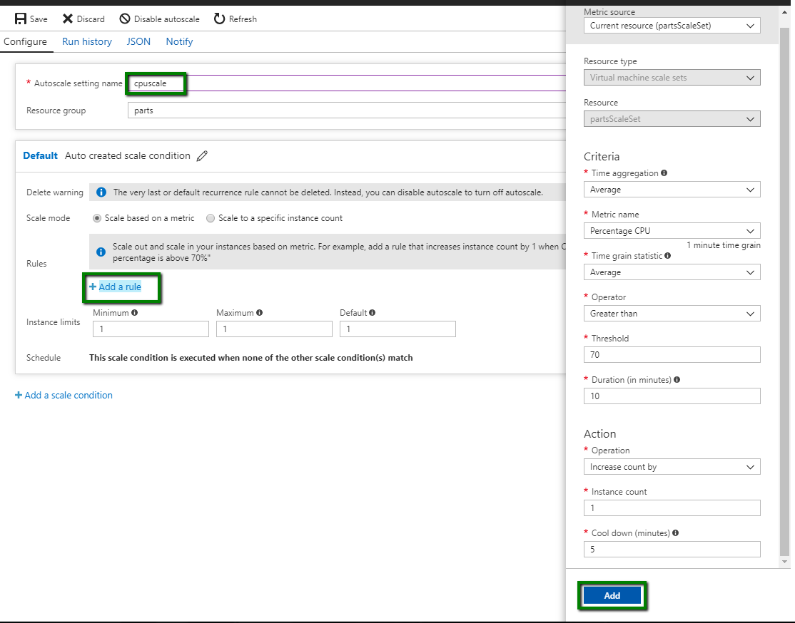
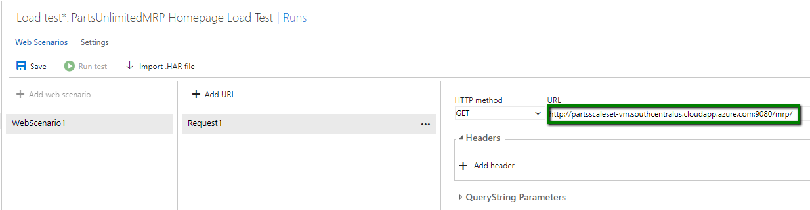

Your Linux Azure virtual machine has suffered significant performance degradation during Black Friday. The business unit responsible for the website’s functionality has complained to IT staff that users would intermittently lose access to the website, and that load times were significant for those who could access it.

In this lab, you will learn how to perform load testing against an endpoint for the PartsUnlimitedMRP Linux Azure virtual machine. Additionally, you will create a virtual machine and VM Scale Set using Azure Command Line tools, as well as add both to a shared availability set to configure auto-scaling the set in cloud services. 


<h3><span style="color: #0000CD;">DevOps MPP Course Source </span></h3>

- This lab is used in course [DevOps200.5x: DevOps Testing](https://www.edx.org/course/devops-testing-microsoft-devops200-5x-0) - Module 4.


<h3><span style="color: #0000CD;"> Lab Video: </span></h3>

<div class="image">
<div onclick="thevid=document.getElementById('thevideo'); thevid.style.display='block'; this.style.display='none'">
    
</div>
<div id="thevideo" style="display: none;">                   
<iframe width="960" height="640" src="https://www.youtube.com/embed/IogcwnasyWw" frameborder="0" allowfullscreen></iframe>
</div>
</div>


<h3><span style="color: #0000CD;">  Pre-Requisites:</span></h3>

- The PartsUnlimitedMRP Linux Azure virtual machine set up and deployed with endpoint 9080 open (see [link](https://microsoft.github.io/PartsUnlimitedMRP/cicd/200.3x-CICD-CDwithHostedAgent.html))

    **Note:** If you don't have the app deployed and just wish to set up and run the URL Load Test, you can use the already deployed app at the URL http://cdrm-pu-demo-dev.azurewebsites.net/. If you wish to do the auto-scaling tasks, you will need the application deployed to be able to configure the virtual machines.

- The Web Load & Performance Testing features are available in **VSTS**, the **Azure Portal** and **Visual Studio**. In Visual studio they are only available on Visual Studio Enterprise, as such if you wanted to perform this task in Visual Studio you would need a [Visual Studio Enterprise subscription](https://www.visualstudio.com/vs/enterprise/) (monthly, annual, or MSDN) to run URL-based load tests. For our purposes in this task you are fine using your Azure and VSTS subscriptions.

- Azure CLI 2.0 (see [link](https://docs.microsoft.com/en-us/cli/azure/install-azure-cli?view=azure-cli-latest)) installed on your local machine

<h3><span style="color: #0000CD;"> Lab Tasks:</span></h3>

- Set up and run a load test in VSTS
- Create virtual machines and VM Scale Set with Azure CLI 2.0
- Run a load test to verify auto-scaling


<h3><span style="color: #0000CD;">Estimated Lab Time:</span></h3>

- approx. 30 minutes  


### Task 1: Set up and run a load test in VSTS

Performing a load test can be done in Visual Studio, in a browser in Visual Studio Team Services, or in the new Azure Portal. For simplicity, we will run a load test in a browser in Visual Studio Team Services. 

1. Open a web browser and navigate to the Team Project Collection ("DefaultCollection") of your Visual Studio Team Services account, i.e.     **https://{VSTS instance}.visualstudio.com**

    Once in your project click on **Test** then **Load Test** to open up load test options in the browser. 

    

    We are interested here in the URL based test but note the availabililty of several Load test options i.e.

    - [HTTP archive](https://docs.microsoft.com/en-us/vsts/load-test/record-and-replay-cloud-load-tests)
    - [Visual Studio webtest](https://blogs.msdn.microsoft.com/testingspot/2017/02/23/guide-to-get-started-with-visual-studio-web-load-testing-and-automation/)
    - [Apache JMeter](https://docs.microsoft.com/en-us/vsts/load-test/get-started-jmeter-test)
    - [URL](https://docs.microsoft.com/en-us/vsts/load-test/get-started-simple-cloud-load-test)
    - [Visual Studio IDE](https://docs.microsoft.com/en-us/vsts/load-test/getting-started-with-performance-testing)


2. In the load test tab, create a simple load test in the browser. Click on the **New** button and select **URL-based test** to create a new URL-based test.

    

3. Name the load test *PartsUnlimitedMRP Homepage Load Test*. Specify the home page URL, which should be the URL to MRP with your virtual machine name and port (such as *http://{mycloudhostname}.cloudapp.net:9080/mrp*).

    

    **Note:** For our scenario we will leave the **HTTP method** set to **GET**, but you can add multiple URLs and select the method for each one, such as **POST** or **PUT**. You can also add headers and **querystring** values if you need to send these as part of the request. The URL Load Test accesses each of these URLs multiple times using the parameters you specify, and records the results.

4. Select the **Settings** tab and change the **Run duration** to 1 minute. You can optionally change the max virtual users, browser mix, and load location as well. Then click the **Save** button.

    

    

5. Click on the **Run test** button to begin the test. The load test will start running and show metrics in real time. 

    

6. When the test has finished loading, it will show metrics, errors, and application performance. There are four tab views available in the VSTS portal, step through them and view the output from your test run. We should be able to solve this issue by creating an availability set for the virtual machines and configuring auto-scaling

    **Summary**
        

    **Charts**
        

    **Diagnostics**
        

    **Logs**
        


### Task 2: Create virtual machines and VM Scale Set with Azure CLI 2.0
In this lab task we are creating a VM image from the already set up mrp linux machine and creating a Virtual Machine Scale Set with it, using **Azure 2.0 CLI**.

1. Ensure that the PartsUnlimitedMRP machine is running. SSH into the machine with your credentials. 

    ````
    ssh <login>@<dnsname>.cloudapp.net
    ````

    

2. In the SSH window, type the following command:

    ````
    sudo waagent -deprovision+user
    ````

    Type **y** to continue where required.

3. In a command prompt on your local machine, de-allocate the VM that you have de-provisioned by:

    ````
    az vm deallocate --resource-group "parts" --name "partsdnsmrp"
    ````

    Where **--resource-group** is the name of your group and **--name** is the name of the VM.

4. Make sure that the VM is marked as generalized with:

    ````
    az vm generalize --resource-group "parts" --name "partsdnsmrp"
    ````

5. Now to create the image by:

    ````
    az image create --resource-group "parts" --name "partsimage" --source "partsdnsmrp"
    ````

    Where now the **--name** is the name you wish the image to be called and the **--source** being the VM.

6. Once the virtual machine image has been created, we need to create the scale set using the image you have created.

    ````
    az vmss create --resource-group parts --name partsScaleSet --image partsimage --upgrade-policy-mode automatic --admin-username azureuser --admin-password Pa55word.012345
    ````
    You need to make sure that the scale set is in the same resource group as the image. The password needs to be at least 12 characters long.

7. After the VM Scale Set has been created you are able to view them in the Azure Portal. To Enable autoscale on the Scale Set you need to select Scaling under Settings and select the Enable Autoscale button.

    

8. You will need to name the new autoscale that you are about to make, then add a rule. 

    

    I have used the default that is provided as listed above, then select add and finish up with a save.

You have now created a scale set that we auto scale based off of the influx of use.

### Task 3: Run a load test to verify auto-scaling

We now have Virtual Machine Scale Set that scales by CPU so that whenever the CPU percentage for PartsUnlimitedMRP is over the threshold of 80%, Azure will automatically add an instance to the virtual machine. We can now run a load test again to compare the results. 

1. Navigate to the Team Project Collection ("DefaultCollection") of your Visual Studio Team Services account, such as:

    https://{VSTS instance}.visualstudio.com

    On the upper-left set of tabs, click on **Load test** to open up load test options in the browser. 

    

2. You will need to update the DNS of the load tests to reflect the DNS of the scale set.

    

3. Select to save the change and Run test. The load test will start running and show metrics in real time. 

    

    The average response time has improved by autoscaling multiple virtual machines in Azure based on CPU load. 


<h3><span style="color: #0000CD;"> Summary</span></h3>
In this lab, you learned how to perform load testing against an endpoint for the PartsUnlimitedMRP Linux Azure virtual machine. Additionally, you created a virtual machine image and VM Scale Set using Azure Command Line tools, as well as adding both to a shared availability set to configure auto-scaling the set in cloud services. You then re-ran a Load Test to verify auto-scaling was working and there was an improved performance.


<h3><span style="color: #0000CD;">References</span></h3>

- [FAQs for Load Testing](https://docs.microsoft.com/en-us/vsts/load-test/reference-qa#links-to-useful-resources)
