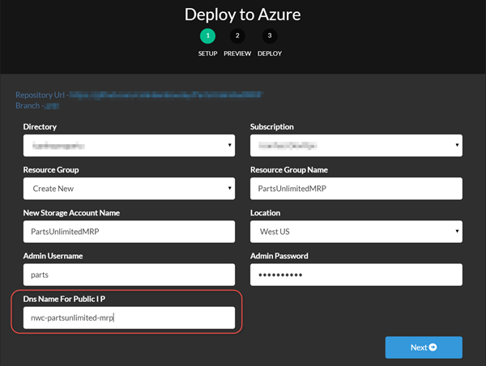

## Deploy the PartsUnlimited MRP App to an Azure Ubuntu Server
[](https://azuredeploy.net/)

Click on the above button to deploy an Ubuntu server in Azure that will install and configure
the PartsUnlimited MRP application.

The server is deployed according to the settings in the ARM template. A custom script
extension then runs the install shell script to install and configure the app.

### Access the MRP application
Once the deployment has succeeded, you can navigate to
```
http://_dnsName_._location_.cloudapp.azure.com:9080/mrp
```
where:
*	`dnsName` is the name of the public IP you configured when deploying. The image
	below shows an example deployment where the `dnsName` is `nwc-partsunlimited-mrp`:

	
* `location` is the location that you selected (e.g. westus)
* An example URL would be http://nwc-partsunlimited-mrp.westus.cloudapp.azure.com:9080/mrp