# HOL - Parts Unlimited MRP App Automated Testing with Visual Studio Team Services Build #

In this lab, you will learn how to create new JUnit tests to the Parts Unlimited MRP App using the Eclipse IDE, and then get them to run in an automated build in Visual Studio Team Services. After finishing this lab, you will have added unit tests to the Parts Unlimited MRP App and have those tests running during build time.

###Pre-requisites###

- An active Visual Studio Team Services account
- Eclipse ([http://www.eclipse.org/](http://www.eclipse.org/ "http://www.eclipse.org/"))
- Completion of the [Continuous Integration HOL](https://github.com/Microsoft/PartsUnlimitedMRP/tree/master/docs/HOL_Continuous-Integration)

###Tasks Overview###

**Set up the development environment:** This step will get your local environment set up to work on the Parts Unlimited MRP App. 

**Add JUnit tests to the Parts Unlimited MRP App:** In this step, you will add automated unit tests to the Parts Unlimited MRP App and run them locally.

**Run the automated tests in an automated build:** In this step, you will run the JUnit tests as part of the Continuous Integration Build that was set up in the  Continuous Integration HOL with Parts Unlimited MRP.

###1. Set up the development environment###

First, we need to set up Eclipse in order to work on the Parts Unlimited MRP App on our local machine. The Parts Unlimited MRP App uses [Gradle](https://gradle.org/), so we need to set up the code as Gradle projects in Eclipse.

**1.** Open up **Eclipse**.

**2.** Navigate to the application toolbar and select `Help -> Eclipse Marketplace`. Search for the [Gradle Buildship plugin](https://projects.eclipse.org/projects/tools.buildship). If the plugin is not installed already, install it and restart Eclipse. If the plugin is installed already, click on the **Installed** tab and select **Update** on the plugin if possible.

**3.** From the menu of Eclipse, select **Window -> Perspective -> Open Perspective -> Other...** to select the perspective that we want. 

**6.** Select **Git** and click **OK**.

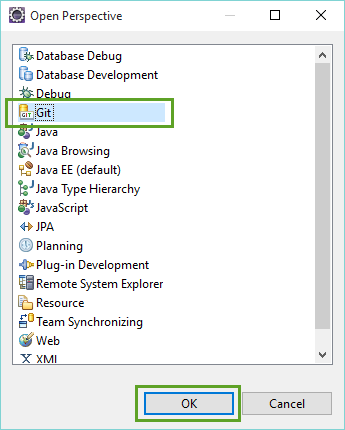

This will open up the Git perspective in Eclipse.

**7.** If the Visual Studio Team Services Git repository already exists on your local machine, **skip to step 8**. Otherwise, click the **Clone a Git repository** from the Git Repositories Window:

In the Clone Git Repository, **paste the URL for your Visual Studio Team Services Git repo** into the URI text field, **enter your alternate credentials** in the Authentication section, and click **Next**.

Select any branch that you want, and click **Next**.

On the next page, leave the defaults and click **Finish**.

This will clone the repository to your local machine. You should be able to see the repository in the Git Repositories window.

**8.** If you already have the Visual Studio Team Services Git repo on your machine, select the option to **Add an existing local Git repository**, then navigate to the folder of the Git repo and check the box next to it to add the repo reference into Eclipse. 

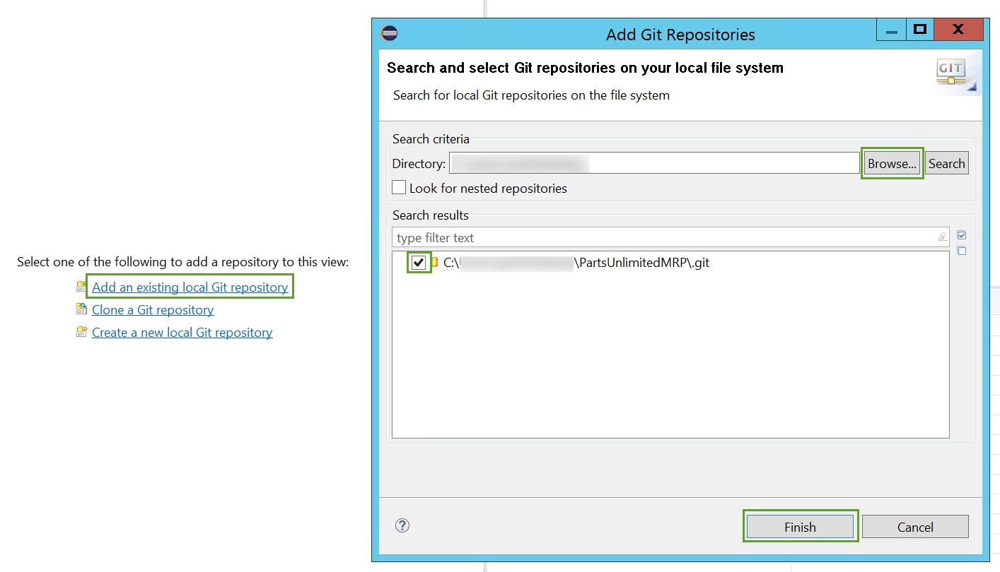

**9.** Open the **Java perspective** by clicking the shortcut in the top right corner of Eclipse.

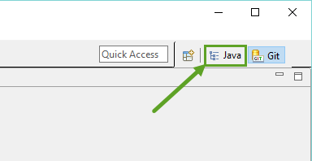

**12.** In the top left, click the **New** drop down and select **Java project**.

**13.** In the New Java Project dialog name the project **IntegrationService**, uncheck the **Use default location**, choose the **IntegrationService** folder located in `src/Backend/` of the PartsUnlimitedMRP repository, and click **Finish**.

**14.** In the Package Explorer window, **right-click on IntegrationService** and then select **Configure -> Add Gradle Nature**.
 
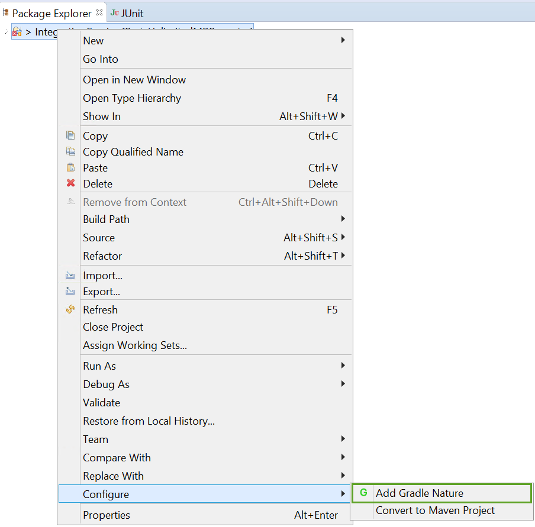

Note: at this point, you should see the errors disappear from the project.

**15.** Follow **Step 12** to create a **new Java Project**.

**16.** In the New Java Project dialog name the project **OrderService**, uncheck the **Use default location**, choose the **OrderService** folder located in `src/Backend/` of the PartsUnlimitedMRP repository, and click **Finish**.

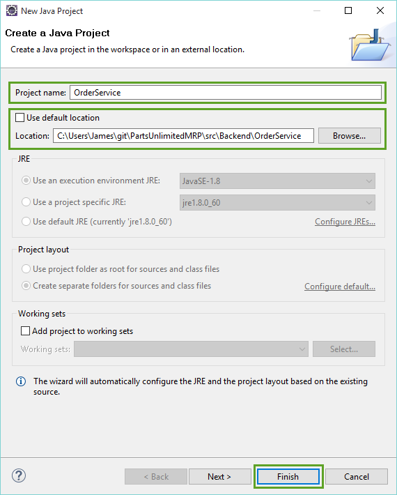

**17.** In the Package Explorer window, **right-click on OrderService** and then select **Configure -> Add Gradle Nature**.

**18.** Follow **Step 12** again to create a **new Java Project**.

**19.** In the New Java Project dialog name the project **Clients**, uncheck the **Use default location**, choose the **Clients** folder located in `src/` of the PartsUnlimitedMRP repository, and click **Finish**.

**20.** In the Package Explorer window, **right-click on Clients** and then select **Configure -> Add Gradle Nature**.

You should now have 3 projects in Eclipse that are all Gradle projects (signified by the `G` in the glyph of the projects in the Package Explorer window).

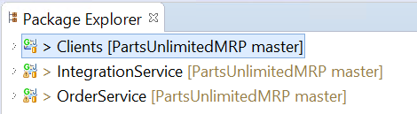

**21.** In Eclipse's menu select **Window -> Show View -> Other...**

**22.** Type `gradle` in the filter box, and select "Gradle Tasks."

You can now select one of the three projects that were created, and be able to view all of the Gradle tasks in each on via the Gradle Tasks window.

The development environment is now set up, and you should be ready to make write some automated tests. Go ahead and look over the different tasks - you may even want to try out the `build` task.

###2. Add JUnit tests to Parts Unlimited MRP App###

This task will focus on creating a unit test to test a part of the Parts Unlimited App.

**1.** There are already many JUnit tests that exist within the various projects of the Parts Unlimited MRP App. **Open up the file** in the **OrderService** Eclipse project located here:

     src/test/java/smpl.ordering.controllers/CatalogControllerTest.java

**2.** Lets go ahead and run these tests. In the menu select **Run -> Run As -> JUnit Test**.

This should open up the JUnit window and give you a summary of the test run.

**3.** Paste the following code on **line 31** of the `CatalogControllerTest.java` file :

	@Test
	public void testAddCatalogItems() throws Exception
	{
    	ResponseEntity<List<CatalogItem>> oldItems = controller.getCatalogItems();
    	int sizeBeforeAdds = 0;
    	if (oldItems.getBody() != null)
    	{
        	sizeBeforeAdds = oldItems.getBody().size();
    	}
    	
    	ResponseEntity<CatalogItem> response = 
    			controller.addCatalogItem(new CatalogItem("ACC-0123", "Storage", 15.75, 5, 2));
    	assertNotNull(response);
    	assertEquals(HttpStatus.CREATED, response.getStatusCode());
    	
    	response = 
    			controller.addCatalogItem(new CatalogItem("ACC-0124", "Storage", 11.25, 7, 6));
    	assertNotNull(response);
    	assertEquals(HttpStatus.CREATED, response.getStatusCode());
    	
    	ResponseEntity<List<CatalogItem>> newItems = controller.getCatalogItems();
    	int sizeAfterAdds = newItems.getBody().size();
    	
    	assertEquals(sizeBeforeAdds + 2, sizeAfterAdds);
	}

The final result should look something like this:

**4.** Go ahead and re-run the JUnit tests from the menu **Run -> Run As -> JUnit Test**.

You should now be able to see that the test in the JUnit Window.

### 3. Run the automated tests in an automated build###

Now that we have the automated tests written, and successfully running, it's important we push the new tests to the shared repository. This will allow other team members to benefit from the automated test and give the automated build more verification that our code is working as expected.

**1.** In Eclipse, **switch to the Git perspective** in the top right of the screen.

**2.** In the Git Repositories window, select the `PartsUnlimitedMRP` git repository. 

**3.** Select the **Git Staging** window. **Highlight** all of the Unstaged Changes and **drag and drop them into Stage Changes**.

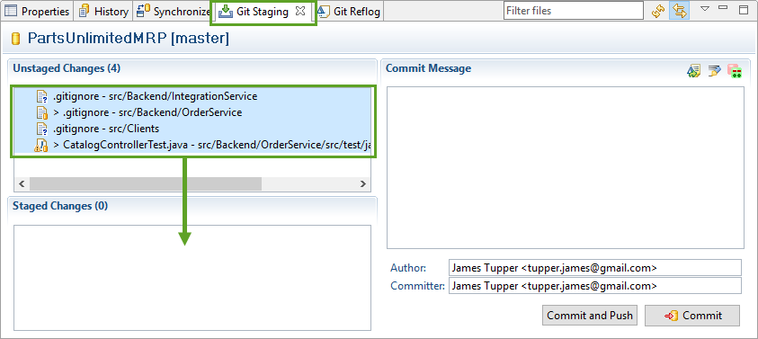

Note: Three `.gitignore` flies have changed. Eclipse automatically added the `bin/` folder here, so any binaries that are built locally will not be tracked. You can choose not to stage these.

**4.** Add the following as a commit message, and then click **Commit and Push**.

    Add new test to CatalogControllerTest.java

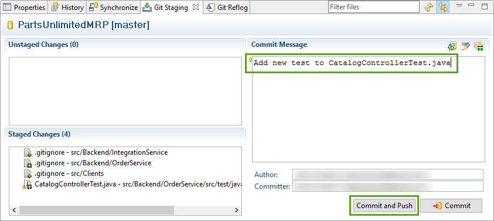

The Push Results window should pop up after you have successfully pushed:

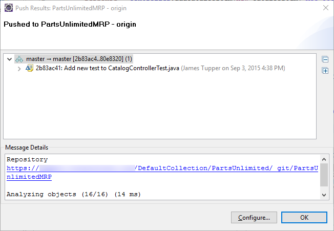

**5.** Navigate to the **BUILD** hub in your Visual Studio Team Services Team Project, and then click the **Queued** tab. You should see that your continuous integration build was triggered, and is running.

Once the build is done, **open up the build summary page** by double-clicking on it. 

**7.** On the build summary page, note that 54 tests have run successfully. Click on the **Tests** tab to view the list of automated tests.

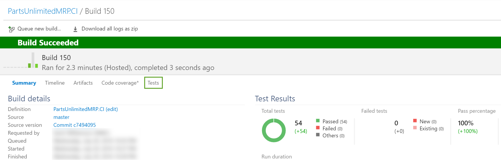

**8.** In the **Tests** tab, select the **Passed** outcome in the dropdown area, and you should now see that your new automated test is a part of the Continuous Integration Build.

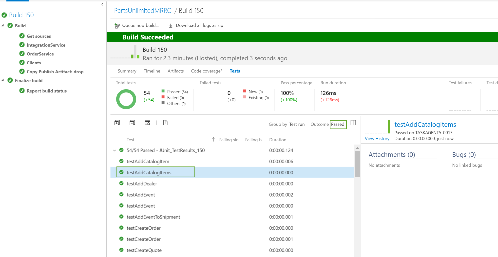

Next steps
----------

In this lab, you set up your development environment to work with Gradle, you added a new JUnit test to the Parts Unlimited MRP App, and you were able to see that reflected in the automated build process.

-   [HOL Parts Unlimited MRP Continuous Deployment](https://github.com/Microsoft/PartsUnlimitedMRP/tree/master/docs/HOL_Continuous-Deployment)

-   [HOL Parts Unlimited MRP Automated Testing](https://github.com/Microsoft/PartsUnlimitedMRP/tree/master/docs/HOL_Automated-Testing)

-   [HOL Parts Unlimited MRP Application Performance Monitoring](https://github.com/Microsoft/PartsUnlimitedMRP/tree/master/docs/HOL_Application-Performance-Monitoring)