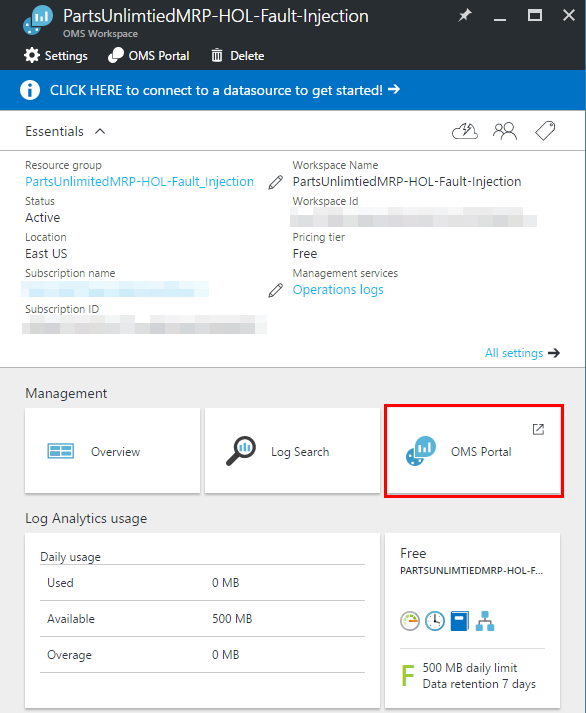
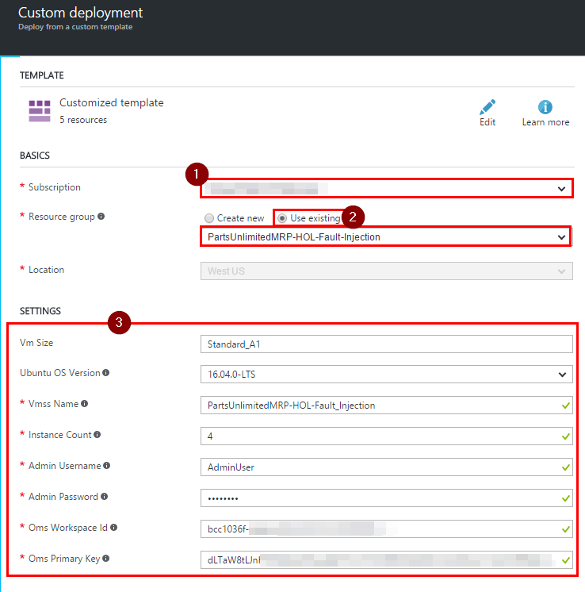
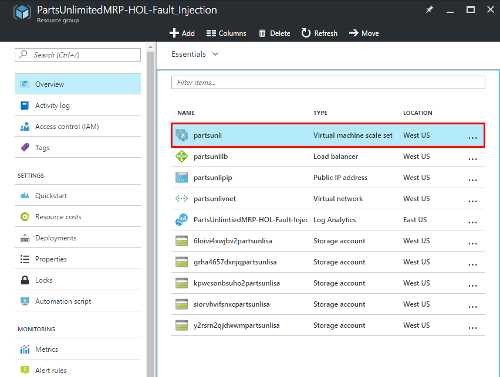
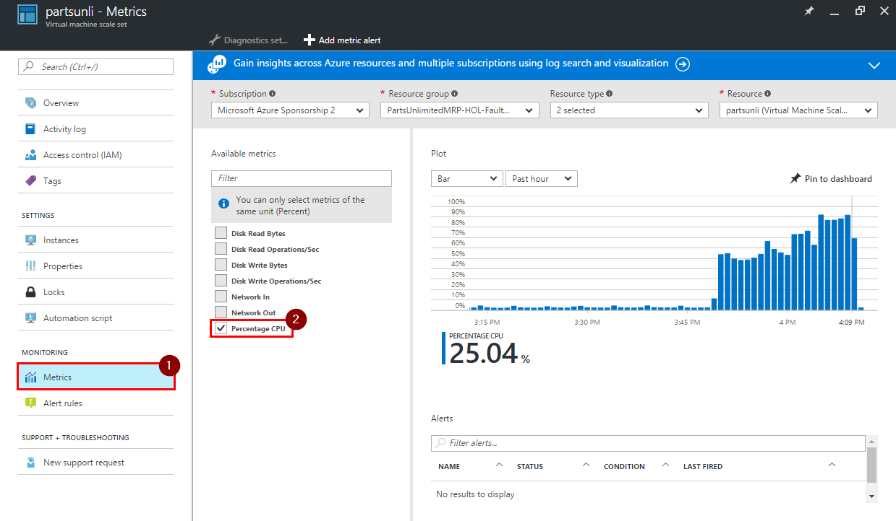
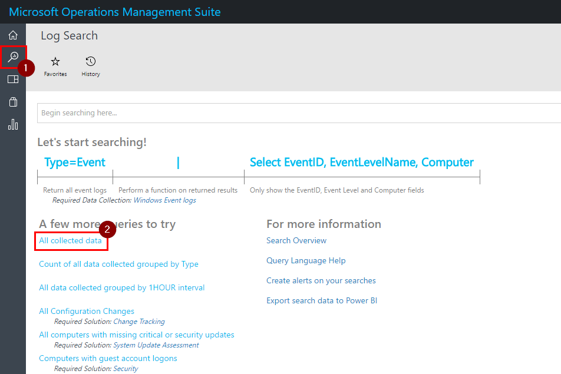
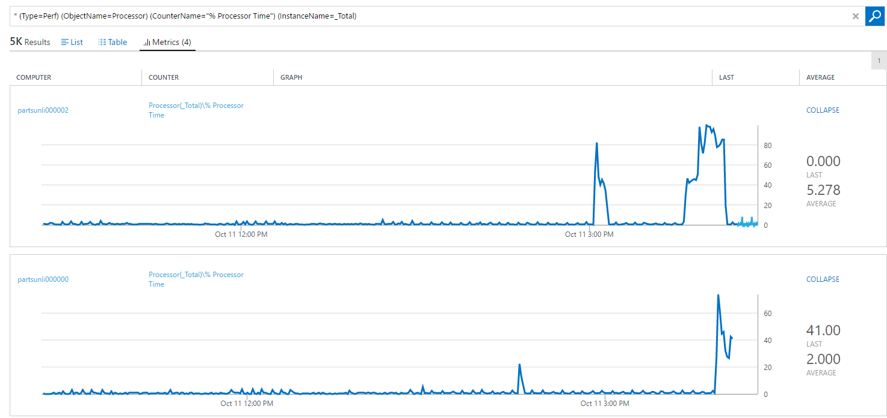

HOL - Fault Injection for Azure IaaS with OMS
=============================================

In this lab you will set up PartsUnlimitedMRP's environment hosted on multiple VMs in Virtual Machine Scale Set (VMSS) for better reliability. Operations Management Suite(OMS) will be used to monitor how this environment handles VM failures under the load. Excepted number of user for this system is 1200 people.

## Pre-requisites:

* Azure account with a subscription

* VSTS account

## Tasks Overview:
**1. Setup OMS workspace** This task will show you how to create OMS Workspace using Azure and then find WORKSPACE ID and PRIMARY KEY used to connect to OMS.

**2. Deploy ARM template** In this task you will deploy an ARM template which creates a VMSS of Linux machines and then installs MRP environment on it.

**3. Inject faults into VMSS** In this task you will configure a load test using VSTS and then inject faults during a load test run.

**4. Analyze load test's results.** In this task you will collect the information related to the load test and fault injection and then analyze it.

## HOL:
###Task 1: Setup OMS workspace

**Step 1.** Open Azure and create a new resource group for this HOL.

1. Click on "Resource groups" icon, then on "+ Add".

    

2. Enter a name for your resource group, pick a subscription, select a location and click on "Create".

    

**Step 2.** Add "Log Analytics" to this resource group.

1. Open the new resource group and click on "+ Add" button on the "Overview" page to add a new resource.

      

2. Filter resources by typing "Log Analytics" into the search bar, press "Enter", click "Log Analytics" and click on "Create" button.

      

3. Create an OMS workspace. Enter name, pick a subscription, location, current resource group and a pricing tier then click on "OK" button.

      
    >**Note:** OMS Workspace name has to be unique across Azure.

**Step 3.** Get "Workspace ID" and "Primary Key" from OMS Portal.

1. Navigate to your resource group and click on "Log Analytics" you just created.

2. Click on "OMS Portal".

      

3. Once OMS portal has loaded, click on "Settings".

      

4. Click on "Connected Sources", then "Linux Servers" and note the "WORKSPACE ID" as well as the "PRIMARY KEY".

    

**Step 4.** To set up collection of metrics click on "Data", "Linux Performance Counters", "Add the selected performance counters" and then on "Save".

 

###Task 2: Deploy ARM template
This task will setup the required environment in Azure.

**Step 1.** Click on "Deploy to Azure" button below.

**Step 2.** Select Azure Subscription and the resource group you created earlier. Fill in Settings section.

  * "Vmss Name" should be a unique alpha-numeric name across Azure.
  * Set "Instance Count" to 4.
  * Admin username and passwords are the credentials for your virtual machines.
  * Enter "Oms Workspace Id and the "Oms Primary Key" you took a note of in OMS Portal earlier.

    

**Step 3.** Reed and agree with terms and conditions, then click on "Purchase".

    

> **Note:** The deployment might take up to 10 minutes.

**Step 4.** Once deployment has finished verify that MRP solution is being hosted and that all 4 machines connected to OMS.

1. Navigate to your resource group and click on "Virtual Machine Scale Set" instance.

      

2. Note the Public IP address of your VMSS.

      

3. Open `<public IP address>/mrp` in a browser. This will take you to MRP solution.

      

4. Now, refresh OMS Portal and you should see that now it's 6 instances connected to the OMS, 4 of which are active in Azure and 2 are disabled.

      

###Task 3: Inject faults into VMSS

**Step 1.** Creating a load test.

1. Open your project in VSTS. Click on "Test", "Load test", "New", then on "URL based test".

    

2. Enter a name for this load test and then enter the URL to MRP page hosted in your VMSS.

    

>**Note:**   1) URL should be in the following format: `http://<name>.<region>.cloudapp.azure.com/mrp`   2) DNS name of the VMSS can be found by navigating to your resource group and clicking on "public IP address" instance.
  

3. Add another request by clicking on "Add URL" and then entering URL in the following format:

        http://<dns name>:8080/catalog

      

4. Switch to "Settings" tab, fill out fields as follows and then click on "Save":

    * Run duration (minutes): 20
    * Max v-users: 1200
    * Warmup duration (seconds): 60

      

5. Click on "Run test".

    

> **Note:** Make sure you familiarize yourself with the costs associated with load testing ([Visual Studio Team Services Pricing](https://azure.microsoft.com/en-us/pricing/details/visual-studio-team-services/)).

**Step 2.** Injecting faults into VMSS.
This step can be done through Azure portal or PowerShell ([Manage virtual machines in a virtual machine scale set](https://azure.microsoft.com/en-in/documentation/articles/virtual-machine-scale-sets-windows-manage/)). In this lab you will inject faults through the Azure portal.

1. Open resource group you created for this lab and click on VMSS instance.

    

2. Click on "Instances" and you will notice that on this page you can select and perform operations to one or multiple instance at the same time.

    

3. Allow the load test to run for five minutes, then decrement the number of instances every five minutes to simulate a series of faults. This can be done by selecting a running VM and then clicking on "Deallocate".
    > **Note:** "Restart" is also a valid fault injection operation. The only difference is that in a couple of minutes this VM will start up and will receive requests again.

    

## Analyze load test's results.

**Step 1.** Lets collect information related to how VMSS has performed during load test.

1. Some information like CPU load, network and disk summary can be found on "Metrics" page of your VMSS.

    

2. VSTS load test provides very informative summary and graphs about the load test and performance of your service.

    

    

3. More information for each of the instance in VMSS can be found in OMS portal.

    * Open OMS portal, click on "Log Search" icon and then "All collected data".

      

    * You can either enter searching query yourself or build them up using options on the left.  

    * Enter `Type=Perf CounterName="% Used Memory"` and then click on "Metrics(4)" to see RAM usage graphs.

    

    * Enter `Type=Perf CounterName="% Processor Time" InstanceName="_Total"` and then click on "Metrics(4)" to see CPU usage graphs.
    

> **Note:** By clicking on any graph, OMS will show it in more details.
    

**Step 2.** Draw a conclusion about the stability of your environment hosted in VMSS.

Based on the information collected about, it seems that most of the errors started occurring after there were left only two instance, therefore to support 1200 concurrent users, this environment should not be hosted on less than 3 machines. Also to improve this environment's scalability, you should set up an automatic scaling of your VMSS.

## Congratulations!
You've completed this HOL! In this lab you have learned how to set up OMS, deploy an ARM template, inject faults into VMSS, run load tests and collect performance metrics.

## Further Reading
1. [Virtual Machine Scale Sets documentation](https://azure.microsoft.com/en-us/documentation/services/virtual-machine-scale-sets/)
2. [Cloud Based Load Testing](https://www.visualstudio.com/team-services/cloud-load-testing/)
3. [What is Log Analytics?](https://azure.microsoft.com/en-us/documentation/articles/log-analytics-overview/)
