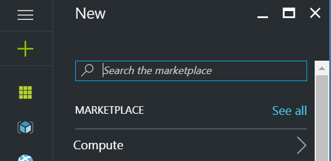

### Set up Parts Unlimited MRP with Jenkins ###

In this lab, we will set up the Jenkins Master that will be used for the PartsUnlimitedMRP project. [Jenkins](https://jenkins.io/) is an open source automation server that provides capabilities for building, deploying and automating any project. This lab will configure the pre-requisites on the Jenkins Master, if you are familiar with Jenkins and already have a Jenkins Master, you may want to skip to the next step for [Parts Unlimited MRP Continous Integration](https://github.com/Microsoft/PartsUnlimitedMRP/tree/master/docs/HOL_Continuous-Integration).


### Pre-Requisites: ###

- An Active Azure Subscription (You can open a trial subscription here: [https://azure.microsoft.com/en-us/free](https://azure.microsoft.com/en-us/free))
- A tool to connect to a Linux vm using SSH (like Putty for example: [http://www.chiark.greenend.org.uk/~sgtatham/putty/](http://www.chiark.greenend.org.uk/~sgtatham/putty/)) 


### Tasks Overview:
The following tasks will install a virtual machine running Ubuntu with Jenkins in Azure then perform the basic configuration of Jenkins.

### Task 1: Create you Jenkins Master in Azure 
We will use the preconfigured VM image that is available on the Azure Market place to deploy our Jenkins master.


<a href="https://portal.azure.com/#create/Microsoft.Template/uri/https%3A%2F%2Fraw.githubusercontent.com%2Fdcaro%2FPartsUnlimitedMRP%2Fmaster%2Fdocs%2Fassets%2Fjenkins%2Fenv%2FJenkinsMaster.json" target="_blank">
        
</a>


**1.** First, navigate with your browser to the Azure portal and sign in with your Azure subscription:

 [https://portal.azure.com](https://portal.azure.com)

**2.** Click on the **+** on the top left of the portal and then click on **See all** 

{:height="150px"}

**3.** Type jenkins in the search bar and select **Azure-Jenkins-012** in the list (the publisher is Microsoft). The blade with the description of the VM will appear on the right. Leave the deployment model as "Resource Manager" and click the **Create** button.


**4.** Set the basic parameters required for the deployment of the VM and click OK.

* Name: This is the name of the virtual machine, use a name that will identify the VM easily.
* VM disk type: leave the default (SSD).
* User name: this is the name of the user that you will use to logon to the VM. root cannot be used.
* Authentication type: You can use a password or and ssh key. You can use puttygen to generate the private/public key pair that you will use to connect to the VM.
* Subscription: Select the subscription that you want to use to run your VM.
* Resource group: We recommend that you create a new Resource Group to faciliate the clean-up process after you have completed this lab.
* Location: Identify the location that is the closest to you to reduce the latency when you will access the VM. 

{:height="500px"}

**5.** Define the size of the Jenkins VM and click **Select**.

We recommend to select _DS2\_V2 Standard_ for the size of the VM to run Jenkins for this lab.

{:height="450px"}

**6.** Leave the default for the advanced settings and click **OK**.

{:height="500px"}

**7.** Review the configuration of the Jenkin VM and click **OK**.

{:height="400px"}

**8.** After the deployment of the VM has completed, open the Resource Group that you have defined in step 4 (in this example _PUMRP-Jenkins_) and click on the network security group object. The defautl name of the network security group is the name of the ressource group followed by "-nsg", in our example it it **PUMRP-Jenkins-nsg**. The blade that opens on the right shows the security rules that are associated with this networks security group.

Click on **Inbound security rules**


**9.** Click on **Add** on the top of the "Inbound security rules" blade. 

In the "Add inbound security rule" blade enter the following information and click **Ok** :

* Name: enter "jenkins"
* Priority: leave the default (1010)
* Source: leave the default (Any)
* Service: leave the default (Custom)
* Protocol: leave the default (Any)
* Port range: enter **8080**
* Action: leave the default (Allow)

{:height="200px"}
{:height="400px"}

**10.** Obtain the public IP of the Jenkins master VM. 

Close the "Inbound security rules blade" and close the network security group blade (_PUMRP-Jenkins-nsg_ in this example).

Click on the virtual machine in the resource group (_PUMRP-Jenkins_ in this example) and look for the "Public IP address/DNS name label".


**11.** SSH to the Jenkins Master VM

Open PuTTY (or any other ssh tool that you like) and type the following information to logon to the VM.

{:height="350px"}

Then type the password that you have specified during step 4 or use the private key associated to the public key that you have defined then.

### Task 2: Configure your Jenkins Master
In this task, we will perform the basic configuration of the Jenkins master server and install the necesary plugins that will be used for Continuous Integration.

**1.** Obtain the initial admin password

From the SSH session that you have opened at the end of Task 1, type the following command to obtain the initial admin password.

``` bash
sudo cat /var/lib/jenkins/secrets/initialAdminPassword
```

Copy the value returned by the command.
Keep the SSH session open, we will return at the end of this task.

 

**2.** Unlock the jenkins master

With your browser, navigate to the default page of the Jenkins master. 

```
http://ip_address_of_your_jenkinsmaster:8080
```

Paste the initial admin password obtained earlier to unlock your instance of Jenkins and click **Continue**.

{:width="500px"}

Click **Install suggested plugins** 

{:width="500px"}

**3.** Create the first user 

Create a user from the "Create First Admin User": 
* Username = jenkins
* Password = Passw0rd
* Click **Save and Finish**. 

{:width="500px"}

**4.** Restart Jenkins

Click the **Restart** button to restart Jenkins. 

{:width="500px"}

You now have a virtual machine in Azure running Jenkins as a Master.

**5.** Install git

Switch to the ssh session that was opened during step 1.

Type the following command:
```
sudo apt-get install git -y
```


Next steps
----------

In this lab, you learned how to setup a Jenkins Master in Azure, try these labs for the next steps: 

- [Parts Unlimited MRP Continous Integration](https://microsoft.github.io/PartsUnlimitedMRP/fundoth/fund-11-Oth-CI.html)
- [Parts Unlimited MRP Continous Deployment](https://microsoft.github.io/PartsUnlimitedMRP/fundoth/fund-12-Oth-CD.html)

# Continuous Feedbacks

#### Issues / Questions about this HOL ??

[If you are encountering some issues or questions during this Hands on Labs, please open an issue by clicking here](https://github.com/Microsoft/PartsUnlimitedMRP/issues)

Thanks
