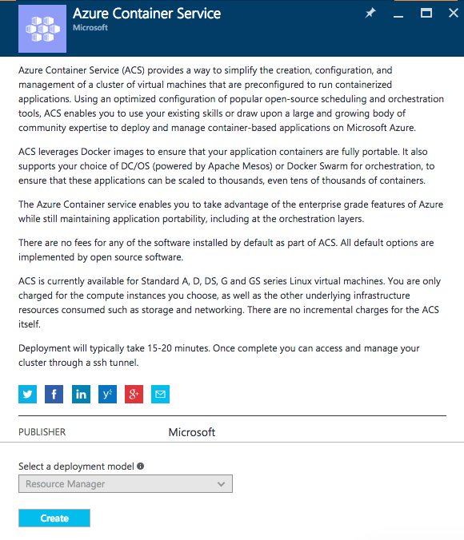
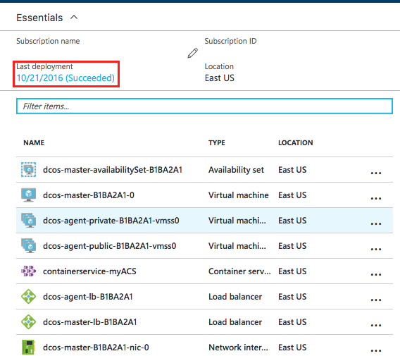
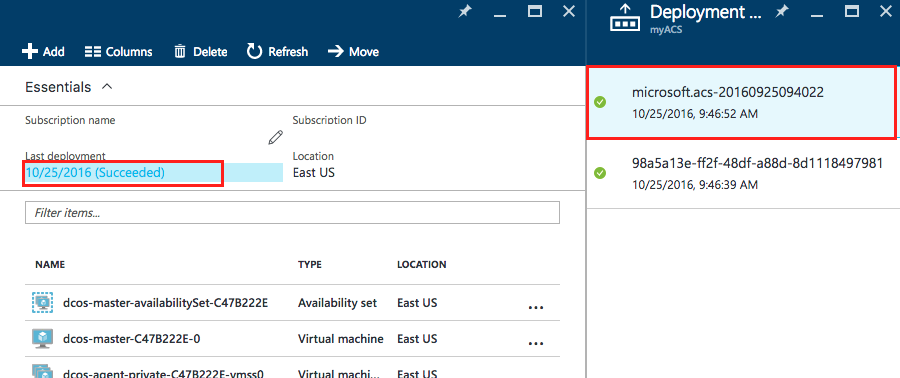
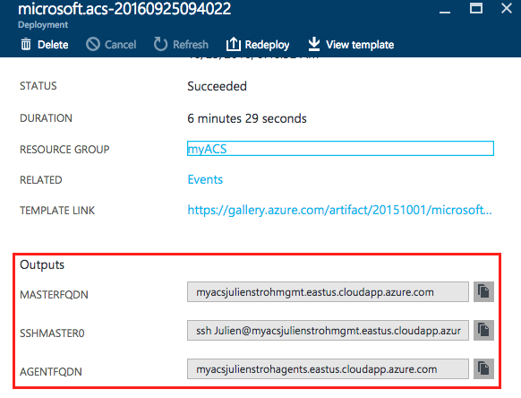
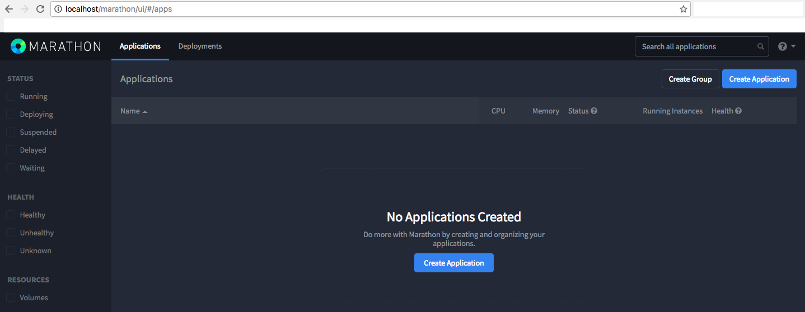
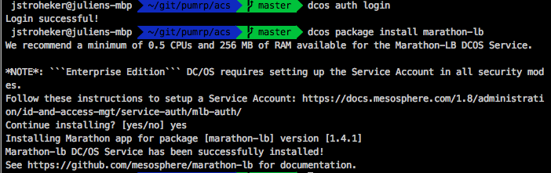
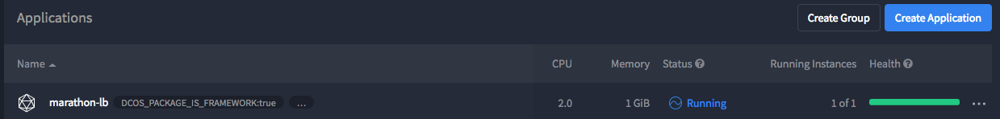

# Deploying Parts Unlimited MRP on DCOS #

## Introduction #

In this HOL, we will explain how you can easly deploy the Parts Unlimited MRP application on DCOS from mesosphere, using Azure Container Services (ACS) on Azure.

We are recommanding you to read and do first the [HOL on Docker](https://microsoft.github.io/PartsUnlimitedMRP/adv/adv-21-Docker.html), to understand the concept of the containers.

## Prerequisites ##

* If you are using Windows, we recomand to install the Bash on Windows feature, and do all the HOL commands using it

> Note : All the screenshots and command are from a Mac environment, it could have some differences in terms of commands or procedure if you are using Windows. Read the feedbacks section at the end of this Labs to have more infos on how you can ask questions.

## Deploy an Azure Container Services (ACS) cluster

ACS is very simple to deploy, you can do it using Azure CLI but we will use the portal for this HOL.

0. First, you have to create a ssh keypair on your machine, you can do that using the **ssh-keygen** command

  

1. [Click here to deploy an ACS cluster from the portal](https://portal.azure.com/#create/microsoft.acs)
  > Note : You may have to enter your credententials to be authenticated on Azure first

2. Click on the **Create** button from the Azure portal

  

3. First, you have to fill the **Basics** section and then click on **OK**

  

  >Note : On the **SSH public key** section you have to paste your **public** key (.pub file), If you using a Mac or a Linux machine you can use the following command : `pbcopy`
  

4. Pick the DC/OS Framework for the next section

  

5. The final step is to define the options about your cluster
  >To do this HOL the following setting are enough : 3 Agent / 1 Master / Standard D2

  

  > Choose an unique **DNS prefix** 

6. Review your final settings and validate your deployment

7. After around 10 minutes, you deployment should be succeeded, click on the **Last deployment** section :

  

8. Click on the first deployment option : ( Ex : microsoft.acs-2016092509.... )

  

9. Notify and copy the output section containing your connections string, we will use it in the next section

  

## Deploy PUMRP on your cluster ##

1. The first step is to inniate the **SSH Tunnel Connection** on your cluster. There is multiple way to do it depends if you are on Mac/Linux or Windows, [you can read the multiple ways to do it by clicking here.](https://azure.microsoft.com/en-us/documentation/articles/container-service-connect/)

  >Note : For example, using my previous example, here is my command : `sudo ssh Julien@myacsjulienstroh.eastus.cloudapp.azure.com -A -p 2200 -L 80:localhost:80 -i acs`

2. Navigate to the following web pages to verify if you connection works :
  * [DCOS Dashboard](http://localhost)
  * [Marathon interface](http://localhost/marathon)

  
  

  > Note : If you have an error to open this two pages, you should fix it first before continue the next step. It may mean that your SSH tunnel connection is not working correctly

2. Download on your local machine [the following marathon.json file](../assets/acs/env/marathon.json)
  >Note : This file contain the PartsUnlimitedMRP deployment

3.  Edit this JSON file with your favorite editor by searching for : `"HAPROXY_0_VHOST":"YOURFQDN"` (lines 53 and 85) and replace `YOURFQDN` with the previous FQDN agents connection string that you copy in the previous section of this HOL
  > Note : In our example it will be `"HAPROXY_0_VHOST":"myacsjulienstrohagents.eastus.cloudapp.azure.com"`

4. Save and close your marathon.json file with the new parameters

5. Open an other terminal, navigate to the folder where the marathon.json file is located, and enter the following command using the dcos CLI :
  > Reminder : You must first install the DCOS CLI, [here more infos](https://docs.mesosphere.com/1.8/usage/cli/install/) !

  ````bash
  dcos auth login
  dcos package install marathon-lb
  ````

> You may have to confirm the deployment of the marathon-lb package in the CLI

  

6. Check on the marathon dashboard [(http://localhost/marathon)](http://localhost/marathon) if the deployment appear

  

7. Back to your terminal, run the following command to deploy Parts Unlimited MRP on your cluster :

  ````bash
  dcos marathon group add marathon.json
  ````

  

  > Double check on the Marathon portal if the deployment is working

  

8. After few second the deployment should be on the **Running** state

  

9. You should be able to browse the application using the public agent FQDN of your cluster and see the result

  > In my case I will browse my cluster using the current FQDN `http://myacsjulienstrohagents.eastus.cloudapp.azure.com/mrp`
  
  > You have to add `/mrp` at then end of the URL

  
  

# Continuous Feedbacks

#### Issues / Questions about this HOL ??

[If you are encountering some issues or questions during this Hands on Labs, please open an issue by clicking here](https://github.com/Microsoft/PartsUnlimitedMRP/issues)

Thanks
