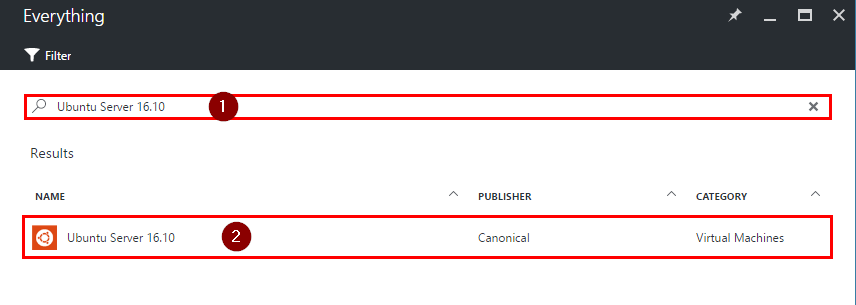
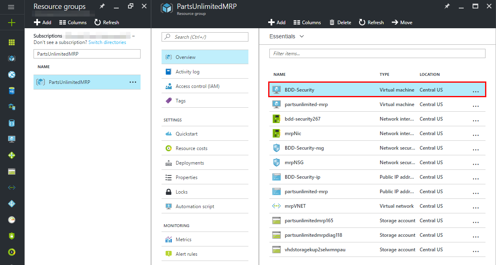
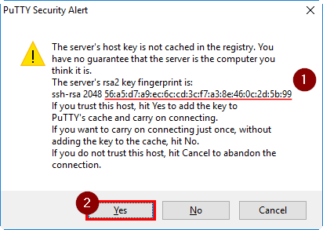
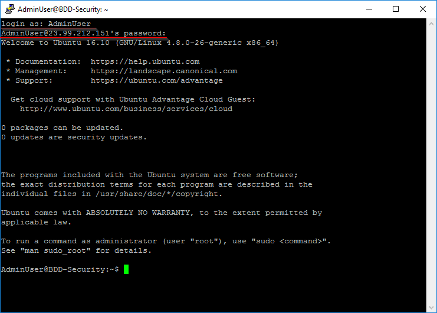
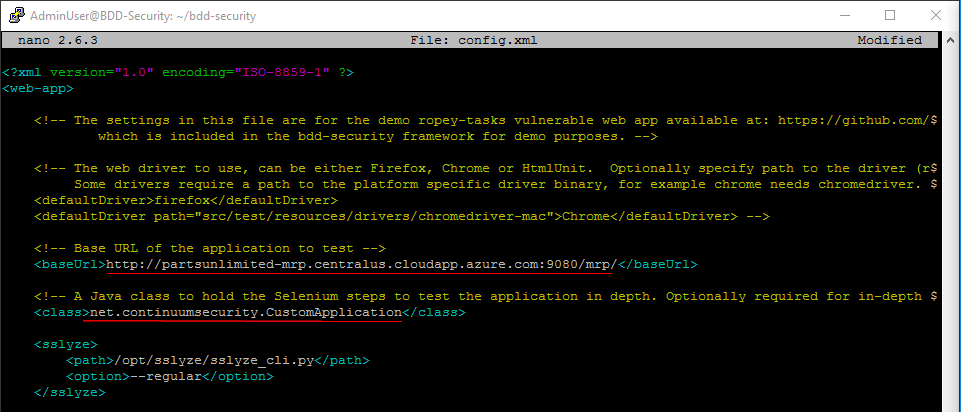
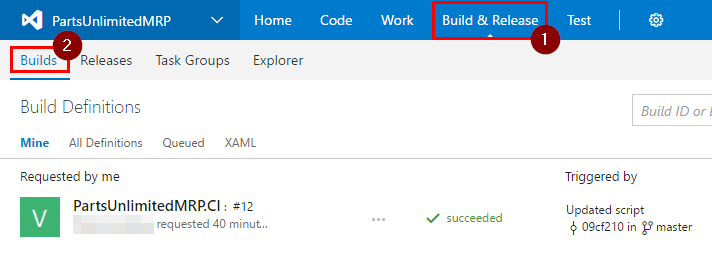
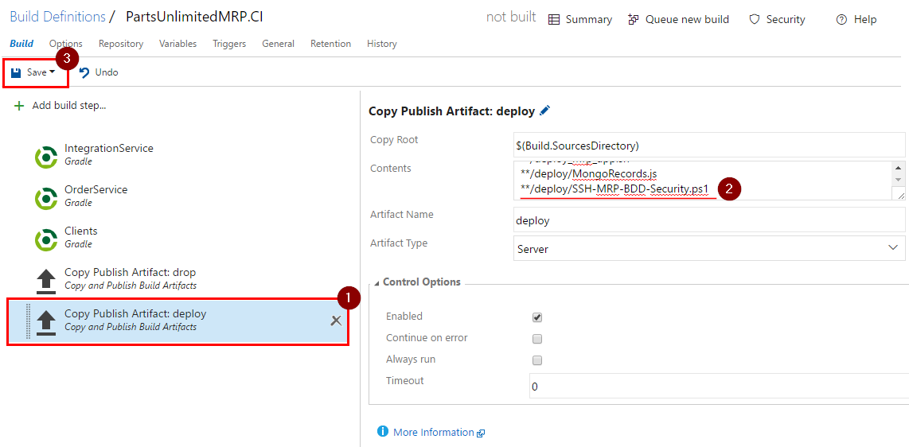
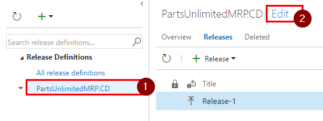
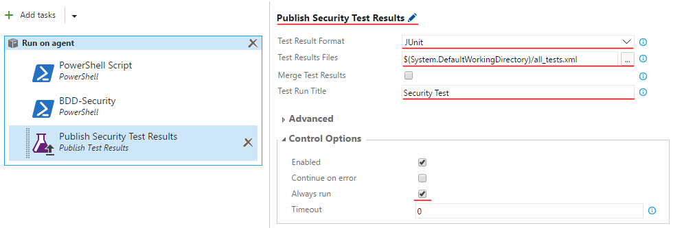
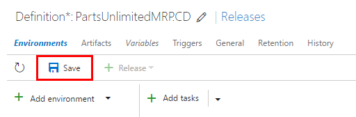

# BDD Security Framework integration into VSTS #

## Introduction ##

BDD Security is a security testing framework that uses Behavior Driven Development concepts to create self-verifying security specifications. 
In this lab you will set up BDD-Security framework on a Linux VM running in Azure and trigger test runs during release stage to dev environment.

## Pre-requisites:

* [HOL - Continuous Integration](https://microsoft.github.io/PartsUnlimitedMRP/fundvsts/fund-01-MS-CI.html)

* [HOL - Continuous Deployment](https://microsoft.github.io/PartsUnlimitedMRP/fundvsts/fund-02-MS-CD.html)


## Tasks Overview:
**1. Create a Ubuntu VM in Azure** This task walks you though creating an Ubuntu 16.10 VM in Azure.  

**2. Set up BDD-Security Framework on Ubuntu VM** In this task you will install prerequisites for BDD-Security Framework and then install and set up framework itself through a SSH client.

**3. Integrate BDD-Security into VSTS** In this task you will update Continuous Integration and Continuous Deployment definition in VSTS to trigger test runs and then publish test results.

**4. Update BDD-Security to include more tests** In this task you will add more tests to run by BDD-Security framework. You will also learn how to find the exact reason for test failure.

### Task 1: Create a Ubuntu VM in Azure
To integrate BDD-Security with VSTS, you need to create a VM where all the tests are going to be run on.

**Step 1.** Open Azure Portal, navigate to the resource group with your environment and click on "Add".


**Step 2.** Enter `Ubuntu Server 16.10` into the search field, press "Enter", select `Ubuntu Server 16.10` option and click on "Create".  




**Step 3.** Enter "Name", "User name", select "Password" as authentication type, enter "Password" for this VM and confirm it, choose your subscription and click on "OK".


**Step 4.** Choose "DS2_V2 Standard" size on the next page and click "Select".   


**Step 5.** On the next page, leave everything as defaults and click "OK".


**Step 6.** On the final page, just click on "OK".


### Task 2: Set up BDD-Security Framework on Ubuntu VM

**Step 1.** Navigate to your Resource Group and click on the newly created VM.




**Step 2.** On "Overview" page, copy the public IP address.


**Step 3.** Open your preferred SSH client and connect to your Ubuntu machine.


> **Note:**<br>
> 1) In this lab we use [PuTTY](http://www.putty.org/) ssh client because we are using a Windows machine.<br>
> 2) Run the following command to initiate the ssh connection if you are using a Unix machine: `ssh <User>@<PublicIp>`


**Step 4.** When the security warning will pop up, note the fingerprint of the Ubuntu VM. This fingerprint is required for VSTS setup later on. Click on "Yes" to add fingerprint to your machine and connect to the machine.



**Step 5.** Enter your credentials to your VM.




**Step 6.** Download and install Java Development Kit (JDK) 8 on this VM using the following commands:

```
sudo apt-get update
sudo apt-get install default-jre -y
sudo apt-get install default-jdk -y
export JAVA_HOME=/usr/lib/jvm/java-8-openjdk-amd64
export PATH=$PATH:/usr/lib/jvm/java-8-openjdk-amd64/bin
```
> **Note:** Ubuntu 16.10 is shipped with java 8 by default.


**Step 7.** Clone [BDD-Security]( https://github.com/continuumsecurity/bdd-security) repository and navigate to it.
```
git clone https://github.com/continuumsecurity/bdd-security.git
cd bdd-security/
```


**Step 8.** Modify `config.xml` file.

1. Use the following command to open `config.xml`:
    ```
    nano config.xml
    ```

2. Update the following tags:

    * baseUrl: URL to your MRP solution

        > **Note:** `baseUrl` tag is used to let BDD-Security know what website to run its tests against.

    * class: `net.continuumsecurity.CustomApplication`

        > **Note:** BDD-Security comes with a tool for automating actions in browsers called `Selenium`. It's primarily used for testing but can also be used for automating administration tasks. The `class` tag is used here to specify a java class with the navigation steps though the website.

    

3. Save the changes and exit the editor. Press `Ctrl+x` to indicate that you want to exit the editor. Press `Y` to save the changes and press `Enter` to confirm the file name.


**Step 9.** Create `CustomApplication.java`.

 - Run the following command to create the `CustomApplication.java` file

    `cat > src/test/java/net/continuumsecurity/CustomApplication.java`

- Copy the following code into the console:

    
    package net.continuumsecurity;

    import net.continuumsecurity.Config;
    import net.continuumsecurity.Credentials;
    import net.continuumsecurity.UserPassCredentials;
    import net.continuumsecurity.behaviour.ILogin;
    import net.continuumsecurity.behaviour.ILogout;
    import net.continuumsecurity.behaviour.INavigable;
    import net.continuumsecurity.web.WebApplication;
    import org.openqa.selenium.By;

    public class CustomApplication extends WebApplication implements INavigable {

        public void navigate() {
        }
    }
    

 > **Note:** You can use this class to navigate though the website using `Selenium` tool. `Selenium` allows an in-depth testing of the website's functionalities by simulating users' actions. We are going to leave this class empty but you can find out more about this here: [Github - BDD-Security ](https://github.com/continuumsecurity/bdd-security/wiki/3-Configuration).

- Press `Ctrl+d` to save the file with the content specified.

**Step 10.** Trigger a build of BDD-Security framework using the following command:
```
./gradlew -Dcucumber.options="--tags @app_scan --tags ~@skip"
```
>**Note:** This command allows us to run the scan locally.

### Task 3: Integrate BDD-Security into VSTS

**Step 1.** Update the build definition to include the BDD-Security script as an artifact.

1.  Open your VSTS and navigate to "Build & Release" of your MRP project and click on "Builds".

    

2. Click on ellipses (...) next to your build definition and select "Edit..."

    

3. Select `Copy Publish Artifact: deploy` task, add `**/deploy/SSH-MRP-BDD-Security.ps1` on a new line in `Contents` and save this definition by clicking on "Save".

    

4. Create a new build by clicking on "Queue new build", then "OK".

    

**Step 2.** Navigate to "Build & Release" of your MRP project and click on "Releases".


**Step 3.** Select your Release Definition and click on "Edit".




**Step 4.** Add new PowerShell task by clicking on "Add tasks", in "Utility" category click on "Add" next to "PowerShell", then click on "Close".


**Step 5.** Change name of the task to "BDD-Security" and set the following values into the task's fields:

  * Type: `File Path`
  * Script Path:  `$(System.DefaultWorkingDirectory)/PartsUnlimitedMRP.CI/deploy/SSH-MRP-BDD-Security.ps1`
  * Arguments: `-sshUser $(BDDSecurityUser) -sshPassword $(BDDSecurityPassword) -sshTarget $(BDDSecurityIP) -sshKey $(BDDSecurityKey)`

    

**Step 6.** Let's define the variables in this environment.

1.  Click on ellipses(...) next to `Dev` environment definition, then on "Configure variables...".

    

2.  Add `BDDSecurityUser` and `BDDSecurityPassword` variables, set their values to the credentials of the BDD-Security VM. 
    Add `BDDSecurityIP` variable and set its value to the IP address or DNS name of the BDD-Security VM. Add `BDDSecurityKey` and set its value to fingerprint of your Ubuntu Machine. Click on "OK".

    
    > **Note:** To get the fingerprint of your Ubuntu machine, connect to it using SSH again and run the following command: `ssh-keygen -l -E md5 -f /etc/ssh/ssh_host_rsa_key.pub`


**Step 7.** Add a new task by clicking on “Add tasks”, in "Test" category click on “Add” next to "Publish Test Results", then click on "Close".

  


**Step 8.** Change name of this step to `Publish Security Test Results`, then fill in the fields in the following way:

* Test Result Format: `JUnit`
* Test Results Files: `$(System.DefaultWorkingDirectory)/all_tests.xml`
* Test Run Title: `Security Test`
* Always run: Ticked

    

**Step 9.** Save the changes by clicking on "Save" and then "OK".

  

**Step 10.** Create a new release to run the security tests. Click on "Release" button, select "Create Release", select the latest build(created at the beginning of this task) and click on "Create".

  

**Step 11.** Once the release has successfully completed, lets check test result.

1. Hover over "Test" and then click on "Runs".

    

2. Double click on the latest test results.

    

3. All of the 16 selected tests should have passed and you should see the following summary.

    


### Task 4: Update BDD-Security to include more tests

**Step 1.** Lets add more tests to be run by BDD-Security. Navigate to the location where you keep your PartsUnlimitedMRP repository and open **SSH-MRP-BDD-Security.ps1** script located at **PartsUnlimitedMRP -> deploy**.


**Step 2.** Replace `./gradlew -Dcucumber.options="--tags @app_scan --tags ~@skip"` with:

 ```
 ./gradlew -Dcucumber.options="--tags @app_scan,@host_config --tags ~@skip"
 ```
 > **Note:** The `@host_config` adds another group of tests to be run by BDD-Security. By default this group contains one test that makes sure that only ports 80 and 443 are open on the machine. To find out more about tags, please refer to this [link](https://github.com/cucumber/cucumber/wiki/Tags)


**Step 3.** At this stage you should also address a possibility of insecure website being promoted to production environment. Add the following code at the end of the script to fail the release if there were errors in test results:
```
# If file with results contains "failed" then returning non-zero value will indicate error and fail the build.
return @(Get-Content all_tests.xml | Where-Object { $_.Contains("failed") }).Count
```


> **Note:** This step is not required to fail the build if you have "Fail on Standard Error" ticked (by default) on "BDD-Security" task
> 


**Step 4.** Save `SSH-MRP-BDD-Security.ps1`. Open command line (which supports git) and navigate to your PartsUnlimitedMRP repository location. Run the following commands to add these changes to the remote repo and trigger automatic build and release.

```
git add .
git commit -m "added more tests to run by SSH-MRP-BDD-Security.ps1"
git push
```


**Step 5.** Once the build and release have completed executing, open test runs in VSTS again and click on the latest result.

  


**Step 6.** Click on "Test results", then double click on failing test to see more information.

  


**Step 7.** Based on the stack trace, a port test has failed by finding open ports other than 80 and 443. To fix this issue, you will need to modify the test to expect the right ports to be open.

  

> **Note:** Do not close port 22 on the Ubuntu VM. It's the port used by SSH to connect to the machine.


**Step 8.** Run the following command on the Ubuntu machine to open file with the failing test in nano editor:
```
nano bdd-security/src/test/resources/features/host_config.feature
```


**Step 9.** Change ports to the expected 22, 8080 and 9080. Also note that initially test was run against localhost (VM with BDD-Security). Change host value to the public IP address of your VM with MRP solution.

   


**Step 10.** Save the changes and exit the editor. Press `Ctrl+x` to indicate that you want to exit the editor. Press `Y` to save the changes and press `Enter` to confirm the file name.


**Step 11.** Rerun the tests by triggering a new deployment or by running the following commands on the Ubuntu machine to see whether the tests will pass this time:
```
cd bdd-security/
./gradlew -Dcucumber.options="--tags @app_scan,@host_config --tags ~@skip"
```

## Congratulations!
You've completed this HOL! In this lab you have learned how to create Ubuntu VM in Azure, install and set up BDD-Security on a Linux VM, integrate BDD-Security framework with VSTS and how to view the tests' results.

# Continuous Feedbacks

#### Issues / Questions about this HOL ??

[If you are encountering some issues or questions during this Hands on Labs, please open an issue by clicking here](https://github.com/Microsoft/PartsUnlimitedMRP/issues)

Thanks