# Deploy and use a Private Docker Registry on Azure in an Application

## Introduction #

This document describes how to set up and secure your own private Docker registry on Microsoft Azure. We will also set up a Continuous Integration build (CI) that will allow us to build and run Docker images, inspect and scan containers, push Docker images to your own private Docker registry and clean up build environment whenever the branch is updated.  

## Prerequisites ##

- You know how to use [Ubuntu](https://www.ubuntu.com/), [PuTTY](http://www.chiark.greenend.org.uk/~sgtatham/putty/) if you are using Windows and [Docker](https://www.docker.com/whatisdocker)

- Complete the [Dockerizing Parts Unlimited MRP](https://microsoft.github.io/PartsUnlimitedMRP/adv/adv-21-Docker.html) lab

- An active Visual Studio Team Services (VSTS) account

- You know how to set up Continuous Integration (CI) with Visual Studio Team Services (You don't? [Learn about CI]( https://microsoft.github.io/PartsUnlimitedMRP/fundvsts/fund-01-MS-CI.html))  

## Tasks Overview ##

**1. Set up a private Docker registry** This will walk you through creating a private Docker registry. It also demonstrates how to tag, push and pull your images.   

**2. Set up a Secured Continuous Integration (CI) with Visual Studio Team Services (VSTS)** Integrate Docker images and containers into your DevOps workflows using [Docker Integration](https://marketplace.visualstudio.com/items?itemName=ms-vscs-rm.docker) for Team Services. This Docker extension adds a task that enables you to build Docker images, push Docker images to an authenticated Docker registry, run Docker images or execute other operations offered by the Docker CLI.   

### Task 1: Set up a private Docker registry
**Step 1.** Deploy an Ubuntu VM with Docker Engine. [Do it quickly on Azure](https://azure.microsoft.com/en-us/documentation/templates/docker-simple-on-ubuntu/)

<a href="https://portal.azure.com/#create/Microsoft.Template/uri/https%3A%2F%2Fraw.githubusercontent.com%2FAzure%2Fazure-quickstart-templates%2Fmaster%2Fdocker-simple-on-ubuntu%2Fazuredeploy.json" target="_blank">  </a>

> **Note:** Latest Ubuntu OS version 16.04 LTS is recommended.

**Step 2.** Once deployed, SSH into the Ubuntu VM using [PuTTY](http://www.chiark.greenend.org.uk/~sgtatham/putty/):


Enter your credentials to your VM:


> **Note:** Run the following command to initiate the ssh connection if you are using a Unix machine: `ssh <user>@<public-ip>`

**Step 3.** Install apache2-utils package. It contains the htpasswd utility which will be used to generate password hashes Nginx can understand:
```
$ sudo apt-get -y install apache2-utils
```

**Step 4.** Set up a Docker registry container. Let's create a new storage account to store Docker images, please sign in to the [Azure portal](https://ms.portal.azure.com/). On the Hub menu, select **New** -> **Storage** -> **Storage account**. Enter your details, and then click **Create**:

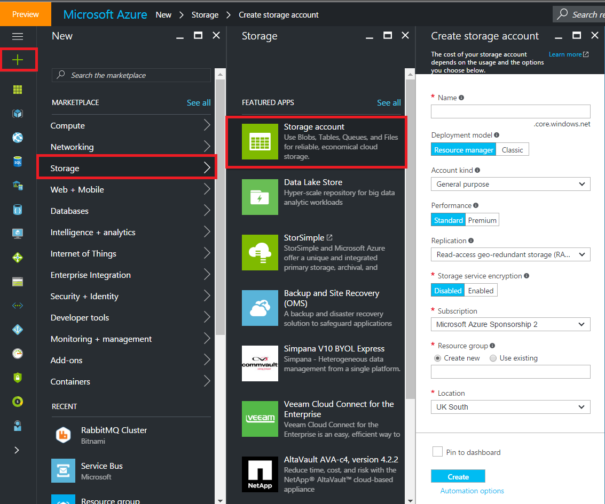

 Once the storage account is created, click **Access Keys** setting, and then copy your storage account name and access key:    


By hosting your Docker Registry instance on Azure VM and storing your images on Azure Blob Storage, you can have several benefits, such as security, performance and reliability.

**Step 5.** [Docker Compose](https://docs.docker.com/compose/) allows you to write one YAML file to set up multiple containers and manage communication between them. Create a docker-compose.yml file using your favorite text editor. Add and save the following contents to docker-compose.yml file, and replace **storage-account** and **storage-key** with your storage account name and access key:
```
$ mkdir ~/docker-registry && cd $_
$ nano docker-compose.yml
```

```
registry:
  image: registry:2
  ports:
    - 127.0.0.1:5000:5000
  environment:
    - REGISTRY_STORAGE=azure
    - REGISTRY_STORAGE_AZURE_ACCOUNTNAME="<storage-account>"
    - REGISTRY_STORAGE_AZURE_ACCOUNTKEY="<storage-key>"
    - REGISTRY_STORAGE_AZURE_CONTAINER="registry"
  volumes:
    - ./data:/data
```

**Step 6.** Set up a Docker Nginx container, and link it up to Docker registry container. Nginx is used to handle security and communication in this lab. Create a directory to store Nginx data:
```
$ mkdir ~/docker-registry/nginx
```

Re-open the docker-compose.yml file in the ~/docker-registry directory:
```
$ nano docker-compose.yml
```

Create a new Docker Nginx container based on the official Nginx image. Paste the following contents at the beginning of docker-compose.yml file and save it:
```
nginx:
  image: "nginx:1.9"
  ports:
    - 443:443
  links:
    - registry:registry
  volumes:
    - ./nginx/:/etc/nginx/conf.d:ro
```
The interesting bit here is the **links** section. It automatically set up a "link" to the registry container. The **volumes** section provides a way to map files in Nginx container to the host machine.

The final version of docker-compose.yml file should look similar to the following:

```
nginx:
  image: "nginx:1.9"
  ports:
    - 443:443
  links:
    - registry:registry
  volumes:
    - ./nginx/:/etc/nginx/conf.d:ro
registry:
  image: registry:2
  ports:
    - 127.0.0.1:5000:5000
  environment:
    - REGISTRY_STORAGE=azure
    - REGISTRY_STORAGE_AZURE_ACCOUNTNAME="mydockerstorageaccountname"
    - REGISTRY_STORAGE_AZURE_ACCOUNTKEY="3c2BbH31iBjliyVh7CSjq9T/luFfwSt1zRZKXEWEu6HcImwXO9ccL124/MY4lemGGm8n7To2IVNr8EmRA=="
    - REGISTRY_STORAGE_AZURE_CONTAINER="registry"
  volumes:
    - ./data:/data
```

Save and Close our new file: Ctrl+X...

**Step 7.** Create a registry.conf file:
```
$ nano ~/docker-registry/nginx/registry.conf
```

Copy and save the following contents into registry.conf file, and change the value of **server_name** to the public DNS name or IP of your Ubuntu VM (e.g., dockerregistry.australiaeast.cloudapp.azure.com):
```
upstream docker-registry {
  server registry:5000;
}

server {
  listen 443;
  server_name <server_name>;

  # SSL
  ssl on;
  ssl_certificate /etc/nginx/conf.d/domain.crt;
  ssl_certificate_key /etc/nginx/conf.d/domain.key;

  # disable any limits to avoid HTTP 413 for large image uploads
  client_max_body_size 0;

  # required to avoid HTTP 411: see Issue #1486 (https://github.com/docker/docker/issues/1486)
  chunked_transfer_encoding on;

  location /v2/ {
    # Do not allow connections from docker 1.5 and earlier
    # docker pre-1.6.0 did not properly set the user agent on ping, catch "Go *" user agents
    if ($http_user_agent ~ "^(docker\/1\.(3|4|5(?!\.[0-9]-dev))|Go ).*$" ) {
      return 404;
    }

    # To add basic authentication to v2 use auth_basic setting plus add_header
    auth_basic "registry.localhost";
    auth_basic_user_file /etc/nginx/conf.d/registry.password;
    add_header 'Docker-Distribution-Api-Version' 'registry/2.0' always;

    proxy_pass                          http://docker-registry;
    proxy_set_header  Host              $http_host;   # required for docker client's sake
    proxy_set_header  X-Real-IP         $remote_addr; # pass on real client's IP
    proxy_set_header  X-Forwarded-For   $proxy_add_x_forwarded_for;
    proxy_set_header  X-Forwarded-Proto $scheme;
    proxy_read_timeout                  900;
  }
}
```

**Step 8.** Set up basic authentication. Let's create a file named registry.password using htpasswd utility for storing user credentials. Replace **user-name** with your preferred user name, and enter your preferred password when prompted. The user name and password will be used to log into your private Docker registry later.
```
$ cd ~/docker-registry/nginx
$ htpasswd -c registry.password <user-name>
```

**Step 9.** Nginx container is configured to use SSL and will look for SSL certificate and key files in **/etc/nginx/conf.d** folder. Due to the mapping we configured earlier in docker-compose.yml file, the **/etc/nginx/conf.d** folder inside Nginx container is mapped to the folder **~/docker-registry/nginx** on your host machine. Let's drop your certificate and key files in that folder.

If you need to create a self-signed certificate, please follow this instruction. To begin, let's change to ~/docker-registry/nginx folder and get ready to create the certificate:
```
$ cd ~/docker-registry/nginx
```
Generate your own certificate and be sure to use the DNS name of your Ubuntu VM (e.g., dockerregistry.australiaeast.cloudapp.azure.com) as CN:
```
$ openssl req -newkey rsa:4096 -nodes -sha256 -keyout domain.key -x509 -days 365 -out domain.crt
```

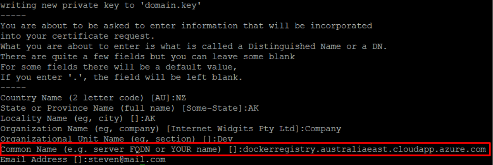

The certificate we just generated isn't verified by any known certificate authority (e.g., VeriSign). In this HOL, we included steps on how to export the certificate from Docker registry and import it to the client machine. Let's do this locally on the host machine so that we can use Docker from the Docker registry server itself:
```
$ sudo mkdir /usr/local/share/ca-certificates/docker-dev-cert
$ sudo cp domain.crt /usr/local/share/ca-certificates/docker-dev-cert
$ sudo update-ca-certificates
```

**Step 10.** Restart the Docker daemon so that it picks up the changes made in certificate store:
```
$ sudo service docker restart
```

**Step 11.** It's time to start up an instance of your private Docker registry:
```
$ cd ~/docker-registry
$ docker-compose up
```

**Step 12.** Open up another terminal and verify that the private Docker registry is running by executing:
```
$ docker ps
```
The output should look similar to the following:
```
CONTAINER ID        IMAGE               COMMAND                CREATED             STATUS              PORTS                          NAMES
d4b6fef0b4d1        nginx:1.9           "nginx -g 'daemon of   2 minutes ago       Up 2 minutes        80/tcp, 0.0.0.0:443->443/tcp   dockerregistry_nginx_1
77668352bd39        registry:2          "registry cmd/regist   2 minutes ago       Up 2 minutes        127.0.0.1:5000->5000/tcp       dockerregistry_registry_1
```
> **Note:** The names all start with dockerregistry_

**Step 13.** Let's try another curl test using your credentials and domain name:
```
$ curl https://<user-name>:<password>@<domain-name>/v2/
```
As of this writing Docker returns an empty json object, so you should see:
```
{}
```

**Step 14.** Log in to Docker registry from a client machine by executing:
```
$ docker login https://<domain-name>
```
Enter the username and password you created earlier, and you should see the following message:
```
Login Succeeded
```
If you use a self-signed certificate, please add the SSL certificate you created in Step 9 to this client machine.
On the Docker registry server, view the certificate:
```
$ sudo cat ~/docker-registry/nginx/domain.crt
```
You'll get output that looks something like this:

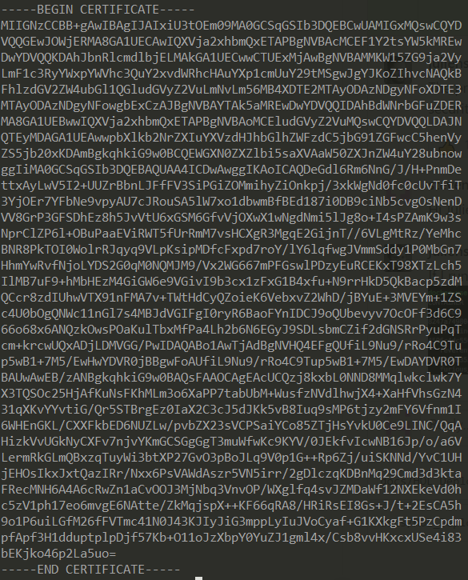

Copy the certificate contents to your clipboard. On the client machine, create the certificate directory:
```
$ sudo mkdir /usr/local/share/ca-certificates/docker-dev-cert
```

Open the certificate file for editing:
```
$ sudo nano /usr/local/share/ca-certificates/docker-dev-cert/domain.crt
```

Paste and save the certificate contents, and then run the following commands to update the certificate store:
```
$ sudo update-ca-certificates
$ sudo service docker restart
```

**Step 15.** You are now ready to publish images to the private Docker registry. You can build your own images using this lab. Let's do an example using [mongo official image](https://store.docker.com/images/9147d1b7-a686-4e38-8ecd-94a47f5da9cf?tab=description) from Docker Store. Pull the mongo image:
```
$ docker pull mongo
```

Tag an image with your registry's domain name (e.g., dockerregistry.australiaeast.cloudapp.azure.com/mongo) in order to push it:
```
$ docker tag mongo <domain-name>/mongo
```

**Step 16.** Now we can push this image (e.g., dockerregistry.australiaeast.cloudapp.azure.com/mongo) to the private Docker registry:
```
$ docker push <domain-name>/mongo
```
This will take a moment to upload to the registry server. You should see output similar to the following:

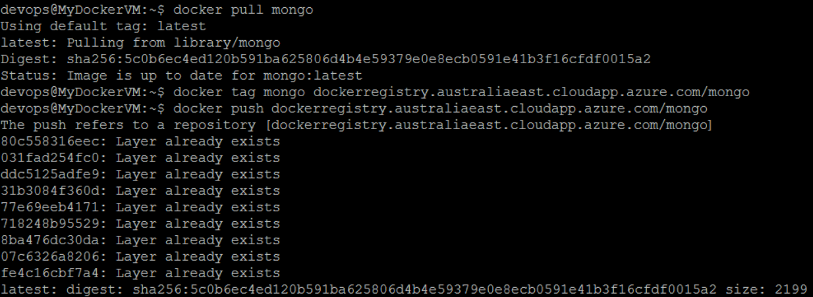

The mongo image appears in your Azure Blob storage.


**Step 17.** Pull this image (e.g., dockerregistry.australiaeast.cloudapp.azure.com/mongo) back from private Docker registry:
```
$ docker pull <domain-name>/mongo
```

### Task 2: Set up a Secured Continuous Integration (CI) with Visual Studio Team Services (VSTS)  

The goal of this task is to build a Continuous Integration (CI) pipeline with Docker. The flow that we will setup is explained as follows:

1. Build: Build a Docker image.
2. Run: Create a running instance of the Docker image.
3. Inspect: Examine the software we build to ensure that they reach a high standard. The following tools are used:
   * [Docker Inspect](https://docs.docker.com/engine/reference/commandline/inspect/): Using the basic inspect command, a wealth of information (e.g., ports) about images and containers can be gathered.
   * [Docker Bench](https://github.com/docker/docker-bench-security): It is a script that checks for dozens of common best-practices around deploying Docker containers in production.
4. Push: After inspection, push your image to the private Docker Registry created in previous task.
5. Remove: Clean up the build environment by removing images and containers.

**Step 1.** Install [Docker Integration](https://marketplace.visualstudio.com/items?itemName=ms-vscs-rm.docker) for Visual Studio Team Services. This Docker extension adds a task that enables you to build Docker images, push Docker images to an authenticated Docker registry, run Docker images or execute other operations offered by the Docker CLI.

**Step 2.** Create a Docker host based on Ubuntu machine in Microsoft Azure using [Docker Machine](https://docs.docker.com/machine/drivers/azure/).
```
$ docker-machine create --driver azure --azure-subscription-id <subs-id> <machine-name>
```
This tool is really easy to use and it allows to have a Docker host up and running in a few minutes! The output using **docker-machine** is shown below:


This is another way to deploy a VM running Docker on Azure. We can also use, like in the first step of previous task, the official image from MS.

> **Note:** Docker Machine is installed along with other Docker products when you install the Docker Toolbox. For details on installing Docker Toolbox, see the [macOS installation](https://docs.docker.com/docker-for-mac/)  instructions or [Windows installation](https://docs.docker.com/docker-for-windows/) instructions.

**Step 3.** Once Docker host is up and running, let's connect to the machine by executing:
```
$ docker-machine ssh <machine_name>
```

**Step 4.** If you use a self-signed certificate, please add the SSL certificate created in your private Docker registry to the Docker host. On the Docker registry server, view the certificate:
```
$ sudo cat ~/docker-registry/nginx/domain.crt
```
You'll get output that looks something like this:


Copy the certificate contents to your clipboard. On the Docker Host, create the certificate directory:
```
$ sudo mkdir /usr/local/share/ca-certificates/docker-dev-cert
```

Open the certificate file for editing:
```
$ sudo nano /usr/local/share/ca-certificates/docker-dev-cert/domain.crt
```

Paste and save the certificate contents, and then run the following commands to update the certificate store:
```
$ sudo update-ca-certificates
$ sudo service docker restart
```

Add the login user (e.g., docker-user by default) to Docker group and reboot the Docker host:
```
$ sudo usermod -aG docker <user-name>
```

**Step 5.** Set up a Docker build agent that runs on Docker host. To begin, please connect to the Docker host and install these [pre-requisites](https://github.com/Microsoft/vsts-agent/blob/master/docs/start/envubuntu.md). After installed, you can download the [build agent](https://github.com/Microsoft/vsts-agent/releases) from the GitHub release page, depending on the Ubuntu version your are running on (e.g., 14.04 or 16.04):
```
$ wget https://github.com/Microsoft/vsts-agent/releases/download/v2.109.2/vsts-agent-ubuntu.16.04-x64-2.109.2.tar.gz
```

At the time that we are writing this HOL, the latest version released for the agent is 2.109.2. Once downloaded, create a new folder **vsts-agent**, and extract the archive in this folder:
```
$ mkdir vsts-agent && cd vsts-agent
$ tar xzf <path-to-build-agent-archive>
```
To be able to authenticate the Docker build agent to your VSTS account, you need to get a [personal access token (PAT)](https://www.visualstudio.com/es-es/docs/setup-admin/team-services/use-personal-access-tokens-to-authenticate).

Run the config.sh script in the vsts-agent directory:
```
$ ./config.sh
```

Follow the configuration steps, accept the license agreement, enter your VSTS account URL, the PAT you have just created, etc., and then run the run.sh script to start the build agent:
```
$ ./run.sh
```

Go to your VSTS account’s homepage (e.g., https://`<account>`.visualstudio.com), open the **Agent pools** page in **Settings** menu.


Check that Docker build agent is available.


**Step 6.** After complete the [Dockerizing Parts Unlimited MRP](https://microsoft.github.io/PartsUnlimitedMRP/adv/adv-21-Docker.html) lab, please structure your directories and files as follows:    

```
PartsUnlimitedMRPDocker
├── src
    ├── Clients
    |   ├── Dockerfile
    |   └── drop    
    |        └── mrp.war
    ├── Database
    |   ├── Dockerfile
    |   └── drop
    |        └── MongoRecords.js
    ├── Order
        ├── Dockerfile
        └── drop
             ├── ordering-service-0.1.0.jar
             └── run.sh
```

1. Create **PartsUnlimitedMRPDocker** directory and **src** subdirectory.
2. Copy **Clients**, **Database** and **Order** created in [Dockerizing Parts Unlimited MRP](https://microsoft.github.io/PartsUnlimitedMRP/adv/adv-21-Docker.html) lab into the **src** directory.

**Step 7.** Go to your VSTS account’s homepage (e.g., https://`<account>`.visualstudio.com). Create a new PartsUnlimitedMRPDocker team project by clicking on the **New** button under Recent projects & teams. Type in the project name as **PartsUnlimitedMRPDocker** and select **Git** as the version control, then click on **Create project**:


After the wizard creates your new team project, navigate to the PartsUnlimitedMRPDocker team project and click on the **Code** tab on the upper-left.


The PartsUnlimitedMRPDocker Git repository will be empty, so copy the **Clone URL** of the VSTS repository to your clipboard and paste it into a text document for use later:

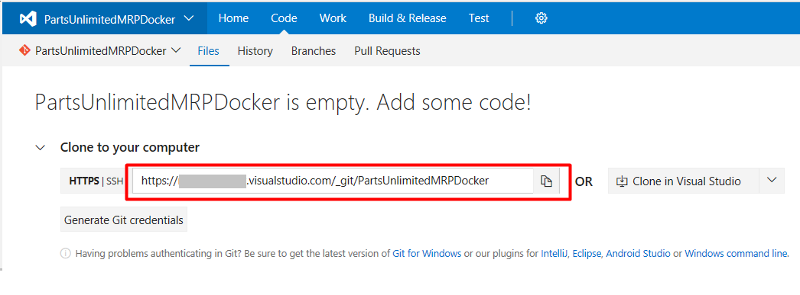

Open your preferred command line tool, and change to **PartsUnlimitedMRPDocker** directory created earlier. Enter the following commands, and replace **clone-url** and **commit-message** with your **Clone URL** and message:
```
$ git init
$ git remote add origin <clone-url>
$ git add .
$ git commit -m <commit-message>
$ git push origin master
```  

Folders and files are now added into in your VSTS Git repository:


**Step 8.** Go to your VSTS account’s homepage (e.g., https://<account>.visualstudio.com). Navigate to the **PartsUnlimitedMRPDocker** team project in VSTS.

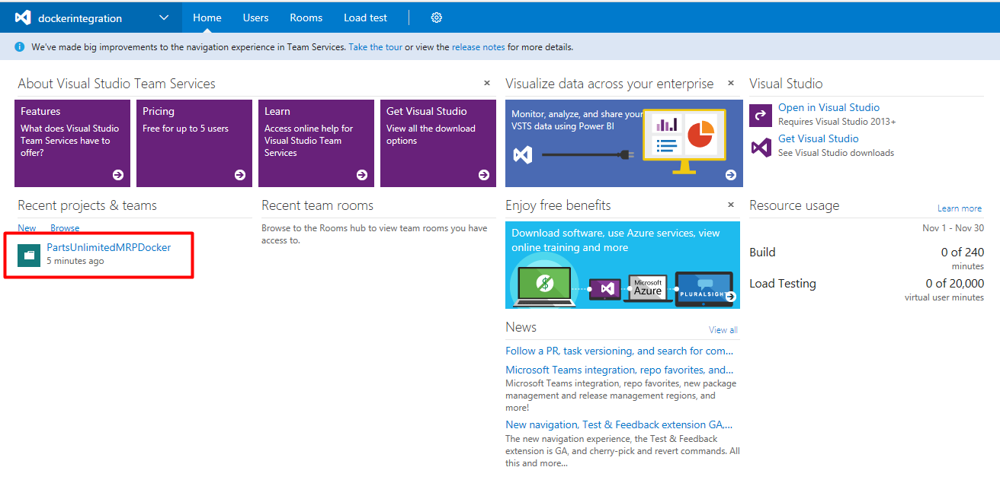

**Step 9.** Create a Docker registry endpoint. In the **Settings** menu, select **Services**.


In the **New Service Endpoint** list, select **Docker Registry**.


Enter the URL of your private Docker registry and login credentials created in previous task.


**Step 10.** Create a new build definition. In the **Build & Release** menu, select **Builds**.


 Click the **+ New Definition** button or the **+ New** button, select **Empty**, and then click **Next >**.


 Ensure the **Team Project** is selected as the **Repository source**, the appropriate repository (created in the previous step), and tick the **Continuous Integration** checkbox, select **Default** as the **Default agent queue**, then click **Create**.

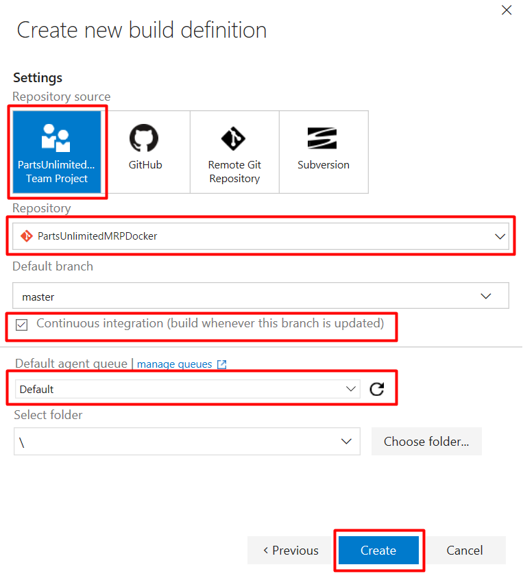

 **Step 11.** Add a build step to build the **Clients** Docker image. Click on the **Build** tab, click **Add build step...**, and then click the **Add** button next to the Docker task. Docker task enables you to build, run, push Docker images or execute other operations offered by the Docker CLI.


Click the pencil icon to enter your preferred task name.

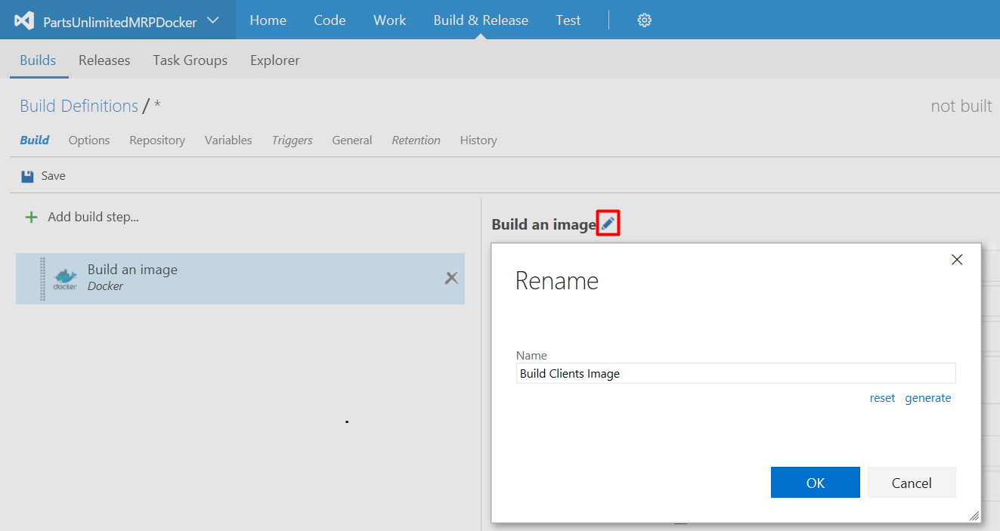

Configure the task (e.g., Build Clients Image) as follows:

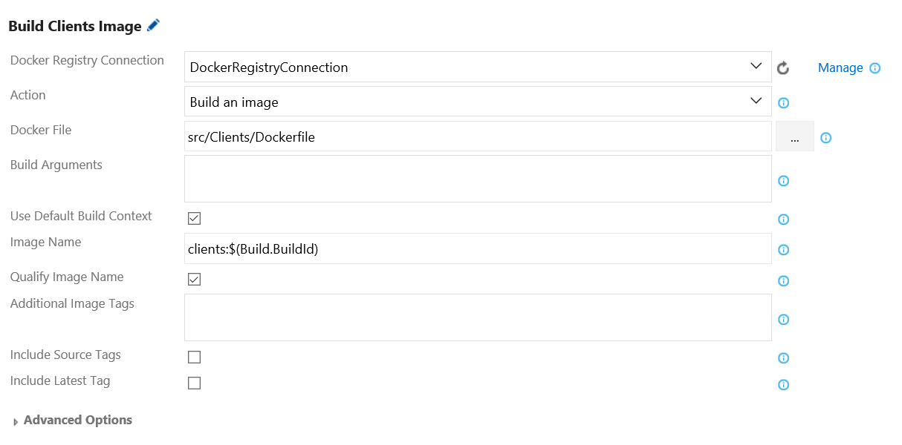

* **Docker Registry Connection**: Select the Docker registry endpoint created earlier.
* **Action**: Select **Build an image**.
* **Docker File**: Select the path to Docker file for your **Clients** Component.
* **Use Default Build Context**: Tick this checkbox. Set the build context to the directory that contains the Docker file.  
* **Image Name**: Enter your preferred image name. You can tag an image with build number (e.g., **clients:$(Build.BuildId)**).
* **Qualify Image Name**: Tick this checkbox. Qualify the image name with the Docker registry connection's hostname.

**Step 12.** In the same Docker build task, add a build step to run the **Clients** Docker image. Configure the Docker task (e.g., Run Clients Image) as follows:


* **Docker Registry Connection**: Select the Docker registry endpoint created earlier.
* **Action**: Select **Run an image**.
* **Image Name**: Enter the image name (e.g., **clients:$(Build.BuildId)**) you wish to run.
* **Qualify Image Name**: Tick this checkbox. Qualify the image name with the Docker registry connection's hostname.
* **Container Name**: Enter your preferred container name (e.g., clients).
* **Ports**: Enter **80:8080**. Ports in the Docker container to publish to the host.

**Step 13.** Add a build step to inspect the running Container using [Docker Inspect](https://docs.docker.com/engine/reference/commandline/inspect/). Configure the Docker task (e.g., Inspect Clients Container) as follows:


* **Action**: Select **Run a Docker command**.
* **Command**: Enter the following command line, and replace the container-name with your container name (e.g., clients):  

    ```
    inspect <container-name>
    ```

**Step 14.** Add a build step to scan security vulnerabilities using [Docker Bench for Security](https://github.com/docker/docker-bench-security). Configure the Docker task (e.g., Scan Security Vulnerabilities for Images and Containers) as follows:


* **Action**: Select **Run a Docker command**.
* **Command**: Enter the following command line:  

    ```
    run --name dockerbenchsecurity --net host --pid host --cap-add audit_control -v /var/lib:/var/lib -v /var/run/docker.sock:/var/run/docker.sock -v /usr/lib/systemd:/usr/lib/systemd -v /etc:/etc --label docker_bench_security docker/docker-bench-security
    ```

**Step 15.** Add a build step to push the **Clients** image to your private Docker registry. Configure the Docker task (e.g., Push Clients Image to Private Docker Registry) as follows:

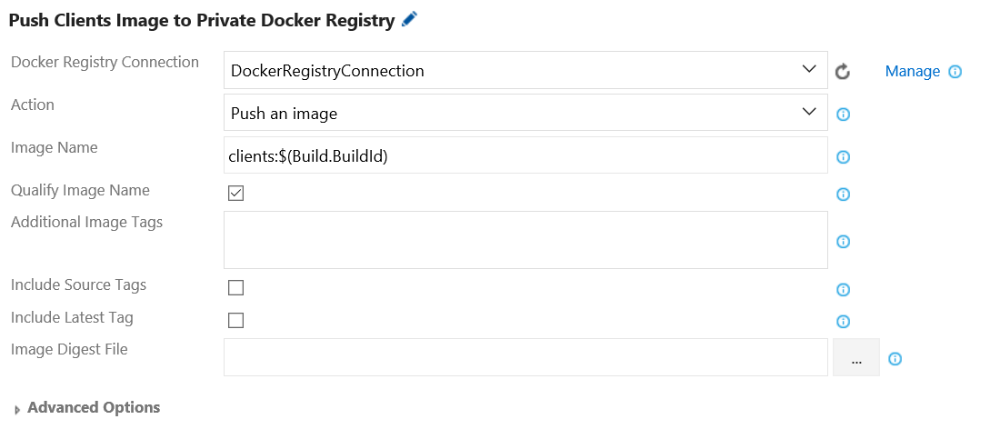

* **Docker Registry Connection**: Select the Docker registry endpoint created earlier.
* **Action**: Select **Push an image**.
* **Image Name**: Enter the image name (e.g., **clients:$(Build.BuildId)**) you wish to push.
* **Qualify Image Name**: Tick this checkbox. Qualify the image name with the Docker registry connection's hostname.

**Step 16.** Add a build step to remove the containers after testing. Configure the Docker task (e.g., Remove Containers after Testing) as follows:


* **Action**: Select **Run a Docker command**.
* **Command**: Enter the following command line, and replace the container-list with your containers:  

    ```
    rm -f [container-list]
    ```

**Step 17.** Add a build step to remove the build image on Docker host after pushing to the private Docker registry. Configure the Docker task (e.g., Remove Clients Build Image after Pushing) as follows:


* **Action**: Select **Run a Docker command**.
* **Command**: Enter the following command line, and replace the image-name with your image name (e.g., **dockerregistry.australiaeast.cloudapp.azure.com/clients:$(Build.BuildId)**):

    ```
    rmi <image-name>:$(Build.BuildId)
    ```

**Step 18.** Save the build definition, and then click the **Queue new build** button.


Select **Default** as **Queue**, **master** as **Branch**, and then click **OK**.


**Step 19.** Once the build is done, click on the build step **Inspect Clients Container** to view the inspection results for **Clients** container.

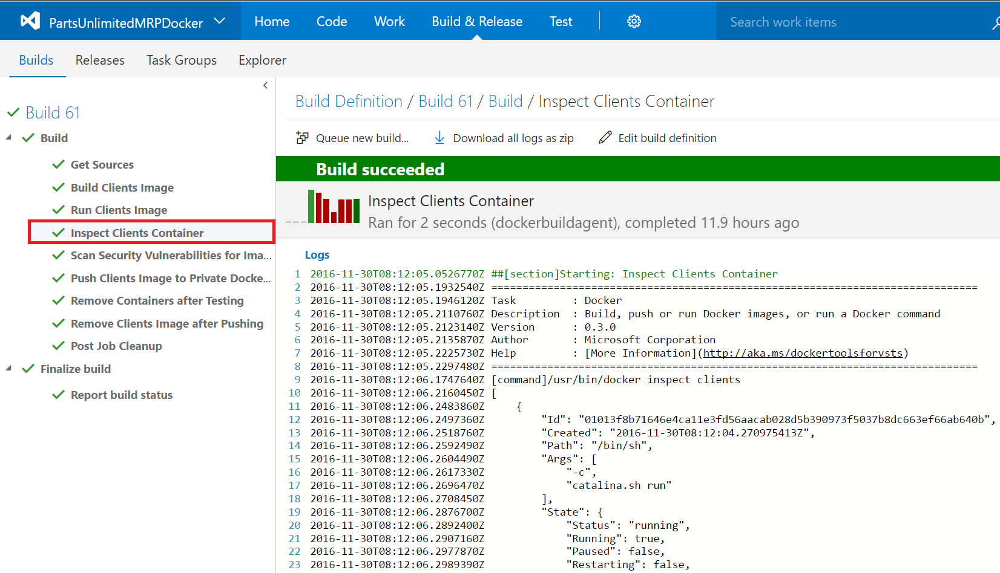

**Step 20.** Click on the build step **Scan Security Vulnerabilities for Images and Containers** to view the scan results for images and containers.

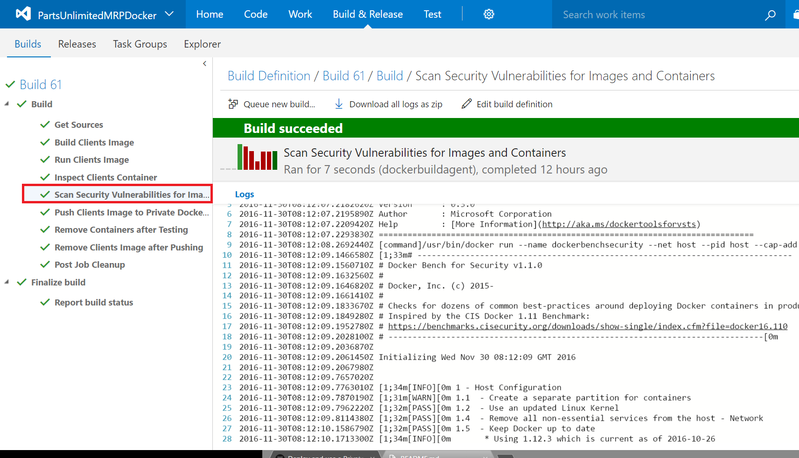

**Step 21.** Open the Azure Blob Storage we created in previous task to store Docker images, you can see the new **clients** image.


**Step 22.** Repeat the above steps for **Order** and **Database** components if you wish to practice more. We can also optimize this workflow by creating a custom script when we call the Docker Inspect and Docker Bench command by rejecting the build and the push if something is wrong during the scan.

## Congratulations!
You've completed this HOL! In this lab, you have learned how to set up a private Docker registry, and integrate with Visual Studio Team Services.

# Continuous Feedbacks

#### Issues / Questions about this HOL ??

[If you are encountering some issues or questions during this Hands on Labs, please open an issue by clicking here](https://github.com/Microsoft/PartsUnlimitedMRP/issues)

Thanks