In this hands-on lab, you will explore some of the new features and capabilities of Deploying MRP App via Chef Server in Azure. This hands-on lab is designed to point out new features, discuss and describe them, and enable you to understand and explain these features to customers as part of the DevOps Lifecycle.


<h3><span style="color: #0000CD;">DevOps MPP Course Source </span></h3>

- This lab is used in course <a href="https://www.edx.org/course/infrastructure-code-microsoft-devops200-2x-0" target="_blank"><span style="color: #0066cc;" color="#0066cc">DevOps200.2x: Infrastructure as Code</span></a> - Module 4.


<h3><span style="color: #0000CD;"> Pre-requisites:</span></h3>

- An active Azure subscription


<h3><span style="color: #0000CD;"> Lab Tasks:</span></h3>

- Set up a Chef Automate machine and client with an ARM template. 

- Configure the Chef Workstation

- Create a Cookbook

- Create a role

- Bootstrap the MRP App Server and Deploy the Application


<h3><span style="color: #0000CD;">Estimated Lab Time:</span></h3>

- approx. 80 minutes  


###  Task 1: Set up a Chef Automate machine and client with an ARM template

We have a few options when looking to deploy and use a Chef Server in Azure
- **Install a clean Linux VM**: i.e. install Ubuntu sku on Azure, and then install and configure Chef Server on that VM.
- **Install Chef Automate**: This is a sku available on Azure, comes with a number of Chef services, including **Chef Server** as part of the **Chef Automate** image.
- **Hosted Chef Server**: You can sign up for a hosted Chef server account at <a href="https://manage.chef.io" target="_blank"><span style="color: #0066cc;" color="#0066cc">https://manage.chef.io</span></a> and use this hosted server.

We will be using the second option above, a **Chef Automate** deployment on Azure.

If you are familiar with previous Chef products, **Chef Automate** contains **Chef Server** and it also replaces **Chef Analytics**, so deploying **Chef Automate** will provide us with the components we need.

If you have time, look through some of the <a href="https://docs.chef.io/install_chef_automate.html" target="_blank"><span style="color: #0066cc;" color="#0066cc">Chef Automate documentation</span></a> to familiarize yourself with how it operates and is structured, if you are unfamiliar with it. 

Also, note that there is a free 30-day trial license for the use of Chef in Azure. We will leave the license fields blank to avail of this in the deployment.


1. This lab calls for the use of 2 virtual machines and your local one. 
	- The Chef Automate which houses the chef server must be a Linux machine. 
	- The MRP app client will be a Linux machine.  This machine will be configured and deployed to by Chef.
	- The Chef workstation can run on Linux, Windows, or Mac. 
	
	For this lab, we will us your local machine as the Chef workstation but you could create a VM in Azure of any operating system and use that if you wished. In thess lab steps we will assume it is a Windows OS. Also, instead of manually creating the VMs in Azure for Chef Automate and the PU MRP applciation, we are going to use Azure Resource Management (ARM) templates.
    
2. Simply click the Deploy to Azure button below and follow the wizard to deploy the Chef Automate machine. You will need
    to log in to the Azure Portal.
                                                                     
	<a href="https://portal.azure.com/#create/Microsoft.Template/uri/https%3A%2F%2Fraw.githubusercontent.com%2FMicrosoft%2FPartsUnlimitedMRP%2Fmaster%2FLabfiles%2FDevOps200.2x-InfrastructureasCode%2FDeployusingChef%2Fenv%2Fdeploychef.json" target="_blank">
		
	</a>
	<a href="http://armviz.io/#/?load=https%3A%2F%2Fraw.githubusercontent.com%2FMicrosoft%2FPartsUnlimitedMRP%2Fmaster%2Fdocs%2FHOL_Deploying-Using-Chef%2Fenv%2Fdeploychef.json" target="_blank">
		
	</a>

    The VM will be deployed to a Resource Group along with a virtual network (VNET) and some other required resources. You can delete the resource group in order to remove all the created resources at any time.

3. You will need to add details for the following:

	- Subscription: **your Azure subscription**
	- Resource group: **a unique resource gorup name i.e. chefmumrprgek01**
	- Location: **select a region to deploy the Resource Group to**
	- Admin Username: **azureuser** or whatever name you choose
	- Admin Password: **Pa$$w0rd0134**
	- Public IP Dns Name: a unique dns name, such as **chefpumrpek01**. This name must be unique, you cna add your initials orsome other unique oidentifier to it to ensure this is the case.
	- Storage Account Name: This value needs to be unique also i.e. **stracnmpumrpek02**


	**Note:** Make sure not to change any other configuration fields as they are populated correctly for you, just edit the ones called out above. Also, make sure you take a note of the region as well as the usernames and passwords for the machine. 

	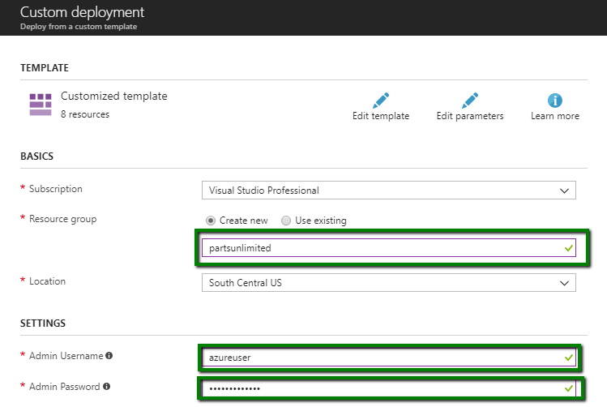

	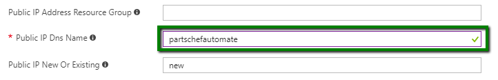
	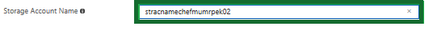
	
	


	Click **Purchase** when finished and allow about 10 minutes for deployment. 

4. When the deployment completes, you should see the following resources in the Azure Portal.

    
	

5.  Check that Chef Automate deployment was successful by going to the resource group then **Overview** and you can view the **Deployments**

	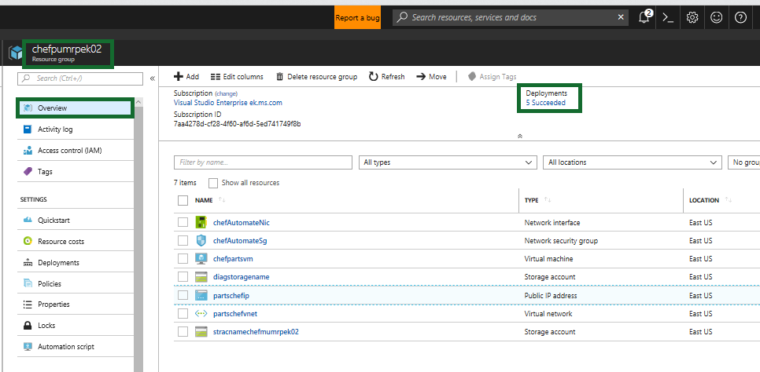

	You cna view the detalis of the deplpoyments by clicking on the Deployments link
	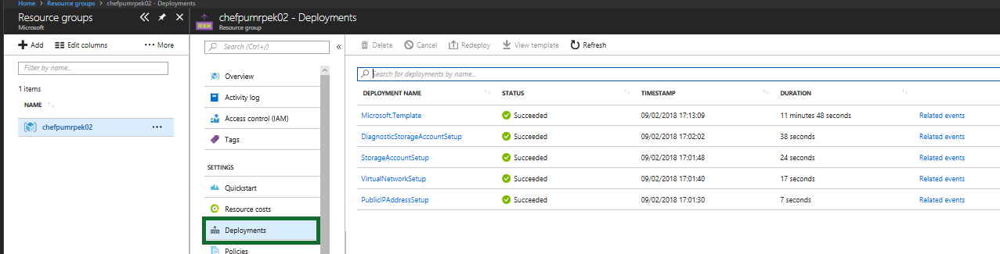	


6. Obtain the Public IP Address by select the **partschefip** resource (or whatever you called it) and copy the **DNS name**.

	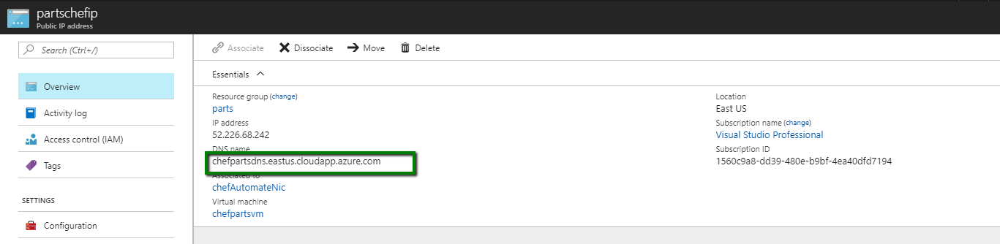
	
    The _dnsaddress_ will be of the form _machinename_._region_.cloudapp.azure.com. Open a browser to https://_dnsaddress_.
    (Make sure you're going to *http`s`*, and **not** *http*). You will be prompted about an invalid certificate, it is safe to
    ignore this for the purposes of this lab. Your prompts and steps to access the page may be different depending on your browser. te below screenshot is using *Edge*.
	
	
	
	If the Chef configuration has succeeded, you should see the Chef Automate login in prompt.

	**Note:** You will **not** be able to sign into **Chef Automate** at this stage. You need to complete Task 2 before you will be able to sign in successfully.

    

## Task 2: Configure the Chef Workstation
In this exercise, you will configure your Chef Workstation by setting up the Chef Starter Kit on your local workstation.

1. Download and install the **Chef Development Kit** from[https://downloads.chef.io/chefdk](https://downloads.chef.io/chefdk), choosing the appropriate version for your environment, i.e. **Mac OSX/macOS**, **Debian**, **Red Hat Enterprise Linux** **SUSE LInux Enterprise Server**,**Ubuntu**, **Windows** and choosing the correct flavour within those groupings.

	**Note**: As of Jan 2018 the latest version of the Chef sdk is 2.4.17. This is the version that was used in these lab steps.

2. Once installed, open the Chef Development Kit shell, you should have a desktop shortcut for it, double click this shortcut, and run `chef verify`.

	You could have different results depending on your configuration

	**Running Chef Verify**

	- It may run successfully all the way through and list **succeeded** at each component and you are good to go. Continue to step 3 below.

	- It may fail or give a warning at one or more components, as per the below screenshot. If it continues to the end without fail errors, you are good to go. Continue to step 3 below. 

		

	- It may fail because of git configuration
	
		

	The `chef verify` command returned errors that git was not configured with your identity information. Proceed with step 2 to configure your identify information in git.

3. Configure your global git variables with your name and email address if you haven't already.

    ```
		git config --global user.name “YourName”
		git config --global user.email “you@yourdomain.com”
	```

	

	Run `chef verify` again to ensure no further errors exist.

4. Now you will need to get the **Chef Starter Kit** for accessing **Chef Automate**. The details you enter here are for licensing on Azure Marketplace. Enter the details i.e. your **First Name**, **Last Name**, **emaill address**, etc and specify a user name and password to use to access the Chef Automate. Note these values down as you will need the values for username, email address, etc later.

	**Important NOTE:** For **Organization** you should use the value **parstunlimited**. This is the organization value that we will make sure is entered in the `knife.rb` file later in Task 3, and the value we specify here must match the value we specify there, otherwise you will get organization not found errors when you go to upload configuration details to the server.

	To get to the **Starter Kit** you will need to access the **Chef Automate VM** that you installed earlier in Task 1, with the following path **https://<dns_label>.<location>.cloudapp.azure.com/biscotti/setup**

	Again you will get a warning message about the certificate, but continue to the web page.

	

	Fill in the required details like above. Then once you have agreed to the terms and conditions you will be taken through to a page where the starter kit will automatically download, it is a file named **starter_kit.zip** and should be downloaded to a local folder.

	**Note**: The starter kit contains credential, user details as well as certificates. If you register on different occasions the details generated each time will be specific to the user and organization details you specified at that time. So you cannot re-use the start kit files across multiple users or registrations.

	


5. After you have downloaded the **Chef Starter Kit**, click **Login to Chef Automate** and enter the user name and password you just provided in the **Chef Automate Azure Marketplace Setup** page and sign into Chef Automate. The **Chef Automate dashboard** should be visible

	

6. Extract the Chef starter kit files to a directory like `C:\Users\<username>\chef\`.

7. In starter kit the extracted files location, open the file `chef-repo\.chef\knife.rb` file  and check that the `chef_server_url` to the external FQDN (e.g. **https://<chef-server-dns-name>.<region>.cloudapp.azure.com/organizations/partsunlimited**). Then, save and close the file.

	**Note**: If you have a different organizatin name present in the knif.rb file change it to partsunlimited organization

	

8. In the **ChefDK shell** window, which you ran chef verify in earlier, Change directories to the `chef-repo` directory  (i.e. `cd C:\Users\<username>\chef\chef-repo`). 

	
	Run the following git commands: 

	```
	git init
	git add -A
	git commit -m "starter kit commit"
	```
	
	

9.  Our Chef server has an SSL certificate that is not trusted. As a result, we have to manually trust the SSL certificate in order to have our workstation communicate with the Chef server. This can also be addressed by importing a valid SSL certificate for Chef to use. Run the knife ssl fetch command:

	```ruby
	knife ssl fetch
	```
	

10. View the current **chef-repo** contents, by running either **ls** or **dir**. This is just to allow you to be more aware of files that will be added in step 10 versus what is currently present.

	```ruby
	dir
	```
	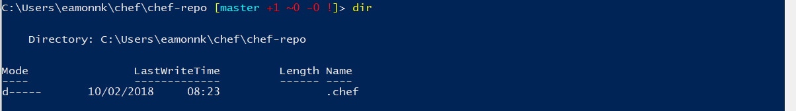

11. Synchronize the Chef repo

	```ruby
	knife download /
	```
	


12. Run the `dir` command from Step 8 again, and observe that additional files and folders have been created in the chef-repo directory. 


		
	


	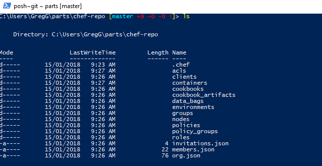
	
13. Commit the added files into the git repository:

	````
	git add -A
	git commit -m "knife download commit"
	````
	

## Task 3: Create a Cookbook
In this exercise, you will create a cookbook and recipe for the MRP app's dependencies to automate the installation of the MRP application and upload it to the Chef server. 

1. Open the **Chef Development kit** window and go to the folder **cookbooks** within the *8chef-repo**. i.e. `cd C:\Users\eamonnk\chef\chef-repo\cookbooks` or wherever you placed your git repo in Task 2. Then use the **knife** tool to generate a cookbook template by running the following command

	```ruby
	chef generate cookbook mrpapp
	```

	
	
	A cookbook is a set of tasks for configuring an application or feature. It defines a scenario and everything required to support that scenario. Within a cookbook, there are a series of recipes that define a set of actions to perform. Cookbooks and recipes are written in the Ruby language. This creates an **mrpapp** directory in the `chef-repo/cookbooks/` directory that contains all of the boilerplate code that defines a cookbook and a default recipe.

	

2. Edit the `metadata.rb` file in our cookbook directory. Open `chef-repo/cookbooks/mrpapp/metadata.rb` for edit. Cookbooks and recipes can leverage other cookbooks and recipes. Our cookbook will use a pre-existing recipe for managing APT repositories. Add the following line at the end of the file, then save and close the file.


	```ruby
	depends 'apt'
	```
	
	

3. We need to install three dependencies for our recipe: the apt cookbook, the windows cookbook, and the chef-client cookbook. This can be accomplished using the knife cookbook site command, which will download the cookbooks from the official Chef cookbook repository, [https://supermarket.chef.io/cookbooks](https://supermarket.chef.io/cookbooks).

	Install the apt cookbook: 

	```ruby
    knife cookbook site install apt
	```

	Install the windows cookbook:

	```ruby
    knife cookbook site install windows
	```

	Install the chef-client cookbook
	
	```ruby
    knife cookbook site install chef-client
	```

4. The last command will change the focus in the **Chefdk** window to the **chef-vendor-windows** branch of your repo. Switch back to the **master** branch (this should happen automatically when you run the command but may fail, and as such you need to change it back to **master** manually if it does).
	
	```
		git checkout master
	```
	

5.  Copy the full contents of the recipe from here: [https://raw.githubusercontent.com/Microsoft/PartsUnlimitedMRP/master/Labfiles/DevOps200.2x-InfrastructureasCode/DeployusingChef/final/default.rb](https://raw.githubusercontent.com/Microsoft/PartsUnlimitedMRP/master/Labfiles/DevOps200.2x-InfrastructureasCode/DeployusingChef/final/default.rb).

	This is a file present in the ParstUnlimited GitHub repo presented in raw form in a browser to allow you copy the content from it easily.

	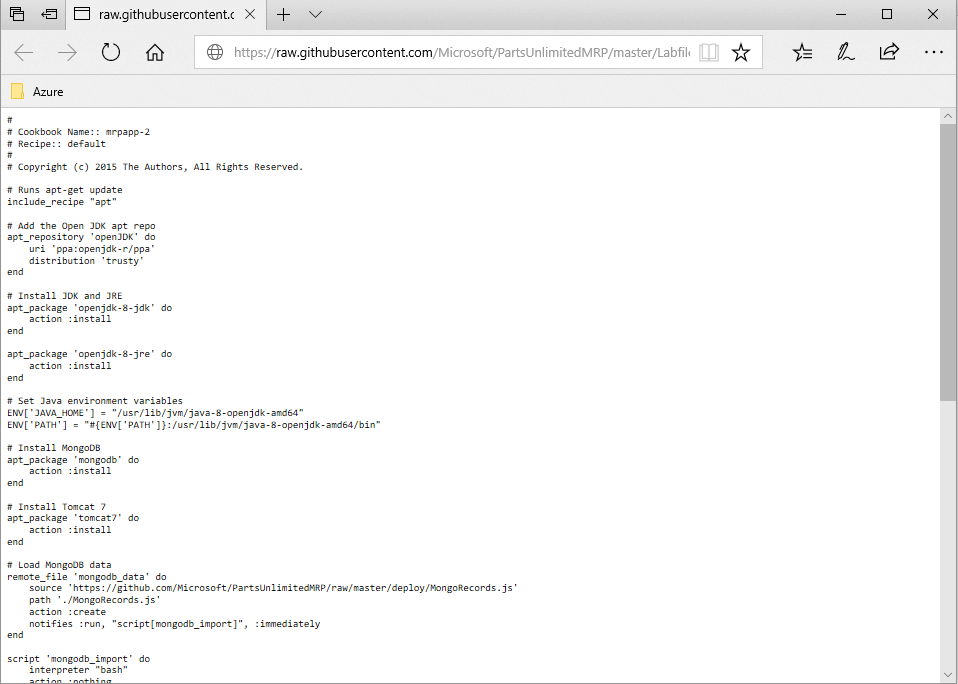

6. Open `chef-repo/cookbooks/mrpapp/recipes/default.rb` for edit.

	The file should look like this to start: 


	
    
7. Paste the contents of the recipe into the default recipe file.

	

	Save and close the file.

8. **The following explains what the recipe is doing to provision the application.**

	The first thing the recipe will do will be to run the `apt` resource – this will cause our recipe to execute `apt-get update` prior to running, to make sure the package sources on the machine are up-to-date.

	```ruby
   		↪	# Runs apt-get update
    	↪	include_recipe "apt"
	```

	Now we add an apt_repository resource to make sure that the **OpenJDK** repository is part of our apt repository list and up-to-date.
    
	```ruby
    	↪	# Add the Open JDK apt repo
    	↪	apt_repository 'openJDK' do
    	↪		uri 'ppa:openjdk-r/ppa'
    	↪		distribution 'trusty'
    	↪	end
	```

	Next, we will use the **apt-package** recipe to ensure that the **OpenJDK** and **OpenJRE** are installed. 

	```ruby
    	↪	# Install JDK and JRE
    	↪	apt_package 'openjdk-8-jdk' do
    	↪		action :install
    	↪	end
    	↪	
    	↪	apt_package 'openjdk-8-jre' do
    	↪		action :install
		↪	end
	```

	Next, we set the `JAVA_HOME` and `PATH` environment variables to reference **OpenJDK**.

	```ruby
    	↪	# Set Java environment variables
    	↪	ENV['JAVA_HOME'] = "/usr/lib/jvm/java-8-openjdk-amd64"
		↪	ENV['PATH'] = "#{ENV['PATH']}:/usr/lib/jvm/java-8-openjdk-amd64/bin"
		
	```

	Next, we'll install the **MongoDB** database engine and **Tomcat** web server.

	```ruby
    	↪	# Install MongoDB
    	↪	apt_package 'mongodb' do
    	↪		action :install
    	↪	end
    	↪	
    	↪	# Install Tomcat 7
    	↪	apt_package 'tomcat7' do
    	↪		action :install
		↪	end
	```

	At this point, all of our dependencies will be installed, so we can start configuring the applications. First, we need to ensure that our MongoDB database has some baseline data in it. The remote_file resource will download a file to a specified location. It's *idempotent* (which is a mathematical term relating to an item that when multiplied by itself remains unchanged) – In this context it means, if the file on the server has the same checksum as the local file, it won't take any action! This also uses the "notifies" command – if the resource runs (e.g. there's a new version of the file), it sends a notification to the specified resource, telling it to run.

	```ruby
    	↪	# Load MongoDB data 
    	↪	remote_file 'mongodb_data' do
    	↪		source 'https://github.com/Microsoft/PartsUnlimitedMRP/tree/master/deploy/MongoRecords.js'
    	↪		path './MongoRecords.js'
    	↪		action :create
    	↪		notifies :run, "script[mongodb_import]", :immediately
		↪	end
	```

	Now we use a "script" resource to define what command line script should be executed to load the MongoDB data we downloaded in the previous step. This resource has its "action" set to "nothing" – this means it won't run on its own. The only time this resource will run is when it's notified by the remote_file resource we used in the previous step. So every time a new version of the `MongoRecord.js` file is uploaded, the recipe will download it and import it. If the `MongoRecords.js` file doesn't change, nothing is downloaded or imported!

	```ruby
    	↪	script 'mongodb_import' do
    	↪		interpreter "bash"
    	↪		action :nothing
    	↪		code "mongo ordering MongoRecords.js"
		↪	end
	```

	Next, we need to set the port that **Tomcat** will run our **MRP application** on. This uses a script resource to invoke a regular expression to update the `/etc/tomcat7/server.xml` file.
	
	The `not_if` action is a guard statement – if the code in the `not_if` action returns true, the resource won't execute. This lets us make sure the script will only run if it needs to run.

	Another thing to note: We are referencing an attribute called `#{node['tomcat']['mrp_port']}`. We haven't defined this value yet, but we will in the next exercise! With attributes, you can set variables, so the MRP application can run on one port on one server, or a different port on a different server.
	If the port changes, you see that it uses "notifies" to invoke a service restart.

	```ruby
    	↪	# Set tomcat port 
    	↪	script 'tomcat_port' do 
    	↪		interpreter "bash"
    	↪		code "sed -i 's/Connector port=\".*\" protocol=\"HTTP\\/1.1\"$/Connector port=\"#{node['tomcat']['mrp_port']}\" protocol=\"HTTP\\/1.1\"/g' /etc/tomcat7/server.xml"
    	↪		not_if "grep 'Connector port=\"#{node['tomcat']['mrp_port']}\" protocol=\"HTTP/1.1\"$' /etc/tomcat7/server.xml"
    	↪		notifies :restart, "service[tomcat7]", :immediately
		↪	end
	```

	Now we can download the **MRP application** and start running it in **Tomcat**. If we get a new version, it signals the Tomcat service to restart.

	```ruby
    	↪	# Install the MRP app, restart the Tomcat service if necessary
    	↪	remote_file 'mrp_app' do
    	↪		source 'https://github.com/Microsoft/PartsUnlimitedMRP/tree/master/builds/mrp.war'
    	↪		action :create
    	↪		notifies :restart, "service[tomcat7]", :immediately
		↪	end
	```

	Now we can download the MRP application and start running it in **Tomcat**. If we get a new version, it signals the **Tomcat** service to restart.

	```ruby
   		↪	# Install the MRP app, restart the Tomcat service if necessary
    	↪	remote_file 'mrp_app' do
    	↪		source 'https://github.com/Microsoft/PartsUnlimitedMRP/tree/master/builds/mrp.war'
    	↪		path '/var/lib/tomcat7/webapps/mrp.war'
    	↪		action :create
    	↪		notifies :restart, "service[tomcat7]", :immediately
		↪	end
	```

	We can define the Tomcat servce's desired state, which is **running**. This will cause the script to check the Tomcat service, and start it, if it isn't running. We can also signal this resource to **restart** with `notifies` (see above).

	```ruby
    	↪	# Ensure Tomcat is running
    	↪	service 'tomcat7' do
    	↪		action :start
    	↪	end
	```

	Finally, we can make sure the `ordering_service` is running. This uses a combination of `remote_file` and `script` resources to check if the `ordering_service` needs to be killed and restarted, or if it's not running at all when it should be. The end result of this is that the `ordering_service` will always be up and running.

	```ruby
    	↪	remote_file 'ordering_service' do
    	↪		source 'https://github.com/Microsoft/PartsUnlimitedMRP/tree/master/builds/ordering-service-0.1.0.jar'
    	↪		path './ordering-service-0.1.0.jar'
    	↪		action :create
    	↪		notifies :run, "script[stop_ordering_service]", :immediately
    	↪	end
    	↪	
    	↪	# Kill the ordering service
    	↪	script 'stop_ordering_service' do
    	↪		interpreter "bash"
    	↪	# Only run when notifed
    	↪		action :nothing
    	↪		code "pkill -f ordering-service"
    	↪		only_if "pgrep -f ordering-service"
    	↪	end
    	↪	
    	↪	# Start the ordering service. 
    	↪	script 'start_ordering_service' do
    	↪		interpreter "bash"
    	↪		code "/usr/lib/jvm/java-8-openjdk-amd64/bin/java -jar ordering-service-0.1.0.jar &"
    	↪		not_if "pgrep -f ordering-service"
    	↪	end
	```


9. Commit the added files into the git repository:

	```
    	git add .
    	git commit -m "mrp cookbook commit"
	```

	

10. Now that the recipe is written, we can upload the cookbooks to the Chef server. From the command line, run: 

	```ruby
    	knife cookbook upload mrpapp --include-dependencies
    	knife cookbook upload chef-client --include-dependencies
	```

	Now that we have a recipe created and all of the dependencies installed, we can upload our cookbooks and recipes to the Chef server with the knife upload command.

### Task 4: Create a Role
In this exercise, you will use the **knife** command to create a role to define a baseline set of cookbooks and attributes that can be applied to multiple servers. At the start of this task, you should be logged in to the Chef Manage web site.


1. Open up the file `C:\Users\<username>\chef\chef-repo\.chef\knife.rb` or wherever you placed your `knife.rb` file.

2. Add the below line to the end of the `knife.rb` file

	```
	knife[:editor] = "notepad"
	```

	

	This will specifiy *notepad* as an editor and open it when creating a role in the next step. If you do not specify this in the `knife.rb`, when you run the command in step 2 you will receive an error saying something like **"Runtime ERROR: please set editor environment variable..."**

2. In the **Chefdk** window run the following command:

	```ruby
		knife role create partsrole
	```

3. This will open **notepad** editor with json content which you need to edit. Change the `default_attributes` to:

	```ruby
		"default_attributes": {
			"tomcat": {
				"mrp_port": 9080
			}
		},
	```

4. Update the `override_attributes` to:

	```ruby
		"override_attributes": {
			"chef_client": {
				"interval": "60",
				"splay": "1"
			}
		},
	```

5. Update the `run_list` to:

	```ruby
		"run_list": [
			"recipe[mrpapp]",
			"recipe[chef-client::service]"
		],
	```

	

	After you finished go to File and Save then exit notepad by clicking the **X** in the top right hand corner, or **File** > **Exit**.The command you ran in step 2, in the **Chefdk**, should then complete and provide validation it was done successfully.

	```ruby
		Created role[partsrole]
	```

	

### Task 5: Bootstrap the MRP App Server and Deploy the Application
In this exercise, you will run the knife command to bootstrap the MRP app server and assign the MRP application role .

1. You will need to create a linux VM in which to run the MRP application. You can do this by selecting the below button to do it via a template directly into Azure.

	<a href="https://portal.azure.com/#create/Microsoft.Template/uri/https%3A%2F%2Fraw.githubusercontent.com%2FMicrosoft%2FPartsUnlimitedMRP%2Fmaster%2FLabfiles%2FDevOps200.2x-InfrastructureasCode%2FDeployusingChef%2Fenv%2Fdeploylinux.json" target="_blank">
		
	</a>

	This will take approx 5 minutes to deploy.

2. Fill in with the following details. 

	- Resource group: **< specify a new resource group i.e. chefmrplinuxvmrg >**
	- Location: **< whatever location you selected for the Chef Automate >**
	- adminUsername: **azureuser**
	- adminPassword: **< your admin password >**
	- dnsLabelPrefix: **appmrpparts**
	- Ubuntu OS Version: **<Leave the default value>**

3. Once this is deployed use knife to boostrap the VM: 

	```ruby
		knife --% bootstrap <FQDN-for-MRP-App-VM> --ssh-user <mrp-app-admin-username> --ssh-password <mrp-app-admin-password> --node-name mrp-app --run-list role[partsrole] --sudo --verbose
	```

	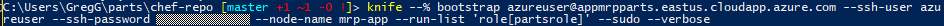

	The script will take approximately 15 minutes to run. You will see it do the following things:

	-	Install Chef on the VM
	-	Assign the **mrp** Chef role to the VM and execute the **mrpapp** recipe.

	Once the deployment is complete, you should be able to navigate to the MRP application website and use it normally.

	If there is an error with resolving the run list you will need to run:
		
	```ruby
		knife node run_list add mrp-app 'role[partsrole]'
	```

	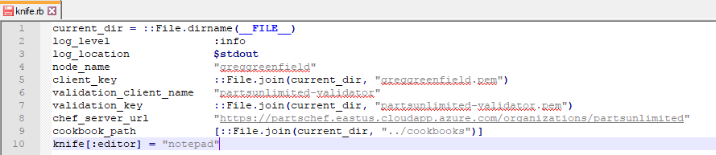
	As this will make sure the missing role is in the node.

4. Open the URL you chose for your public DNS name in a browser. The URL should be something like `http://<mrp-dns-name>.<region>.cloudapp.azure.com:9080/mrp.`

	

5. Click around the site and observe that it functions normally.


<h3><span style="color: #0000CD;"> Summary</span></h3> 
In this hands-on lab you explored some of the new features and capabilities of Deploying MRP App via Chef Server in Azure. This hands-on lab was designed to point out new features, discuss and describe them, and enable you to understand and explain these features to customers as part of the DevOps Lifecycle.
