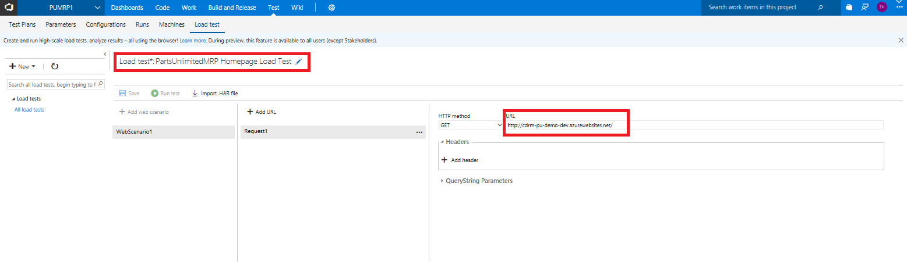
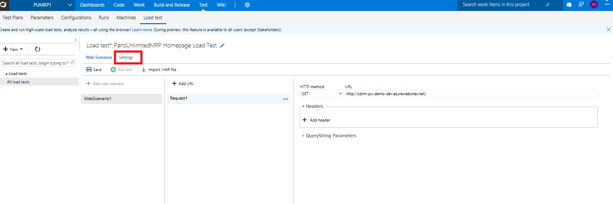
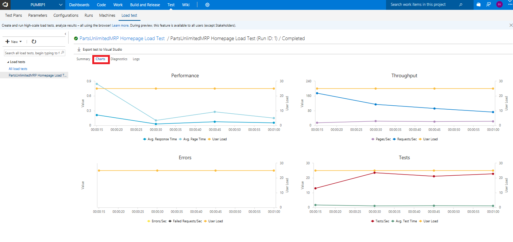
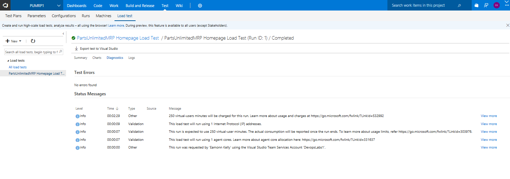
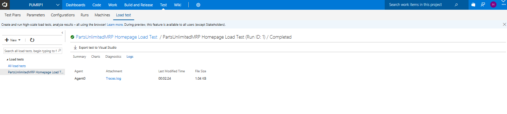

Your Linux Azure virtual machine has suffered significant performance degradation during Black Friday. The business unit responsible for the website’s functionality has complained to IT staff that users would intermittently lose access to the website, and that load times were significant for those who could access it.

In this lab, you will learn how to perform load testing against an endpoint for the PartsUnlimitedMRP Linux Azure virtual machine. 

<h3>DevOps MPP Course Source </h3>

- This lab is used in course [DevOps200.5x: DevOps Testing](https://www.edx.org/course/devops-testing-microsoft-devops200-5x-0) - Module 4.

<h3>  Pre-Requisites:</h3>

- The Web Load & Performance Testing features of Visual studio are only available on Visual Studio Enterprise, as such you will need a [Visual Studio Enterprise subscription](https://www.visualstudio.com/vs/enterprise/) (monthly, annual, or MSDN) to run URL-based load tests.

- The PartsUnlimitedMRP Linux Azure virtual machine set up and deployed with endpoint 9080 open (see [link](https://microsoft.github.io/PartsUnlimitedMRP/pandp/200.1x-PandP-PUMRPSetupVSTS.html))

    **Note:** If you don't have the app deployed and just wish to set up and run the URL Load Test, you can use the already deployed app at the URL http://cdrm-pu-demo-dev.azurewebsites.net/.

<h3> Lab Tasks:</h3>

1. Setting up and running a load test in Visual Studio Team Services

<h3>Estimated Lab Time:</h3>

- approx. 20 minutes  

### Task 1: Setting up and running a load test in Visual Studio Team Services ###

Performing a load test can be done in Visual Studio, in a browser in Visual Studio Team Services, or in the new Azure Portal. For simplicity, we will run a load test in a browser in Visual Studio Team Services. 

1. Open a web browser and navigate to the Team Project Collection ("DefaultCollection") of your Visual Studio Team Services account, i.e.     **https://{VSTS instance}.visualstudio.com**

    Once in your project click on "Test" then **Load Test** to open up load test options in the browser. 

    

    We are interested here in the URL based test but note the availabililty of several Load test options i.e.

    - [HTTP archive](https://docs.microsoft.com/en-us/vsts/load-test/record-and-replay-cloud-load-tests)
    - [Visual Studio webtest](https://blogs.msdn.microsoft.com/testingspot/2017/02/23/guide-to-get-started-with-visual-studio-web-load-testing-and-automation/)
    - [Apache JMeter](https://docs.microsoft.com/en-us/vsts/load-test/get-started-jmeter-test)
    - [URL](https://docs.microsoft.com/en-us/vsts/load-test/get-started-simple-cloud-load-test)
    - [Visual Studio IDE](https://docs.microsoft.com/en-us/vsts/load-test/getting-started-with-performance-testing)

2. In the load test tab, create a simple load test in the browser. Click on the **New** button and select **URL-based test** to create a new URL-based test.

    

3. Name the load test *PartsUnlimitedMRP Homepage Load Test*. Specify the home page URL, which should be the URL to MRP with your virtual machine name and port (such as *http://{mycloudhostname}.cloudapp.net:9080/mrp*) and click **Save**

    

    **Note:** For our scenario we will leave the **HTTP method** set to **GET**, but you can add multiple URLs and select the method for each one, such as **POST** or **PUT**. You can also add headers and **querystring** values if you need to send these as part of the request. The URL Load Test accesses each of these URLs multiple times using the parameters you specify, and records the results.

4. Select the **Settings** tab and change the **Run duration** to 1 minute. You can optionally change the max virtual users, browser mix, and load location as well. Then click the **Save** button.

    

    

5. Click on the **Run test** button to begin the test. The load test will start running and show metrics in real time. 

    

6. When the test has finished loading, it will show metrics, errors, and application performance. There are four tab views available in the VSTS portal, step through them and view the output from your test run.

    **Summary**
        

    **Charts**
        

    **Diagnostics**
        

    **Logs**
        

<h3> Summary</h3>

In this lab, you learned how to perform load testing against an endpoint for the PartsUnlimitedMRP Linux Azure virtual machine. 

<h3>Next steps</h3>

-   [Continuous Integration with VSTS Build ](https://microsoft.github.io/PartsUnlimitedMRP/cicd/200.3x-CICD-CI.html)

-   [Automated Testing with VSTS and Eclipse](https://microsoft.github.io/PartsUnlimitedMRP/testing/200.5x-Testing-VSTSandEclipse.html)

-   [HOL Parts Unlimited MRP Application Performance Monitoring](https://github.com/Microsoft/PartsUnlimitedMRP/tree/master/docs/HOL_Application-Performance-Monitoring)

<h3>References</h3>

- [FAQs for Load Testing](https://docs.microsoft.com/en-us/vsts/load-test/reference-qa#links-to-useful-resources)