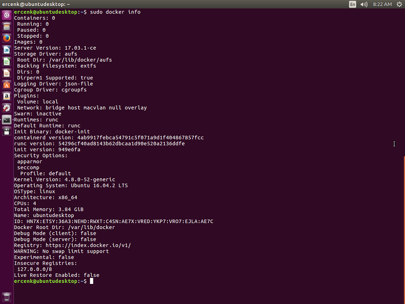
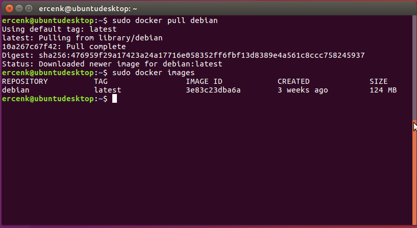
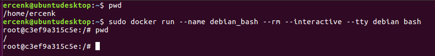
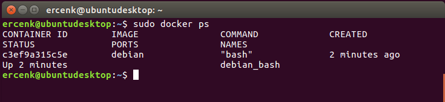
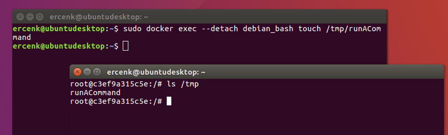
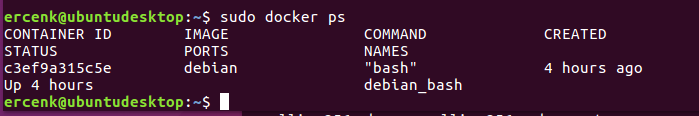
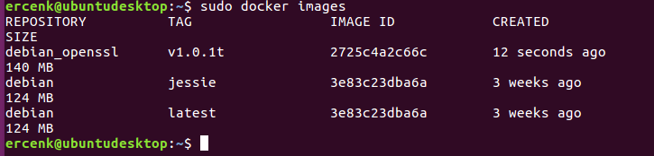
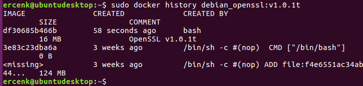

In this lab, we will first install Docker on a Linux box, Create a container image and then run the container.


<h3><span style="color: #0000CD;">DevOps MPP Course Source </span></h3>

- This lab is used in course <a href="https://www.edx.org/course/architecting-distributed-cloud-microsoft-devops200-9x-1" target="_blank"><span style="color: #0066cc;" color="#0066cc">DevOps200.9x: Architecting Distributed Cloud Applications</span></a> - Module 1.


<h3><span style="color: #0000CD;"> Pre-requisites:</span></h3>

- There are no pre-requisites


<h3><span style="color: #0000CD;"> Lab Tasks:</span></h3> 

- Install Docker on a Linux box
- Create a Container Image and Run the Container 


<h3><span style="color: #0000CD;">Estimated Lab Time:</span></h3>

- approx. 40 minutes  


### Task 1: Install Docker on a Linux box


1. In this lab, we will first install Docker on a Linux box (if you do not already have it installed). If you want to install it on Windows operating systems, please see the <a href="https://docs.microsoft.com/en-us/virtualization/windowscontainers/about/" target="_blank"><span style="color: #0066cc;" color="#0066cc">documentation</span></a>.

2. We have a new Ubuntu Desktop 16.04 LTS, and we followed the instructions to install Docker CE at this <a href="https://docs.docker.com/engine/installation/linux/ubuntu/#recommended-extra-packages-for-trusty-1404" target="_blank"><span style="color: #0066cc;" color="#0066cc">link</span></a>


### Task 2: Create a Container Image and Run the Container 

1. Let's start with examining the start configuration, by issuing the following command:

    ```
    sudo docker info
    ```

    This will display the systemwide information. The result will look something like:

    

2. And now issue the following command to display all top-level images on this box:

    ```
    sudo docker images
    ```

    Assuming this is a brand new installation on this box, the result will not display any images.


3. Most of the images that you will create will be built on top of a base image that can be retrieved from the <a href="https://hub.docker.com/" target="_blank"><span style="color: #0066cc;" color="#0066cc">Docker Hub</span></a>registry. Let's start with pulling the latest Debian image from the repository. 

    ```
    sudo docker pull debian
    ```

    If no tag is provided, the Docker engine will use the `:latest` as the default. You will see Docker pulling the image, with an output that looks like the following:

    

4. Now, let's list the images we have, by issuing the command:

    ```
    sudo docker images
    ```

    You will see the image you have just pulled, listed as:

    

5. Docker images consist of multiple layers. To demonstrate, let's pull the `jessie`, which is the latest release of `debian`. This image shares layer with the `debian:latest` image.

    ```
    sudo docker pull debian:jessie
    ```

    

6. Notice that nothing is downloaded, because `debian:jessie` shares the `debian:latest` layer. Listing the images will give us:

    

7. To see the history of an image, to see how the image was built, use the following command:

    ```
    sudo docker history debian
    ```

    


8. Now, let's start a new container, name it as `debian_bash` (`--name`), start `bash` in it, while capturing the STDIN on it (`--interactive`), and also keeping the terminal open(`--tty`), and remove the container automatically once we exit the shell.

    ```
    sudo docker run --name debian_bash --rm --interactive --tty debian bash
    ```

    

9. Notice we are now interacting with the new container, named `docker_bash`. Let's start another terminal and issue the command: 

    ```
    sudo docker ps
    ```

    

10. We can also run commands in a container from the command line of the host. Let's create a new file by executing this in the background (`--detach`) and detach from the container.

    ```
    sudo docker exec --detach debian_bash touch /tmp/runACommand
    ```

    When you go back to the first terminal and list the files on /tmp directory, you should see the new file.

    

11. Now, let's assume we want to use OpenSSL to generate a self-signed certificate, but we do not want to install it to our main box. Instead, we want to install it on a container. We already have the bash shell open and waiting for us.

12. The first step is to install the openssl package. But to do that, we might need to update the package list first by running: 

    ```
    apt-get update
    ```

13. then install openssl,

    ```
    apt-get install openssl
    ```

14. Now we can see openssl installed by checking its version:

    ```
    openssl version
    ```

15. It's all good, our container is ready to be used now. But wait. If we exit the shell now, the container we had just started with the name `debian_bash` will get deleted because we used `--rm` option. However, we want to persist this as an image for later use. To do that, let's first get the ID of the container with:

    ```
    sudo docker ps
    ```

    

16. We will need to grab the container ID, which is "c3ef9a315c5e" in this case, and use the following command to commit the changes, and create a new container image with the name `debian_openssl` and label `v1.0.1t` to identify the openssl version. Please note that although we can use anything to label the image, it is best practice to be as specific as possible.

    ```
    sudo docker commit --author "Ercenk Keresteci" --message "OpenSSL v1.0.1t" c3ef9a315c5e debian_openssl:v1.0.1t
    ```

17. To check the new image, now let's issue:

    ```
    sudo docker images
    ```

    

18. We can now exit from the bash shell, and observe the container to be removed automatically by issuing 

    ```
    sudo docker ps
    ```

19. However, when we list the images, we will continue to see the image we had just committed. You can also check the history of the image you have just created by seeing the layers, with the command:

    ```
    sudo docker history debian_openssl:v1.0.1t
    ```

    


<h3><span style="color: #0000CD;"> Summary</span></h3>

In this lab you completed the following tasks:

- Installed Docker on a Linux box
- Created a Container Image and Ran the Container 